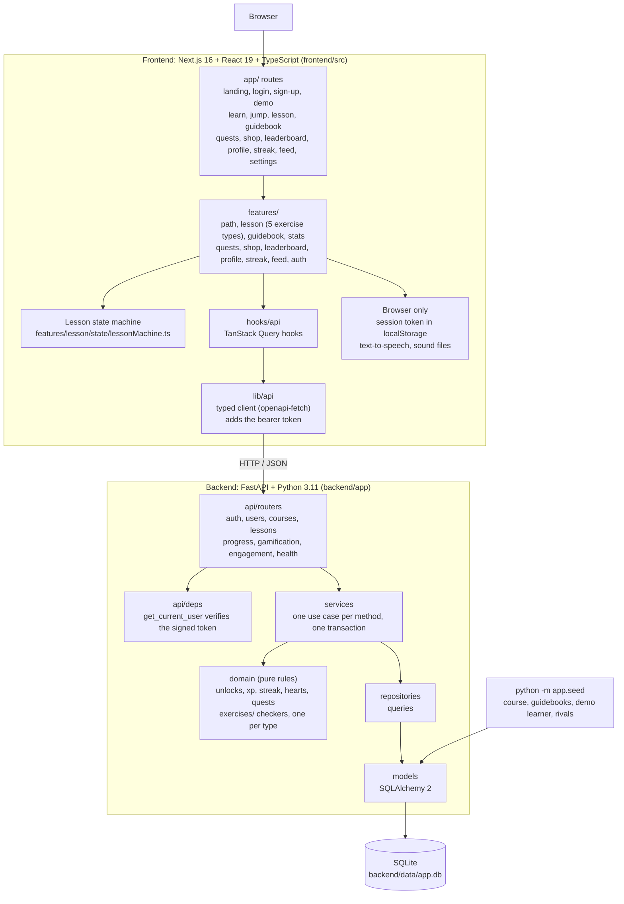
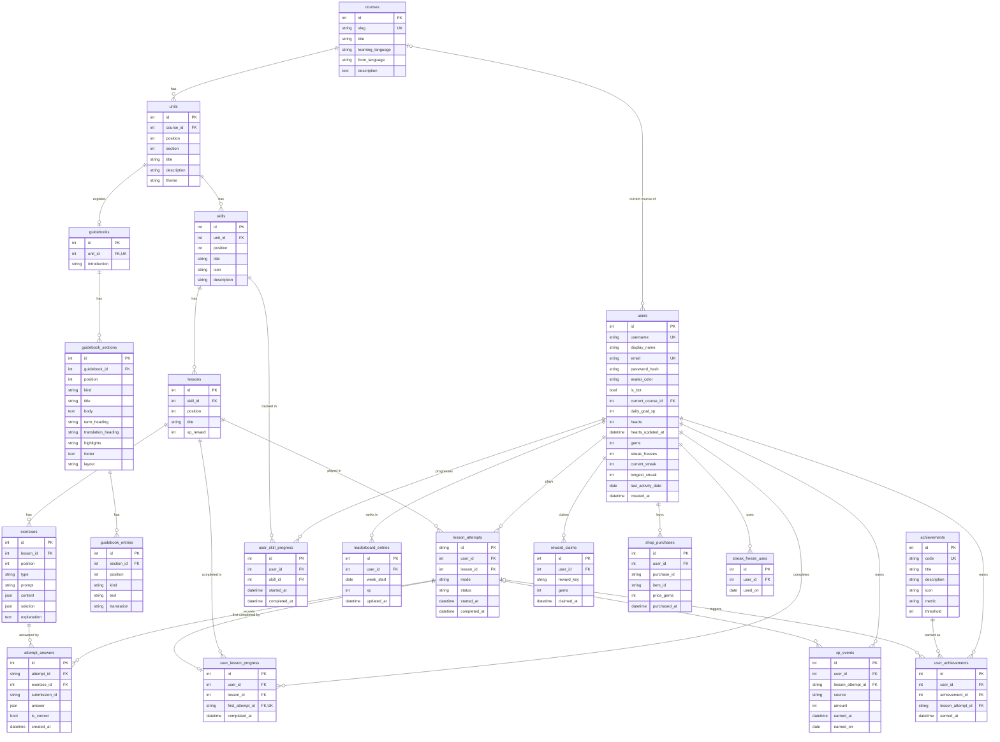

# Lingo — a Duolingo-style language-learning app


A full-stack, gamified language-learning web app built for an SDE assessment. It follows the
layout and interaction patterns of Duolingo's web app closely, on top of its own backend,
database schema and course content.

**Highlights**

- **Section 1 of a Spanish course, Units 1–10.** Each unit has its own colour, skill path,
  characters, treasure chest, trophy and guidebook.
- **Lesson player with five exercise types:** multiple choice, word bank (tap the words), match
  pairs, fill in the blank and type the answer.
- **Server-side gamification:** XP, hearts (with timed regeneration and gem refills), streak,
  gems, daily quests, unit chests, achievements, a weekly league and Legendary challenges.
- **Interactive header:** hover cards for courses, streak, XP, gems and hearts.
- **"Jump here":** any unit can be started from its fast-forward node.
- **Real accounts:** sign-up, login, signed sessions and protected routes.
- **Extras:** unit guidebooks with text-to-speech audio, sound effects, dark mode, and a
  responsive layout from 375px phones to desktop.

## Contents

1. [Tech stack](#tech-stack)
2. [Architecture](#architecture)
3. [Database schema](#database-schema)
4. [API overview](#api-overview)
5. [Setup](#setup)
6. [Deployment](#deployment)
7. [Testing](#testing)
8. [Evaluation criteria](#evaluation-criteria)
9. [Assumptions and scope](#assumptions-and-scope)
10. [Artwork and audio](#artwork-and-audio)
11. [Documentation](#documentation)

## Tech stack

| Layer | Technology |
|---|---|
| Frontend | Next.js 16 (App Router), React 19, TypeScript (strict), Tailwind CSS v4, `motion` |
| Server state | TanStack Query (one hook per endpoint) |
| Lesson state | A pure reducer (state machine) in `lessonMachine.ts` |
| HTTP client | `openapi-fetch`, typed from the backend's OpenAPI document |
| Icons | `lucide-react`, plus image assets in `frontend/public/brand` |
| Backend | Python 3.11, FastAPI, Pydantic v2 |
| Database | SQLite through SQLAlchemy 2 (no Prisma, Drizzle or Node backend) |
| Auth | PBKDF2 password hashes, HMAC-signed bearer tokens |
| Tests | pytest (unit and integration), Playwright (desktop and phone) |
| Quality | ruff, mypy `--strict`, ESLint, `tsc --noEmit` |

The API contract is generated, not hand-written: FastAPI exports `openapi.json`, and
`npm run gen:api` turns it into `src/lib/api/schema.d.ts`. A request to an endpoint or field the
backend does not have fails the type check.

## Architecture



There are no other services: no external APIs, no analytics and no separate auth provider.

**Frontend**

| Part | Where | What it does |
|---|---|---|
| App shell | `components/layout` | Sidebar, phone bottom bar, right rail |
| Stats bar | `features/stats` | Course, streak, XP, gems and hearts, each with a hover card |
| Learning path | `features/path` | Unit banners, nodes, characters, lesson card, jump node |
| Jump screen | `features/lesson/JumpAheadScreen.tsx` | Loading, then "Pass this test…", then the lesson player |
| Lesson player | `features/lesson` | Exercise screens, feedback, hearts, completion screen |
| Exercises | `features/lesson/exercises` | One component per type, chosen through `registry.tsx` |
| Guidebook | `features/guidebook` | Key phrases, tips and tables with audio |
| Other pages | `features/{quests,shop,leaderboard,profile,streak,feed,settings}` | One folder per page |

State lives in three places and nowhere else: server data in TanStack Query, the lesson in
progress in a reducer (`lessonMachine.ts`), and the session token plus theme and sound
preferences in `localStorage`. Each unit's look (node positions, characters, locked artwork) is
configuration in `features/path/unitArt.ts`; which skills exist and whether each is locked always
comes from the API.

**Backend**

| Layer | Where | Rule |
|---|---|---|
| Routers | `app/api/routers` | Validate the request, call one service, return a schema |
| Services | `app/services` | One use case per method, one transaction |
| Domain | `app/domain` | Pure functions and classes; no database, no HTTP |
| Repositories | `app/repositories` | The only place that builds queries |
| Models | `app/models` | SQLAlchemy tables |

**Authentication.** `POST /api/auth/signup` and `/login` return a token signed with `SECRET_KEY`
(HMAC) that names the user and an expiry. The browser keeps it in `localStorage` and sends it as
`Authorization: Bearer …`. Every learner route depends on `get_current_user`, which verifies the
signature and expiry and loads the user; a bad or expired token gets a 401, and the frontend
then clears it and shows the login page. Passwords are stored as PBKDF2 hashes. Sessions are not
stored in the database.

**How a lesson is processed**

1. **Start.** `POST /api/lessons/{id}/attempts` checks the lesson is unlocked and the learner has
   hearts, then creates an attempt (or resumes the active one).
2. **Answer.** `POST /api/lessons/{id}/check` grades one answer on the server. Solutions are never
   sent to the browser before an answer is checked. A wrong answer costs one heart.
3. **Out of hearts.** At zero hearts the API refuses further answers; the player offers a gem
   refill or waiting for regeneration.
4. **Complete.** `POST /api/progress/lesson/{id}/complete` awards XP, updates the streak, daily
   goal, quests, league and achievements, and unlocks the next node, in one transaction.

**Rules worth knowing**

- **The backend is the source of truth.** The frontend never computes XP, hearts, streak or
  unlocks.
- **Store facts, compute states.** Locked, available and completed are derived from completion
  rows.
- **Every reward is idempotent.** Answers, completions, claims and purchases carry a unique key,
  so a retry or double-click cannot pay out twice.
- **Time goes through one clock.** Streak days and league weeks use `APP_TIMEZONE`; tests use a
  fixed clock.
- **Unlocking.** A skill opens when the previous one is completed. The first skill of every unit
  is always open ("Jump here"); the rest of that unit still unlocks skill by skill.

The longer version, with the decisions and trade-offs, is in
[docs/architecture.md](docs/architecture.md).

## Database schema

Twenty tables, generated here from the SQLAlchemy models in `backend/app/models` and checked
against the SQLite file: the tables and columns match exactly.



`PK` primary key, `FK` foreign key, `UK` unique on its own. `||--o{` is one-to-many, `||--o|` is
one-to-one, and a leading `|o` means the foreign key may be empty.

**How the tables group**

- **Content** (`courses` → `units` → `skills` → `lessons` → `exercises`, plus the three guidebook
  tables): the same for every learner, ordered by `position`.
- **Learner facts** (`lesson_attempts`, `attempt_answers`, `user_lesson_progress`,
  `user_skill_progress`): what a learner did. Progress is separate from content, so a course can
  change without touching learner rows.
- **Ledgers and rewards** (`xp_events`, `leaderboard_entries`, `user_achievements`,
  `reward_claims`, `shop_purchases`, `streak_freeze_uses`): append-only records that the totals
  are computed from.
- **`users`** holds the account (email, password hash) and the few cached numbers the top bar
  needs: hearts, gems and streak.
- **Many-to-many** relationships go through a table of their own: learners and lessons through
  `user_lesson_progress`, learners and skills through `user_skill_progress`, learners and
  achievements through `user_achievements`.

**Constraints**

| Table | Unique constraints | Foreign keys (on delete) |
|---|---|---|
| `courses` | `slug` | — |
| `units` | `course_id, position` | `course_id` → `courses` (cascade) |
| `skills` | `unit_id, position` | `unit_id` → `units` (cascade) |
| `lessons` | `skill_id, position` | `skill_id` → `skills` (cascade) |
| `exercises` | `lesson_id, position` | `lesson_id` → `lessons` (cascade) |
| `guidebooks` | `unit_id` | `unit_id` → `units` (cascade) |
| `guidebook_sections` | `guidebook_id, position` | `guidebook_id` → `guidebooks` (cascade) |
| `guidebook_entries` | `section_id, position` | `section_id` → `guidebook_sections` (cascade) |
| `users` | `email`; `username` | `current_course_id` → `courses` (set null) |
| `lesson_attempts` | — | `user_id` → `users` (cascade); `lesson_id` → `lessons` (restrict) |
| `attempt_answers` | `attempt_id, submission_id` | `attempt_id` → `lesson_attempts` (cascade); `exercise_id` → `exercises` (restrict) |
| `user_lesson_progress` | `first_attempt_id`; `user_id, lesson_id` | `user_id` → `users` (cascade); `lesson_id` → `lessons` (restrict); `first_attempt_id` → `lesson_attempts` (cascade) |
| `user_skill_progress` | `user_id, skill_id` | `user_id` → `users` (cascade); `skill_id` → `skills` (restrict) |
| `xp_events` | `lesson_attempt_id, source` | `user_id` → `users` (cascade); `lesson_attempt_id` → `lesson_attempts` (cascade) |
| `leaderboard_entries` | `user_id, week_start` | `user_id` → `users` (cascade) |
| `achievements` | `code`; `metric, threshold` | — |
| `user_achievements` | `user_id, achievement_id` | `user_id` → `users` (cascade); `achievement_id` → `achievements` (restrict); `lesson_attempt_id` → `lesson_attempts` (set null) |
| `reward_claims` | `user_id, reward_key` | `user_id` → `users` (cascade) |
| `shop_purchases` | `user_id, purchase_id` | `user_id` → `users` (cascade) |
| `streak_freeze_uses` | `user_id, used_on` | `user_id` → `users` (cascade) |

- **Cascade** follows ownership: deleting a course removes its units, skills, lessons and
  exercises, and deleting a user removes that learner's rows.
- **Restrict** protects history: a lesson, skill, exercise or achievement that a learner's rows
  refer to cannot be deleted.
- **Unique keys make rewards idempotent.** A repeated answer, completion, claim or purchase hits
  a unique constraint and cannot pay out twice.
- SQLite has foreign keys off by default; the app turns them on for every connection.

**Design notes**

- **No stats table.** Hearts, gems and streak are columns on `users`; total and daily XP are sums
  over `xp_events`.
- **No options table.** An exercise's options are in its JSON `content`, because each of the five
  types has a different shape. The answer is in `solution`, which the API never serves before an
  answer is checked.
- **No shop items table.** The two purchasable items are defined in `app/domain/shop.py`;
  purchases are rows.
- **No sessions table.** A session is a signed token, verified without a lookup.
- **Statuses are computed.** Locked, available and completed are never stored.
- Starting the API creates missing tables and adds missing nullable columns. It never drops data.

## API overview

All routes are under `/api`. Everything except health and auth needs
`Authorization: Bearer <token>`. Interactive docs: http://localhost:8000/docs.

| Method | Path | Purpose |
|---|---|---|
| GET | `/health` | Liveness and database check |
| POST | `/auth/signup` | Create an account and sign in |
| POST | `/auth/login` | Sign in with email or username |
| POST | `/auth/logout` | Sign out |
| POST | `/auth/demo` | Sign in as the demo learner (only with `ENABLE_DEMO_LOGIN=true`) |
| GET | `/users/me` | Current learner with streak, XP, gems and hearts |
| PATCH | `/users/me` | Update preferences (daily goal) |
| GET | `/courses` | List courses |
| GET | `/courses/{course_id}` | Course detail |
| GET | `/courses/{course_id}/path` | Units and skills with the learner's status |
| GET | `/skills/{skill_id}` | A skill's lessons and their status |
| GET | `/units/{unit_id}/guidebook` | Unit guidebook |
| GET | `/lessons/{lesson_id}` | Exercises for play (no solutions) |
| POST | `/lessons/{lesson_id}/attempts` | Start or resume an attempt |
| POST | `/lessons/{lesson_id}/check` | Check one answer |
| POST | `/progress/lesson/{lesson_id}/complete` | Complete an attempt and receive rewards |
| GET | `/progress` | XP, daily goal, streak and course progress |
| GET | `/hearts` | Hearts and regeneration time |
| POST | `/hearts/refill` | Refill hearts with gems |
| GET | `/streak` | Streak with a month calendar |
| GET | `/leaderboard` | This week's league |
| GET | `/profile` | Profile, stats and achievements |
| GET | `/shop` | Shop items and gem balance |
| POST | `/shop/purchase` | Buy an item with gems |
| GET | `/quests` | Today's quests with progress |
| POST | `/quests/{code}/claim` | Claim a completed quest's reward |
| POST | `/units/{unit_id}/chest/claim` | Open a completed unit's chest |
| GET | `/feed` | Activity feed |

Errors share one shape: `{ "error": { "code", "message", "details" } }`, for example
`LESSON_LOCKED`, `OUT_OF_HEARTS` or `EMAIL_TAKEN`.

## Setup

**Requirements:** Python 3.11 and Node.js 20 or newer. Commands are for Windows; on macOS or
Linux use `.venv/bin/` in place of `.venv\Scripts\`.

**0. Get the code**

```bash
git clone https://github.com/Kartikpatel1202/duolingo-web-app.git
```

**1. Backend** (from `backend/`)

```bash
py -3.11 -m venv .venv
```

```bash
.venv\Scripts\pip install -r requirements-dev.txt
```

```bash
copy .env.example .env
```

Seed the course, the demo learner and nine league rivals:

```bash
.venv\Scripts\python -m app.seed
```

```bash
.venv\Scripts\python -m uvicorn app.main:app --reload --port 8000
```

**2. Frontend** (from `frontend/`)

```bash
npm install
```

```bash
copy .env.example .env.local
```

```bash
npm run dev
```

Open http://localhost:3000.

**Environment variables**

| File | Variable | Default | Meaning |
|---|---|---|---|
| `backend/.env` | `DATABASE_URL` | `sqlite:///./data/app.db` | SQLAlchemy URL |
| | `CORS_ORIGINS` | `http://localhost:3000` | Allowed browser origins |
| | `APP_TIMEZONE` | `UTC` | Defines the learning day and week |
| | `SECRET_KEY` | development default | Signs sessions; required in production |
| | `SESSION_DAYS` | `30` | How long a login lasts |
| | `ENABLE_DEMO_LOGIN` | `false` | Enables the one-click `/demo` link |
| | `ENABLE_TEST_ROUTES` | `false` | Test-only reset route for Playwright |
| `frontend/.env.local` | `NEXT_PUBLIC_API_URL` | `http://localhost:8000` | Backend base URL |

**Signing in**

- **New account:** GET STARTED opens sign-up (email and a password of 8 or more characters).
- **Seeded learner with progress:** `alex@example.com` / `learn-spanish` (defined in
  `backend/app/seed/people.py`).

**Seed commands**

| Command | Effect |
|---|---|
| `python -m app.seed` | Create tables if needed and seed; keeps accounts and progress |
| `python -m app.seed --no-demo` | Same, without playing the demo learner's past lessons |
| `python -m app.seed --reset` | Drop everything and reseed. Deletes every account; saves a `.bak` copy of the database first |

After changing the API, refresh the contract from `backend/` and then `frontend/`:

```bash
.venv\Scripts\python -m scripts.export_openapi
```

```bash
npm run gen:api
```

## Deployment

The project has not been deployed. The repository has no deployment configuration: no
`Dockerfile`, `render.yaml`, `vercel.json` or `Procfile`. The two halves deploy separately, and
these are the settings each host needs. They are untested.

**Backend on Render (or any host that runs a Python web service)**

| Setting | Value |
|---|---|
| Root directory | `backend` |
| Build command | `pip install -r requirements.txt && python -m app.seed` |
| Start command | `uvicorn app.main:app --host 0.0.0.0 --port $PORT` |
| `APP_ENV` | `production` |
| `SECRET_KEY` | a long random value (the app refuses to start in production without one) |
| `CORS_ORIGINS` | the frontend's URL |
| `DATABASE_URL` | `sqlite:////var/data/app.db` on a persistent disk |

**SQLite needs a persistent disk.** The database is one file. On a host with an ephemeral
filesystem (the default on most free tiers) it is lost on every deploy or restart, which deletes
every account and all progress, and the seeded course with it. Either attach a persistent disk
and point `DATABASE_URL` at it, or accept a demo that resets. SQLite also allows one writer at a
time, which is fine for a demo and not for real traffic. The models are not SQLite-specific, but
the app has only been run against SQLite.

`NEXT_PUBLIC_API_URL` is read when the frontend is built, so changing the backend's address
means rebuilding the frontend. `CORS_ORIGINS` must list the frontend's exact origin or the
browser will block every request.

**Frontend on Vercel**

| Setting | Value |
|---|---|
| Root directory | `frontend` |
| Framework preset | Next.js |
| `NEXT_PUBLIC_API_URL` | the backend's public URL, without a trailing slash |

Before deploying anywhere public, read [Artwork and audio](#artwork-and-audio).

## Testing

Backend (from `backend/`):

```bash
.venv\Scripts\python -m pytest
```

```bash
.venv\Scripts\ruff check app tests
```

```bash
.venv\Scripts\mypy
```

Frontend (from `frontend/`):

```bash
npm run typecheck
```

```bash
npm run lint
```

```bash
npm run test:e2e
```

Playwright starts its own API (port 8001, a separate `e2e.db`) and a production Next build (port
3100), and resets the database before every test.

## Evaluation criteria

| Criterion | Where to look |
|---|---|
| Functionality | Learning path and unlocking: `backend/app/domain/unlocks.py`, `backend/app/services/course_progress.py`. Lesson loop and the five exercise types: `backend/app/services/{lesson,answer,completion}_service.py`, `backend/app/domain/exercises`, `frontend/src/features/lesson`. XP, hearts, streak: `backend/app/domain/{xp,hearts,streak}.py`. Jump here: `frontend/src/features/lesson/JumpAheadScreen.tsx`. Progress is stored per user in the progress tables |
| UI/UX | Path, unit colours and characters: `frontend/src/features/path`. Lesson feedback: `frontend/src/features/lesson/components`. Guidebook and audio: `frontend/src/features/guidebook`, `frontend/src/hooks/useSpeech.ts`. Header cards: `frontend/src/features/stats`. Colours and dark theme: `frontend/src/styles/tokens.css`, `frontend/src/app/globals.css`. Phone layout: `frontend/e2e/mobile.spec.ts` |
| Database design | `backend/app/models`, and [Database schema](#database-schema) above: content hierarchy, learner progress kept apart from content, foreign keys and unique constraints |
| Backend / API design | Routers → services → domain → repositories in `backend/app`. Typed contract: `frontend/openapi.json` → `frontend/src/lib/api/schema.d.ts`. Authentication: `backend/app/services/auth_service.py`, `backend/app/api/deps.py`. Answers are graded on the server |
| Code quality | ruff, mypy `--strict`, ESLint and `tsc` pass; 301 backend tests |
| Code modularity | One lesson engine for all ten units. Units differ only by data: `backend/app/seed/spanish_course.py` and `frontend/src/features/path/unitArt.ts`. One exercise checker per type on the backend and one component per type on the frontend |
| Code understanding | The diagrams above, [docs/architecture.md](docs/architecture.md) and [docs/interview-notes.md](docs/interview-notes.md) |

Bonus items from the brief that are implemented: audio (browser text-to-speech), achievements, a
working leaderboard across seeded learners, a Legendary challenge mode and dark mode.

## Assumptions and scope

- **One course.** Spanish for English speakers, Section 1, Units 1–10: 40 skills, 80 lessons and
  about 500 exercises. Every unit contains all five exercise types.
- **Accounts are real, not a single default learner.** Each learner's progress is stored per
  user. A seeded learner with progress exists so the app is usable immediately.
- **Simplified authentication.** No email verification, password reset or social login.
- **"Jump here" has no test-out exam.** It opens the unit's first lesson; passing or failing it
  changes nothing beyond normal lesson completion.
- **Match pairs is graded as a whole set** when CHECK is pressed, because the browser never
  holds the solution.
- **Audio is the browser's text-to-speech.** There is no speech recognition.
- **Placeholders, labelled as such in the UI:** Super subscription, friends and friend streaks,
  friend quests, extra courses (Math, English, German), XP Boost, Timer Boost, Daily Chest and
  practice reminders. There is no payment code.
- **Smaller than the reference.** Each unit has four skills and one chest; the reference
  screenshots show more nodes per unit.
- **SQLite** keeps the project runnable with no services to install. The SQLAlchemy models are
  not SQLite-specific.

## Artwork and audio

The code, database schema and course content are this project's own. Some characters, icons and
the three sound effects in `frontend/public/brand` and `frontend/public/sounds` were taken from
screenshots and recordings of the Duolingo product to match its look for this assessment. They
belong to Duolingo and are not licensed for redistribution, so this repository is for evaluation
only and should not be published or deployed publicly with those files in it.

## Documentation

- [docs/architecture.md](docs/architecture.md) — design, schema, API, decisions and trade-offs
- [docs/evaluation-checklist.md](docs/evaluation-checklist.md) — each criterion mapped to code and tests
- [docs/interview-notes.md](docs/interview-notes.md) — demo script and likely questions
