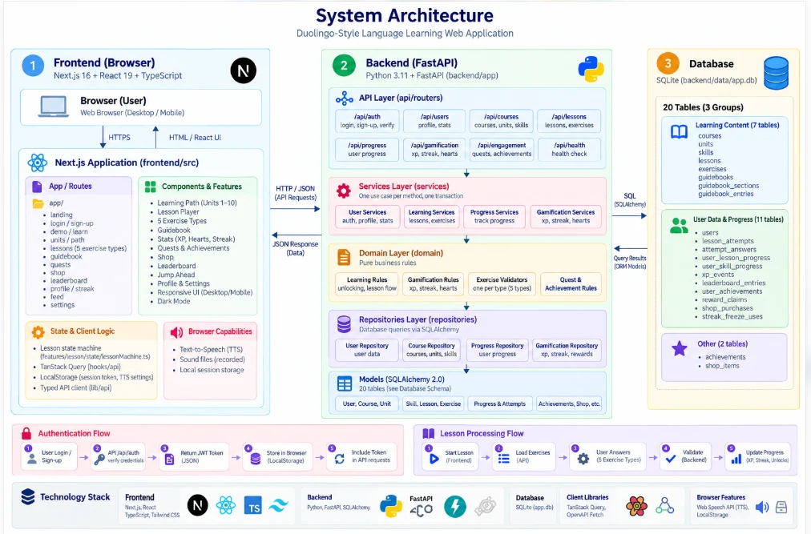
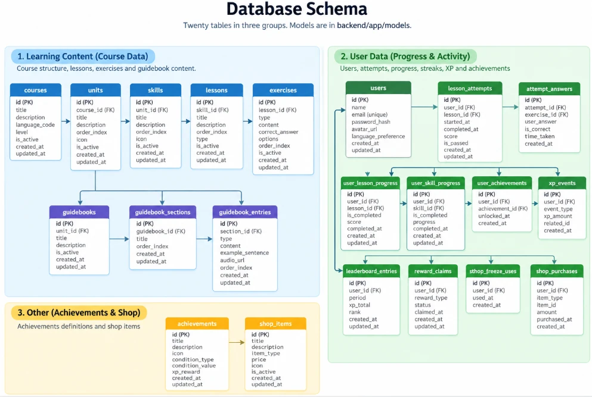

# Lingo — a Duolingo-style language-learning app


A full-stack, gamified language-learning web app built for an SDE assessment. It follows the
layout and interaction patterns of Duolingo's web app closely, on top of its own backend,
database schema and course content.

**Highlights**

- **Section 1 of a Spanish course, Units 1–10.** Each unit has its own colour, skill path,
  characters, treasure chest, trophy and guidebook.
- **Lesson player with five exercise types:** multiple choice, word bank (tap the words), match
  pairs, fill in the blank and type the answer.
- **Server-side gamification:** XP, hearts (with timed regeneration and gem refills), streak,
  gems, daily quests, unit chests, achievements, a weekly league and Legendary challenges.
- **Interactive header:** hover cards for courses, streak, XP, gems and hearts.
- **"Jump here":** any unit can be started from its fast-forward node.
- **Real accounts:** sign-up, login, signed sessions and protected routes.
- **Extras:** unit guidebooks with text-to-speech audio, sound effects, dark mode, and a
  responsive layout from 375px phones to desktop.

## Contents

1. [Tech stack](#tech-stack)
2. [Architecture](#architecture)
3. [Database schema](#database-schema)
4. [API overview](#api-overview)
5. [Setup](#setup)
6. [Testing](#testing)
7. [Assumptions and scope](#assumptions-and-scope)
8. [Artwork and audio](#artwork-and-audio)
9. [Documentation](#documentation)

## Tech stack

| Layer | Technology |
|---|---|
| Frontend | Next.js 16 (App Router), React 19, TypeScript (strict), Tailwind CSS v4, `motion` |
| Server state | TanStack Query (one hook per endpoint) |
| Lesson state | A pure reducer (state machine) in `lessonMachine.ts` |
| HTTP client | `openapi-fetch`, typed from the backend's OpenAPI document |
| Icons | `lucide-react`, plus image assets in `frontend/public/brand` |
| Backend | Python 3.11, FastAPI, Pydantic v2 |
| Database | SQLite through SQLAlchemy 2 (no Prisma, Drizzle or Node backend) |
| Auth | PBKDF2 password hashes, HMAC-signed bearer tokens |
| Tests | pytest (unit and integration), Playwright (desktop and phone) |
| Quality | ruff, mypy `--strict`, ESLint, `tsc --noEmit` |

The API contract is generated, not hand-written: FastAPI exports `openapi.json`, and
`npm run gen:api` turns it into `src/lib/api/schema.d.ts`. A request to an endpoint or field the
backend does not have fails the type check.

## Architecture



The full design, including how a lesson is started, checked and completed, is in
[docs/architecture.md](docs/architecture.md).

## Database schema



The models are in `backend/app/models`; the schema is described table by table in
[docs/architecture.md](docs/architecture.md).

## API overview

All routes are under `/api`. Everything except health and auth needs
`Authorization: Bearer <token>`. Interactive docs: http://localhost:8000/docs.

| Method | Path | Purpose |
|---|---|---|
| GET | `/health` | Liveness and database check |
| POST | `/auth/signup` | Create an account and sign in |
| POST | `/auth/login` | Sign in with email or username |
| POST | `/auth/logout` | Sign out |
| POST | `/auth/demo` | Sign in as the demo learner (only with `ENABLE_DEMO_LOGIN=true`) |
| GET | `/users/me` | Current learner with streak, XP, gems and hearts |
| PATCH | `/users/me` | Update preferences (daily goal) |
| GET | `/courses` | List courses |
| GET | `/courses/{course_id}` | Course detail |
| GET | `/courses/{course_id}/path` | Units and skills with the learner's status |
| GET | `/skills/{skill_id}` | A skill's lessons and their status |
| GET | `/units/{unit_id}/guidebook` | Unit guidebook |
| GET | `/lessons/{lesson_id}` | Exercises for play (no solutions) |
| POST | `/lessons/{lesson_id}/attempts` | Start or resume an attempt |
| POST | `/lessons/{lesson_id}/check` | Check one answer |
| POST | `/progress/lesson/{lesson_id}/complete` | Complete an attempt and receive rewards |
| GET | `/progress` | XP, daily goal, streak and course progress |
| GET | `/hearts` | Hearts and regeneration time |
| POST | `/hearts/refill` | Refill hearts with gems |
| GET | `/streak` | Streak with a month calendar |
| GET | `/leaderboard` | This week's league |
| GET | `/profile` | Profile, stats and achievements |
| GET | `/shop` | Shop items and gem balance |
| POST | `/shop/purchase` | Buy an item with gems |
| GET | `/quests` | Today's quests with progress |
| POST | `/quests/{code}/claim` | Claim a completed quest's reward |
| POST | `/units/{unit_id}/chest/claim` | Open a completed unit's chest |
| GET | `/feed` | Activity feed |

Errors share one shape: `{ "error": { "code", "message", "details" } }`, for example
`LESSON_LOCKED`, `OUT_OF_HEARTS` or `EMAIL_TAKEN`.

## Setup

**Requirements:** Python 3.11 and Node.js 20 or newer. Commands are for Windows; on macOS or
Linux use `.venv/bin/` in place of `.venv\Scripts\`.

**1. Backend** (from `backend/`)

```bash
py -3.11 -m venv .venv
```

```bash
.venv\Scripts\pip install -r requirements-dev.txt
```

```bash
copy .env.example .env
```

Seed the course, the demo learner and nine league rivals:

```bash
.venv\Scripts\python -m app.seed
```

```bash
.venv\Scripts\python -m uvicorn app.main:app --reload --port 8000
```

**2. Frontend** (from `frontend/`)

```bash
npm install
```

```bash
copy .env.example .env.local
```

```bash
npm run dev
```

Open http://localhost:3000.

**Environment variables**

| File | Variable | Default | Meaning |
|---|---|---|---|
| `backend/.env` | `DATABASE_URL` | `sqlite:///./data/app.db` | SQLAlchemy URL |
| | `CORS_ORIGINS` | `http://localhost:3000` | Allowed browser origins |
| | `APP_TIMEZONE` | `UTC` | Defines the learning day and week |
| | `SECRET_KEY` | development default | Signs sessions; required in production |
| | `SESSION_DAYS` | `30` | How long a login lasts |
| | `ENABLE_DEMO_LOGIN` | `false` | Enables the one-click `/demo` link |
| | `ENABLE_TEST_ROUTES` | `false` | Test-only reset route for Playwright |
| `frontend/.env.local` | `NEXT_PUBLIC_API_URL` | `http://localhost:8000` | Backend base URL |

**Signing in**

- **New account:** GET STARTED opens sign-up (email and a password of 8 or more characters).
- **Seeded learner with progress:** `alex@example.com` / `learn-spanish` (defined in
  `backend/app/seed/people.py`).

**Seed commands**

| Command | Effect |
|---|---|
| `python -m app.seed` | Create tables if needed and seed; keeps accounts and progress |
| `python -m app.seed --no-demo` | Same, without playing the demo learner's past lessons |
| `python -m app.seed --reset` | Drop everything and reseed. Deletes every account; saves a `.bak` copy of the database first |

After changing the API, refresh the contract from `backend/` and then `frontend/`:

```bash
.venv\Scripts\python -m scripts.export_openapi
```

```bash
npm run gen:api
```

## Testing

Backend (from `backend/`):

```bash
.venv\Scripts\python -m pytest
```

```bash
.venv\Scripts\ruff check app tests
```

```bash
.venv\Scripts\mypy
```

Frontend (from `frontend/`):

```bash
npm run typecheck
```

```bash
npm run lint
```

```bash
npm run test:e2e
```

Playwright starts its own API (port 8001, a separate `e2e.db`) and a production Next build (port
3100), and resets the database before every test.

## Assumptions and scope

- **One course.** Spanish for English speakers, Section 1, Units 1–10: 40 skills, 80 lessons and
  about 500 exercises. Every unit contains all five exercise types.
- **Accounts are real, not a single default learner.** Each learner's progress is stored per
  user. A seeded learner with progress exists so the app is usable immediately.
- **Simplified authentication.** No email verification, password reset or social login.
- **"Jump here" has no test-out exam.** It opens the unit's first lesson; passing or failing it
  changes nothing beyond normal lesson completion.
- **Match pairs is graded as a whole set** when CHECK is pressed, because the browser never
  holds the solution.
- **Audio is the browser's text-to-speech.** There is no speech recognition.
- **Placeholders, labelled as such in the UI:** Super subscription, friends and friend streaks,
  friend quests, extra courses (Math, English, German), XP Boost, Timer Boost, Daily Chest and
  practice reminders. There is no payment code.
- **Smaller than the reference.** Each unit has four skills and one chest; the reference
  screenshots show more nodes per unit.
- **SQLite** keeps the project runnable with no services to install. The SQLAlchemy models are
  not SQLite-specific.

## Artwork and audio

The code, database schema and course content are this project's own. Some characters, icons and
the three sound effects in `frontend/public/brand` and `frontend/public/sounds` were taken from
screenshots and recordings of the Duolingo product to match its look for this assessment. They
belong to Duolingo and are not licensed for redistribution, so this repository is for evaluation
only and should not be published or deployed publicly with those files in it.

## Documentation

- [docs/architecture.md](docs/architecture.md) — design, schema, API, decisions and trade-offs
- [docs/evaluation-checklist.md](docs/evaluation-checklist.md) — each criterion mapped to code and tests
- [docs/interview-notes.md](docs/interview-notes.md) — demo script and likely questions
