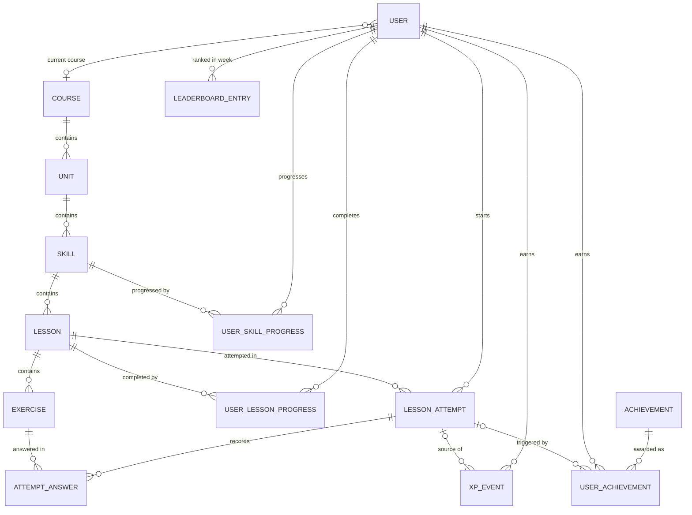

# Architecture — "Lingo" (Duolingo-inspired language-learning app)

> Status: **Phase 0 — design baseline.** Nothing here is implemented yet. This document is the
> contract that Phase 1+ implement against. When an implementation decision deviates from this
> document, update the document in the same change.

Contents

1. [System architecture](#1-system-architecture)
2. [Frontend architecture](#2-frontend-architecture)
3. [Backend architecture](#3-backend-architecture)
4. [Database architecture](#4-database-architecture)
5. [API architecture](#5-api-architecture)
6. [Exercise architecture](#6-exercise-architecture)
7. [Gamification rules](#7-gamification-rules)
8. [State management](#8-state-management)
9. [Testing strategy](#9-testing-strategy)
10. [Architectural decisions and trade-offs](#10-architectural-decisions-and-trade-offs)
11. [Design system](#11-design-system)
12. [Interview cheat-sheet](#12-interview-cheat-sheet)
13. [Known risks before Phase 1](#13-known-risks-before-phase-1)

---

## 1. System architecture

A single, explainable **modular monolith**: one Next.js frontend, one FastAPI backend, one SQLite file.

```
Browser
  │  (React UI, lesson reducer, TanStack Query cache)
  ▼
Next.js frontend (App Router, client-rendered feature pages)
  │  typed fetch client generated from OpenAPI
  ▼  REST / JSON  (http://localhost:8000/api/...)
FastAPI routers          ← HTTP only: parse, call one service, return schema
  ▼
Service layer            ← use-cases + transaction boundary ("complete a lesson")
  ▼
Domain layer             ← pure rules: hearts, streak, XP, unlocks, checkers (no DB, no HTTP)
  ▼
Repositories             ← named SQLAlchemy queries
  ▼
SQLAlchemy 2.0 ORM models
  ▼
SQLite (WAL, foreign_keys=ON)
```

### Core principles

| # | Rule | Why |
|---|------|-----|
| 1 | Route handlers are thin (≈5–10 lines). | HTTP concerns don't leak into rules; rules are testable without HTTP. |
| 2 | Business logic lives in services (orchestration) and domain (pure rules). | One place to read/test each rule. |
| 3 | SQLAlchemy models = persistence shape; Pydantic schemas = API contract. | The DB can be refactored without breaking clients and vice versa; solutions never leak by accident. |
| 4 | All frontend HTTP goes through one generated, typed client. | No ad-hoc `fetch` calls; contract drift becomes a compile error. |
| 5 | React UI components contain no business rules. | Components render props; rules live in reducers/hooks/backend. |
| 6 | Lesson interaction state ≠ server state. | Reducer for the moment-to-moment lesson; TanStack Query for cached server data. |
| 7 | The database is the source of truth for all persistent learner state. | The client never decides XP, hearts or unlocks; it displays what the server returns. |
| 8 | Time comes from an injected `Clock`. | Streak/daily/weekly/regeneration logic is deterministic in tests. |

### Authentication assumption

There is no login. A FastAPI dependency `get_current_user()` resolves the **default learner** (seeded
username from `DEFAULT_USERNAME`). Every route that needs a user depends on it, so swapping in real
auth later (session cookie / JWT) changes exactly one function.

---

## 2. Frontend architecture

### Stack

Next.js (App Router) · TypeScript (strict) · Tailwind CSS v4 · Framer Motion (`motion`) ·
TanStack Query v5 · `openapi-typescript` + `openapi-fetch` for the typed client.
Font: **Nunito** (Google Fonts, OFL) — rounded and friendly, an open alternative to proprietary fonts.

### Folder structure

```
frontend/
├── src/
│   ├── app/                         # ROUTING + PAGE COMPOSITION ONLY
│   │   ├── layout.tsx               # <html>, font, <Providers>
│   │   ├── providers.tsx            # QueryClientProvider, ToastProvider, MotionConfig
│   │   ├── globals.css              # Tailwind import + @theme design tokens
│   │   ├── page.tsx                 # redirect → /learn
│   │   ├── (main)/                  # route group: app shell (side nav / bottom nav)
│   │   │   ├── layout.tsx           # <AppShell>
│   │   │   ├── learn/page.tsx       # learning path
│   │   │   ├── leaderboard/page.tsx
│   │   │   └── profile/page.tsx
│   │   └── (lesson)/                # route group: full-screen, no nav
│   │       └── lesson/[lessonId]/page.tsx
│   ├── components/                  # REUSABLE, DOMAIN-AGNOSTIC UI
│   │   ├── ui/                      # Button, Card, Modal, Toast, Badge, ProgressRing, ProgressBar,
│   │   │                            # StatCard, IconButton, Skeleton, FeedbackBar, Tooltip
│   │   ├── icons/                   # original inline SVG icons (Heart, Flame, Gem, Bolt, Lock, Crown…)
│   │   └── layout/                  # AppShell, SideNav, BottomNav, TopStatsBar, RightRail
│   ├── features/                    # DOMAIN UI + BEHAVIOUR
│   │   ├── path/                    # LearningPath, UnitHeader, SkillNode, PathConnector,
│   │   │                            # SkillPopover, pathLayout.ts (zig-zag offsets)
│   │   ├── lesson/                  # LessonPlayer, LessonHeader, LessonFooter, LessonComplete,
│   │   │   │                        # OutOfHeartsModal, lessonReducer.ts, useLessonSession.ts
│   │   │   └── exercises/           # registry.ts, ExerciseRenderer.tsx, one folder per type
│   │   ├── stats/                   # StreakBadge, HeartsBadge, GemsBadge, DailyGoalCard
│   │   ├── leaderboard/             # LeaderboardTable, LeaderboardRow, WeekCountdown
│   │   └── profile/                 # ProfileHeader, StatsGrid, AchievementList
│   ├── hooks/
│   │   ├── api/                     # useCurrentUser, useCoursePath, useSkill, useLesson, useHearts,
│   │   │                            # useProgress, useProfile, useLeaderboard (queries)
│   │   │                            # useStartAttempt, useCheckAnswer, useCompleteLesson,
│   │   │                            # useRefillHearts (mutations)
│   │   └── useMediaQuery.ts, useKeyboardShortcut.ts, usePrefersReducedMotion.ts
│   ├── lib/
│   │   ├── api/
│   │   │   ├── schema.d.ts          # GENERATED from OpenAPI — never edited by hand
│   │   │   ├── client.ts            # openapi-fetch instance + error normalisation → ApiError
│   │   │   └── queryKeys.ts         # single query-key factory
│   │   ├── motion.ts                # shared animation variants/springs
│   │   └── cn.ts                    # className helper
│   ├── types/
│   │   └── api.ts                   # friendly aliases: type Lesson = components["schemas"]["LessonOut"]
│   └── styles/
│       └── tokens.css               # CSS custom properties consumed by @theme
├── e2e/                             # Playwright specs + fixtures
├── openapi.json                     # exported contract snapshot (committed)
├── playwright.config.ts
└── .env.example
```

**Rules of placement**

* `app/` files compose features; they never contain JSX longer than a screen or any business rule.
* `components/ui` never imports from `features/` or `hooks/api`.
* `features/*` may import `components/`, `hooks/`, `lib/`, `types/` — never another feature's internals
  (only its public `index.ts`).
* Only `lib/api/client.ts` knows the base URL; only `hooks/api/*` call the client.

### Rendering strategy

Pages are client components inside a server `layout.tsx`. Data is per-learner, highly interactive and
served by a separate origin, so SSR data fetching adds complexity (cookie forwarding, hydration of the
query cache) without a user-visible gain for this assessment. Skeletons cover first paint.

### OpenAPI → TypeScript flow

```
Pydantic schemas (backend/app/schemas)
      │ FastAPI builds
      ▼
OpenAPI 3.1 document  ── `python -m scripts.export_openapi` ──►  frontend/openapi.json (committed)
      │ `npm run gen:api` (openapi-typescript)
      ▼
src/lib/api/schema.d.ts (paths + components types)
      │ openapi-fetch: client.GET("/api/lessons/{lesson_id}", { params: { path: { lesson_id } } })
      ▼
hooks/api/* → features
```

* A backend change that renames a field breaks `tsc` in the frontend instead of breaking at runtime.
* Discriminated unions (`type: "multiple_choice" | ...`) become TS unions, so exercise rendering is
  exhaustively type-checked.
* Exporting to a file (not fetching from a running server) makes generation reproducible and lets a
  CI/pre-push step run `gen:api && git diff --exit-code` to detect drift.

### Responsive strategy (designed per breakpoint, not scaled)

| Width | Shell | Path | Lesson |
|-------|-------|------|--------|
| **< 768 (375 target)** | Top stats bar (flag, streak, gems, hearts) + fixed **bottom tab bar** | single column, zig-zag amplitude ×0.6, nodes 64px | full-height `100dvh`, sticky footer with `env(safe-area-inset-bottom)`, full-width CTA, tiles wrap, feedback sheet covers footer |
| **768–1023** | Icon-only **left rail** | centered column, full amplitude | content max-width 600px, footer CTA right-aligned |
| **≥ 1024 / 1280+** | Labelled **left sidebar** + **right rail** (stats, daily goal, leaderboard preview) | centered 600px column | same as tablet, keyboard shortcuts hinted (Enter, 1–9) |

Touch: every target ≥ 48×48px, no hover-only affordances, inputs use `font-size ≥ 16px` (prevents iOS
zoom), `touch-action: manipulation` on tiles to remove double-tap delay.

---

## 3. Backend architecture

### Folder structure

```
backend/
├── app/
│   ├── main.py                      # create_app(): routers, CORS, exception handlers
│   ├── core/
│   │   ├── config.py                # Settings (pydantic-settings) from env
│   │   ├── clock.py                 # Clock protocol, SystemClock, FixedClock, local-date helpers
│   │   └── errors.py                # AppError hierarchy + handlers → {"error": {...}}
│   ├── db/
│   │   ├── base.py                  # DeclarativeBase, naming convention for constraints
│   │   └── session.py               # engine (PRAGMA foreign_keys=ON, WAL), SessionLocal, get_db
│   ├── models/                      # SQLAlchemy ORM (persistence shape only)
│   │   ├── content.py               # Course, Unit, Skill, Lesson, Exercise
│   │   ├── user.py                  # User
│   │   ├── progress.py              # UserLessonProgress, UserSkillProgress, LessonAttempt, AttemptAnswer
│   │   └── gamification.py          # XpEvent, LeaderboardEntry, Achievement, UserAchievement
│   ├── schemas/                     # Pydantic API contracts (request/response)
│   │   ├── common.py                # ErrorResponse, HeartsOut, StreakOut
│   │   ├── user.py, course.py, skill.py, lesson.py, progress.py, leaderboard.py, profile.py
│   │   └── exercise.py              # PublicExercise union, Answer union (built from domain registry)
│   ├── api/
│   │   ├── deps.py                  # get_db, get_clock, get_current_user, service factories
│   │   └── routers/                 # health, users, courses, skills, lessons, progress,
│   │                                # hearts, leaderboard, profile, test_support
│   ├── services/                    # use-cases; own the transaction
│   │   ├── user_service.py
│   │   ├── course_service.py        # path assembly (content + learner status)
│   │   ├── lesson_service.py        # get lesson, start/resume attempt
│   │   ├── answer_service.py        # check answer (idempotent), heart deduction
│   │   ├── completion_service.py    # complete lesson (idempotent orchestration)
│   │   ├── hearts_service.py        # read with regeneration, refill
│   │   ├── xp_service.py            # the ONLY writer of XpEvent + LeaderboardEntry
│   │   ├── achievement_service.py
│   │   ├── leaderboard_service.py
│   │   └── profile_service.py
│   ├── domain/                      # PURE functions/values; no Session, no FastAPI
│   │   ├── rules.py                 # constants: MAX_HEARTS, XP values, costs…
│   │   ├── hearts.py                # regenerate(), deduct(), refill()
│   │   ├── streak.py                # advance_streak(), displayed_streak()
│   │   ├── xp.py                    # completion_award()
│   │   ├── unlocks.py               # skill/lesson status computation
│   │   ├── leaderboard.py           # week_start(), rank()
│   │   ├── achievements.py          # newly_earned(metrics, catalog)
│   │   ├── text.py                  # normalize()
│   │   └── exercises/
│   │       ├── base.py              # ExerciseChecker protocol, CheckResult
│   │       ├── registry.py          # type → checker
│   │       ├── multiple_choice.py, word_bank.py, match_pairs.py, fill_blank.py, type_answer.py
│   ├── repositories/                # named queries; return ORM objects / small dataclasses
│   │   ├── content_repo.py, user_repo.py, progress_repo.py, attempt_repo.py,
│   │   └── xp_repo.py, leaderboard_repo.py, achievement_repo.py
│   └── seed/
│       ├── data/spanish_course.json # course content (validated through checker schemas)
│       ├── data/users.json          # default learner + deterministic bot learners
│       └── run.py                   # `python -m app.seed [--reset]`
├── scripts/export_openapi.py
├── tests/
│   ├── conftest.py                  # in-memory engine, FixedClock, TestClient, seeded fixtures
│   ├── unit/                        # domain: checkers, text, streak, hearts, unlocks, leaderboard…
│   └── integration/                 # API-level: lesson loop, idempotency, unlocks, leaderboard…
├── pyproject.toml                   # deps + ruff + mypy + pytest config
└── .env.example
```

### Layer responsibilities

| Layer | Knows about | Must not know about | Example |
|-------|-------------|---------------------|---------|
| Router | FastAPI, schemas, a service | SQL, rules | `return service.check_answer(user, lesson_id, body)` |
| Schema | Pydantic | ORM | `CheckAnswerRequest`, `LessonOut` |
| Service | repositories, domain, Session, Clock | HTTP status codes (raises `AppError`s) | open transaction, load attempt, call checker, apply heart rule, persist |
| Domain | plain Python / Pydantic value objects | DB, HTTP, `datetime.now()` | `advance_streak(state, today) -> StreakState` |
| Repository | SQLAlchemy | rules | `attempt_repo.get_active(user_id, lesson_id)` |
| Model | SQLAlchemy | API shape | `class LessonAttempt(Base)` |

Example of the target thinness:

```python
@router.post("/lessons/{lesson_id}/check", response_model=CheckAnswerResponse)
def check_answer(
    lesson_id: int,
    body: CheckAnswerRequest,
    user: User = Depends(get_current_user),
    service: AnswerService = Depends(get_answer_service),
) -> CheckAnswerResponse:
    return service.check(user, lesson_id, body)
```

### Transactions and consistency

* `get_db` yields one `Session` per request. **Mutating service methods are the transaction boundary**:
  they do all reads/writes then `commit()` once; any exception → rollback in `get_db`.
* SQLite serialises writers. Mutating services begin with `BEGIN IMMEDIATE` (via
  `session.connection().exec_driver_sql` or engine event) so two concurrent completions cannot both
  read "not completed" and both award XP. Unique constraints are the second line of defence; an
  `IntegrityError` on an idempotency key is translated into "already done → return stored result".
* SQLite foreign keys are **off by default**: the engine sets `PRAGMA foreign_keys=ON` on every
  connection via a `connect` event listener. WAL mode for concurrent reads during writes.
* Schema is created with `Base.metadata.create_all()` and a seed command. Alembic is a documented
  future step (see §10).

### Error model

```json
{ "error": { "code": "LESSON_LOCKED", "message": "This lesson is locked.", "details": {"lesson_id": 12} } }
```

* `AppError(code, message, status, details)` subclasses live in `core/errors.py`
  (`NotFoundError`, `ConflictError`, `ForbiddenError`, `DomainValidationError`).
* Services raise them; one exception handler serialises them. Routers never build error JSON.
* `RequestValidationError` → `422 VALIDATION_ERROR` with Pydantic errors in `details.fields`.
* Unknown exceptions → `500 INTERNAL_ERROR` (message generic, stack trace only in logs).
* Every route declares `responses={...: {"model": ErrorResponse}}` so errors appear in OpenAPI and in
  the generated TS types.

### Clock / time abstraction

```python
class Clock(Protocol):
    def now(self) -> datetime: ...          # always timezone-aware UTC

class SystemClock:      now() -> datetime.now(UTC)
class FixedClock:       now() -> self._now ; advance(timedelta) ; set(datetime)   # tests only

def local_date(instant: datetime, tz: ZoneInfo) -> date     # "learning day"
```

* `get_clock()` is a FastAPI dependency; services receive the clock in their constructor.
  Tests override it with `app.dependency_overrides[get_clock] = lambda: fixed_clock`.
* Domain functions receive `today: date` / `now: datetime` as **arguments** — they never read a clock.
* `datetime.now()` / `date.today()` appear in exactly one place: `SystemClock`. A test greps for it.

**Timezone strategy (one rule, documented):**

* All timestamps are stored as **UTC** (`DateTime(timezone=True)`, normalised on write).
* Calendar concepts — *learning day* (streak, daily XP) and *learning week* (leaderboard) — are
  computed in a single configured **application timezone** `APP_TIMEZONE` (IANA name, default `UTC`).
* Computed local dates that are queried by day (`XpEvent.earned_on`, `User.last_activity_date`,
  `LeaderboardEntry.week_start`) are **stored at write time**, so changing the setting later does not
  rewrite history.
* Trade-off: a per-learner timezone column is the "real product" answer; with one demo learner it adds
  complexity without visible benefit. Adding it later = add `users.timezone`, pass it to `local_date`.

---

## 4. Database architecture

**Guiding principle: store facts, compute states.** A table either stores content, a learner fact
(something that happened), or a learner balance that can't be derived (hearts, gems). States like
"skill is available", "lesson is locked", "daily XP", "total XP", "rank" are computed. The two
deliberate exceptions (streak state, weekly leaderboard XP) are documented with how they stay consistent.

### Entity–relationship diagram



### Conventions

* Integer surrogate PKs (`id INTEGER PRIMARY KEY`), except `lesson_attempts.id` (UUID string, because
  the client holds it and it should not be enumerable).
* `created_at`/timestamps: `DateTime(timezone=True)`, UTC.
* SQLAlchemy `MetaData(naming_convention=...)` so constraints have stable names (`uq_lessons_skill_id_position`).
* Enumerations are stored as strings with a `CHECK` constraint (`Enum(..., native_enum=False, create_constraint=True)`).
* `position` columns are 1-based, unique within the parent, and define all ordering.
* **Content** cascades downward (`ON DELETE CASCADE`). **Learner rows** cascade from `users`.
  Learner rows referencing **content** use `ON DELETE RESTRICT`: deleting content that learners have
  progress on must be a deliberate migration, never an accident.

### Content tables

#### `courses` — a language course (one seeded: Spanish for English speakers)
| Column | Type | Null | Notes |
|---|---|---|---|
| id | INTEGER | PK | |
| slug | VARCHAR(64) | no | **UNIQUE** (`es-en`) |
| title | VARCHAR(120) | no | "Spanish" |
| learning_language | VARCHAR(8) | no | BCP-47 code `es` |
| from_language | VARCHAR(8) | no | `en` |
| description | TEXT | yes | |

Why: root of the content tree; lets the schema support more courses without change.

#### `units` — themed group of skills (rendered as a coloured banner on the path)
| Column | Type | Null | Notes |
|---|---|---|---|
| id | INTEGER | PK | |
| course_id | INTEGER | no | FK → courses.id **ON DELETE CASCADE** |
| position | INTEGER | no | CHECK ≥ 1 |
| title | VARCHAR(120) | no | "Unit 1" |
| description | VARCHAR(255) | yes | "Order food, describe people" |
| theme | VARCHAR(16) | no | design-token name: `green`, `purple`, `blue`… (no raw colours in DB) |

Constraints: **UNIQUE(course_id, position)** (also serves as the lookup index).

#### `skills` — a node on the learning path
| Column | Type | Null | Notes |
|---|---|---|---|
| id | INTEGER | PK | |
| unit_id | INTEGER | no | FK → units.id **CASCADE** |
| position | INTEGER | no | CHECK ≥ 1 |
| title | VARCHAR(120) | no | "Basics", "Food" |
| icon | VARCHAR(32) | no | key into frontend icon set |
| description | VARCHAR(255) | yes | |

Constraints: **UNIQUE(unit_id, position)**.
Prerequisites: the path is **linear** — skill *n* requires skill *n-1* in global order
(`unit.position, skill.position`). No prerequisite table (YAGNI); a `skill_prerequisites` join table is the
extension point if a branching tree is ever needed.

#### `lessons` — one playable session inside a skill
| Column | Type | Null | Notes |
|---|---|---|---|
| id | INTEGER | PK | |
| skill_id | INTEGER | no | FK → skills.id **CASCADE** |
| position | INTEGER | no | CHECK ≥ 1 |
| title | VARCHAR(120) | yes | |
| xp_reward | INTEGER | no | default 10, CHECK > 0 |

Constraints: **UNIQUE(skill_id, position)**.

#### `exercises` — one challenge inside a lesson (single polymorphic table)
| Column | Type | Null | Notes |
|---|---|---|---|
| id | INTEGER | PK | |
| lesson_id | INTEGER | no | FK → lessons.id **CASCADE** |
| position | INTEGER | no | CHECK ≥ 1 |
| type | VARCHAR(32) | no | CHECK IN (`multiple_choice`,`word_bank`,`match_pairs`,`fill_blank`,`type_answer`) |
| prompt | VARCHAR(255) | no | instruction shown above the exercise ("Translate this sentence") |
| content | JSON | no | **learner-visible** payload, shape defined by the type's `Content` model |
| solution | JSON | no | **server-only** payload, shape defined by the type's `Solution` model |
| explanation | TEXT | yes | optional tip shown in feedback |

Constraints: **UNIQUE(lesson_id, position)**.
Why JSON instead of a table per type: the five types share identity, ordering, prompt and lifecycle;
only their payloads differ. Payload integrity is enforced in code: the seed loader validates every row's
`content`/`solution` against the registered checker's Pydantic models, so malformed content fails at seed
time, not in front of a learner. Splitting `content` from `solution` makes "never send the solution" a
structural property: public schemas simply have no `solution` field.

### Learner tables

#### `users` — learner identity, preferences and non-derivable balances
| Column | Type | Null | Notes |
|---|---|---|---|
| id | INTEGER | PK | |
| username | VARCHAR(32) | no | **UNIQUE** |
| display_name | VARCHAR(64) | no | |
| avatar_color | VARCHAR(16) | no | design-token name for generated avatar |
| is_bot | BOOLEAN | no | default false; seeded leaderboard competitors |
| current_course_id | INTEGER | yes | FK → courses.id **ON DELETE SET NULL** |
| daily_goal_xp | INTEGER | no | default 20, CHECK IN (10, 20, 30, 50) |
| hearts | INTEGER | no | default 5, CHECK BETWEEN 0 AND 5 — stored count *as of* `hearts_updated_at` |
| hearts_updated_at | DATETIME | no | anchor for lazy regeneration |
| gems | INTEGER | no | default 0, CHECK ≥ 0 |
| current_streak | INTEGER | no | default 0, CHECK ≥ 0 — **materialised state**, see below |
| longest_streak | INTEGER | no | default 0, CHECK ≥ current_streak |
| last_activity_date | DATE | yes | learning day of last completed lesson |
| created_at | DATETIME | no | |

What is **not** on `users`: total XP, daily XP, weekly XP, lessons completed, unlocked skills — all derived.

*Why streak is stored (deliberate exception):* it could be derived from completed-attempt dates, but
`longest_streak` must be remembered anyway and the incremental rule ("same day: unchanged; yesterday:
+1; gap: reset") is the clearest thing to explain and test. Consistency: the three streak columns are
written **only** by `CompletionService` through the pure `advance_streak()` function, inside the
completion transaction. Staleness is handled at read time by `displayed_streak()` (a stored streak of 9
with `last_activity_date` three days ago displays as 0) — no nightly job.

#### `lesson_attempts` — a learner playing one lesson once (integrity anchor)
| Column | Type | Null | Notes |
|---|---|---|---|
| id | VARCHAR(36) | PK | UUID4, generated server-side |
| user_id | INTEGER | no | FK → users.id **CASCADE** |
| lesson_id | INTEGER | no | FK → lessons.id **RESTRICT** |
| status | VARCHAR(16) | no | CHECK IN (`in_progress`, `completed`, `abandoned`) |
| started_at | DATETIME | no | |
| completed_at | DATETIME | yes | set iff status = completed (CHECK) |

Indexes: `(user_id, lesson_id)`; **partial UNIQUE (user_id, lesson_id) WHERE status = 'in_progress'**
(SQLite partial index) → at most one active attempt per learner per lesson; "start" therefore resumes.
Mistake count, XP awarded and solved exercises are **derived** from `attempt_answers` / `xp_events`.

#### `attempt_answers` — every checked answer (audit + idempotency + resume)
| Column | Type | Null | Notes |
|---|---|---|---|
| id | INTEGER | PK | |
| attempt_id | VARCHAR(36) | no | FK → lesson_attempts.id **CASCADE** |
| exercise_id | INTEGER | no | FK → exercises.id **RESTRICT** |
| submission_id | VARCHAR(36) | no | client-generated UUID = idempotency key |
| answer | JSON | no | validated submitted payload |
| is_correct | BOOLEAN | no | |
| created_at | DATETIME | no | |

Constraints: **UNIQUE(attempt_id, submission_id)**; index `(attempt_id, exercise_id)`.
A retried request with the same `submission_id` returns the stored result and **does not deduct a heart again**.

#### `user_lesson_progress` — the fact "learner completed lesson X (first time at T)"
| Column | Type | Null | Notes |
|---|---|---|---|
| id | INTEGER | PK | |
| user_id | INTEGER | no | FK → users.id **CASCADE** |
| lesson_id | INTEGER | no | FK → lessons.id **RESTRICT** |
| first_attempt_id | VARCHAR(36) | no | FK → lesson_attempts.id (the attempt that earned completion XP) |
| completed_at | DATETIME | no | |

Constraints: **UNIQUE(user_id, lesson_id)** — this unique key *is* the "completion XP only once" guarantee.
Replays live in `lesson_attempts`; this row is never duplicated or updated.

#### `user_skill_progress` — skill-level milestones
| Column | Type | Null | Notes |
|---|---|---|---|
| id | INTEGER | PK | |
| user_id | INTEGER | no | FK → users.id **CASCADE** |
| skill_id | INTEGER | no | FK → skills.id **RESTRICT** |
| started_at | DATETIME | no | first lesson completion in this skill |
| completed_at | DATETIME | yes | when the last lesson of the skill was first completed |

Constraints: **UNIQUE(user_id, skill_id)**.
Why it exists although lesson counts are derivable: `completed_at` is a *milestone fact* that (a) unlocks
the next skill with an O(1) lookup and (b) stays true if content is later extended with extra lessons
(a learner who finished a skill shouldn't be re-locked). `lessons_completed / total_lessons` is computed
from `user_lesson_progress` at read time — not stored.

#### `xp_events` — append-only XP ledger (source of truth for all XP numbers)
| Column | Type | Null | Notes |
|---|---|---|---|
| id | INTEGER | PK | |
| user_id | INTEGER | no | FK → users.id **CASCADE** |
| lesson_attempt_id | VARCHAR(36) | yes | FK → lesson_attempts.id **CASCADE** (NULL for seeded bot history) |
| source | VARCHAR(24) | no | CHECK IN (`lesson_completion`, `perfect_bonus`, `seed`) |
| amount | INTEGER | no | CHECK > 0 |
| earned_at | DATETIME | no | UTC instant |
| earned_on | DATE | no | learning day in `APP_TIMEZONE` (stored at write time) |

Constraints: **UNIQUE(lesson_attempt_id, source)** (idempotency: an attempt can earn each XP source once);
index `(user_id, earned_on)`.
Derived from it: total XP (`SUM`), daily XP (`SUM WHERE earned_on = today`), 7-day chart (`GROUP BY earned_on`).

#### `leaderboard_entries` — weekly league standing (deliberate cache)
| Column | Type | Null | Notes |
|---|---|---|---|
| id | INTEGER | PK | |
| user_id | INTEGER | no | FK → users.id **CASCADE** |
| week_start | DATE | no | Monday of the learning week in `APP_TIMEZONE` |
| xp | INTEGER | no | CHECK ≥ 0 — cached `SUM(xp_events)` for that week |
| updated_at | DATETIME | no | time the learner reached the current `xp` (tie-breaker) |

Constraints: **UNIQUE(user_id, week_start)**; index `(week_start, xp DESC)`.
Why cached: the leaderboard is the one read that aggregates *all* users; a row per learner-week turns it
into an indexed scan and also represents "joined this week's league" (a learner appears once they earn
XP that week). Consistency: written **only** by `XpService.award()`, in the same transaction as the
`xp_events` insert (upsert `xp = xp + amount`). An integration test asserts
`entry.xp == SUM(xp_events in week)` after every scenario. Rank is never stored.

#### `achievements` — catalog (content)
| Column | Type | Null | Notes |
|---|---|---|---|
| id | INTEGER | PK | |
| code | VARCHAR(48) | no | **UNIQUE** (`first_lesson`) |
| title | VARCHAR(80) | no | |
| description | VARCHAR(255) | no | |
| icon | VARCHAR(32) | no | |
| metric | VARCHAR(24) | no | CHECK IN (`lessons_completed`,`total_xp`,`longest_streak`,`skills_completed`,`perfect_lessons`) |
| threshold | INTEGER | no | CHECK > 0 |

Constraints: **UNIQUE(metric, threshold)**.

#### `user_achievements` — the fact "learner earned achievement A"
| Column | Type | Null | Notes |
|---|---|---|---|
| id | INTEGER | PK | |
| user_id | INTEGER | no | FK → users.id **CASCADE** |
| achievement_id | INTEGER | no | FK → achievements.id **RESTRICT** |
| lesson_attempt_id | VARCHAR(36) | yes | FK → lesson_attempts.id **SET NULL** (which completion triggered it) |
| earned_at | DATETIME | no | |

Constraints: **UNIQUE(user_id, achievement_id)** → earned once, never revoked.
`lesson_attempt_id` lets a repeated (idempotent) completion call return the same "new achievements".

### Source-of-truth summary

| Concept | Source of truth | Derived how |
|---|---|---|
| Total XP | `xp_events` | `SUM(amount)` |
| Daily XP | `xp_events.earned_on` | `SUM WHERE earned_on = today` |
| Weekly XP | `xp_events` | cached in `leaderboard_entries` (same txn) |
| Lesson completed | `user_lesson_progress` row exists | — |
| Lesson available | — | skill available ∧ (position 1 ∨ previous lesson completed) |
| Skill progress | `user_lesson_progress` ⋈ `lessons` | `COUNT / total lessons` |
| Skill completed | `user_skill_progress.completed_at` | milestone written at completion |
| Skill available | — | first skill ∨ previous skill completed |
| Hearts | `users.hearts` + `hearts_updated_at` | lazy regeneration on read |
| Gems | `users.gems` | balance |
| Streak | `users.current_streak/longest/last_activity_date` | `displayed_streak()` at read |
| Achievements | `user_achievements` | evaluated after completion |
| Rank | — | `ORDER BY xp DESC, updated_at ASC, user_id ASC` |

---

## 5. API architecture

Base path `/api`. JSON only. All responses are Pydantic response models (never ORM objects).
Authorization assumption for every endpoint except `/health`: **the default learner** via `get_current_user`.
Common errors on every endpoint: `422 VALIDATION_ERROR`, `500 INTERNAL_ERROR`.

### Endpoint overview

| Method | Path | Purpose | Success |
|---|---|---|---|
| GET | `/api/health` | liveness + DB reachable | 200 |
| GET | `/api/users/me` | identity + top-bar stats | 200 |
| PATCH | `/api/users/me` | *(supporting)* change daily goal | 200 |
| GET | `/api/courses` | list courses | 200 |
| GET | `/api/courses/{course_id}` | course detail + learner summary | 200 |
| GET | `/api/courses/{course_id}/path` | units → skills with learner status | 200 |
| GET | `/api/skills/{skill_id}` | skill + lessons with status (path popover) | 200 |
| GET | `/api/lessons/{lesson_id}` | lesson + exercises **without solutions** | 200 |
| POST | `/api/lessons/{lesson_id}/attempts` | *(supporting)* start or resume an attempt | 201 / 200 |
| POST | `/api/lessons/{lesson_id}/check` | check one answer | 200 |
| POST | `/api/progress/lesson/{lesson_id}/complete` | complete attempt, award rewards (idempotent) | 200 |
| GET | `/api/progress` | XP/daily/streak/course progress summary | 200 |
| GET | `/api/hearts` | hearts with regeneration info | 200 |
| POST | `/api/hearts/refill` | spend gems to refill | 200 |
| GET | `/api/leaderboard` | current-week ranking | 200 |
| GET | `/api/profile` | profile, stats, achievements | 200 |
| POST | `/api/test/reset` | *(test-only, `ENABLE_TEST_ROUTES=true`)* reset + reseed DB | 204 |

### Shared shapes

```jsonc
// HeartsOut
{ "current": 4, "max": 5, "next_heart_at": "2026-10-06T14:30:00Z" /* null when full */,
  "regen_minutes": 30, "refill_cost_gems": 100 }

// StreakOut
{ "current": 6, "longest": 12, "active_today": true }

// DailyGoalOut
{ "goal_xp": 20, "earned_xp": 15, "met": false }
```

### Contracts

#### `GET /api/health`
200 `{ "status": "ok", "database": "ok" }` · 503 `SERVICE_UNAVAILABLE` if the DB query fails. No auth.

#### `GET /api/users/me`
200
```json
{ "id": 1, "username": "learner", "display_name": "Alex", "avatar_color": "blue",
  "current_course_id": 1, "total_xp": 230, "gems": 480,
  "hearts": { "...": "HeartsOut" }, "streak": { "...": "StreakOut" }, "daily_goal": { "...": "DailyGoalOut" } }
```
Errors: 404 `USER_NOT_FOUND` (default learner not seeded — tells the developer to run the seed).

#### `PATCH /api/users/me` *(supporting)*
Request `{ "daily_goal_xp": 30 }` (Literal[10,20,30,50]). 200 → same as `GET /users/me`.

#### `GET /api/courses`
200 `{ "courses": [{ "id": 1, "slug": "es-en", "title": "Spanish", "learning_language": "es", "from_language": "en" }] }`

#### `GET /api/courses/{course_id}`
200 `{ ...course, "unit_count": 2, "skill_count": 6, "lesson_count": 15, "completed_lesson_count": 4 }`
404 `COURSE_NOT_FOUND`.

#### `GET /api/courses/{course_id}/path`
200
```json
{
  "course": { "id": 1, "title": "Spanish" },
  "current_skill_id": 3,
  "units": [{
    "id": 1, "position": 1, "title": "Unit 1", "description": "Greet people", "theme": "green",
    "skills": [{
      "id": 3, "position": 3, "title": "Food", "icon": "apple",
      "status": "in_progress",               // locked | available | in_progress | completed
      "lessons_completed": 1, "total_lessons": 3, "progress": 0.33,
      "next_lesson_id": 9                    // null when locked; first lesson when completed (practice)
    }]
  }]
}
```
404 `COURSE_NOT_FOUND`. Built by `CourseService.get_path()` with **3 queries** (content tree, completed
lesson ids, skill progress rows) and the pure `domain.unlocks.compute_path_status()`. No N+1.

#### `GET /api/skills/{skill_id}`
200
```json
{ "id": 3, "title": "Food", "icon": "apple", "status": "in_progress", "unit_id": 1,
  "lessons": [{ "id": 8, "position": 1, "title": null, "xp_reward": 10, "exercise_count": 6,
                "status": "completed" /* locked | available | completed */ }] }
```
404 `SKILL_NOT_FOUND`. Locked skills are returned (popover shows "complete previous skill") — not 403.

#### `GET /api/lessons/{lesson_id}`
200
```json
{ "id": 9, "skill_id": 3, "title": null, "xp_reward": 10,
  "exercises": [
    { "id": 41, "position": 1, "type": "multiple_choice", "prompt": "Which one is \"the apple\"?",
      "content": { "options": [{ "id": "a", "text": "la manzana", "image": "apple" }, { "id": "b", "text": "el pan", "image": "bread" }] } },
    { "id": 42, "position": 2, "type": "word_bank", "prompt": "Translate this sentence",
      "content": { "source_text": "I eat bread", "tiles": [{ "id": "t1", "text": "Yo" }, { "id": "t2", "text": "como" }, { "id": "t3", "text": "pan" }, { "id": "t4", "text": "agua" }] } }
  ] }
```
`exercises[]` is a **discriminated union on `type`** of public models — they have no `solution` field.
403 `LESSON_LOCKED` · 404 `LESSON_NOT_FOUND`.

#### `POST /api/lessons/{lesson_id}/attempts` *(supporting — integrity anchor)*
Request: none. Creates an attempt, or **resumes** the active one (refresh-safe).
201 (new) / 200 (resumed)
```json
{ "attempt_id": "2b6f…", "lesson_id": 9, "status": "in_progress", "started_at": "…",
  "solved_exercise_ids": [41], "mistakes": 1, "hearts": { "...": "HeartsOut" } }
```
403 `LESSON_LOCKED` · 404 `LESSON_NOT_FOUND` · 409 `OUT_OF_HEARTS` (hearts = 0 after regeneration).

#### `POST /api/lessons/{lesson_id}/check`
Request
```json
{ "attempt_id": "2b6f…", "exercise_id": 42, "submission_id": "c1d3…uuid",
  "answer": { "type": "word_bank", "tile_ids": ["t1", "t2", "t3"] } }
```
`answer` is a discriminated union (`multiple_choice{option_id}`, `word_bank{tile_ids[]}`,
`match_pairs{pairs[{left_id,right_id}]}`, `fill_blank{text}`, `type_answer{text}`).
200
```json
{ "submission_id": "c1d3…", "exercise_id": 42, "is_correct": false,
  "correct_answer": "Yo como pan", "explanation": "…", "note": null,
  "hearts": { "...": "HeartsOut" },
  "attempt": { "solved_count": 1, "total_exercises": 6, "mistakes": 2, "can_complete": false } }
```
`note` carries soft feedback such as "Pay attention to accents: *está*" (accepted, but nudged).
Validation & errors:
* 404 `LESSON_NOT_FOUND` / `ATTEMPT_NOT_FOUND` (or attempt belongs to another user — same 404, no leak)
* 422 `ATTEMPT_LESSON_MISMATCH` — attempt is for a different lesson
* 422 `EXERCISE_NOT_IN_LESSON`
* 422 `ANSWER_TYPE_MISMATCH` — `answer.type ≠ exercise.type`
* 422 `INVALID_ANSWER` — references unknown option/tile ids, duplicate tile ids, etc.
* 409 `ATTEMPT_NOT_ACTIVE` — attempt completed/abandoned
* 409 `EXERCISE_ALREADY_SOLVED` — this exercise already has a correct answer in the attempt
* 409 `OUT_OF_HEARTS` — hearts are 0 (refill first)
* Same `submission_id` again → **200 with the stored result, no side effects** (idempotent retry).

#### `POST /api/progress/lesson/{lesson_id}/complete`
Request `{ "attempt_id": "2b6f…" }`
200
```json
{ "attempt_id": "2b6f…", "first_completion": true,
  "xp_awarded": 15, "xp_breakdown": [{ "source": "lesson_completion", "amount": 10 }, { "source": "perfect_bonus", "amount": 5 }],
  "gems_awarded": 5, "mistakes": 0, "accuracy": 1.0,
  "total_xp": 245, "daily_goal": { "goal_xp": 20, "earned_xp": 30, "met": true },
  "streak": { "current": 7, "longest": 12, "active_today": true, "extended": true },
  "skill": { "id": 3, "status": "completed", "lessons_completed": 3, "total_lessons": 3 },
  "next_lesson_id": 10, "unlocked_skill_id": 4,
  "new_achievements": [{ "code": "first_lesson", "title": "First Steps", "icon": "footprints" }],
  "hearts": { "...": "HeartsOut" }, "gems": 485 }
```
Idempotency: calling again with the same completed attempt returns **200 with an equivalent body**
(awards reconstructed from `xp_events` / `user_achievements` linked to the attempt; `extended:false`)
and changes nothing.
Errors: 404 `LESSON_NOT_FOUND`/`ATTEMPT_NOT_FOUND` · 422 `ATTEMPT_LESSON_MISMATCH` ·
409 `LESSON_NOT_FINISHED` (not every exercise has a correct answer; `details.unsolved_exercise_ids`) ·
409 `ATTEMPT_NOT_ACTIVE` (abandoned).
Why under `/progress` rather than `/lessons`: it mutates learner progress (XP, streak, unlocks) — the
`check` endpoint mutates only attempt state.

#### `GET /api/progress`
200
```json
{ "total_xp": 245, "daily_goal": { "...": "DailyGoalOut" }, "streak": { "...": "StreakOut" },
  "lessons_completed": 5, "skills_completed": 1,
  "courses": [{ "course_id": 1, "lessons_completed": 5, "total_lessons": 15, "progress": 0.33 }],
  "last_7_days": [{ "date": "2026-09-30", "xp": 0 }, { "date": "2026-10-06", "xp": 30 }] }
```

#### `GET /api/hearts`
200 `HeartsOut`. Regeneration is applied (and persisted) lazily.

#### `POST /api/hearts/refill`
Request: none. 200 `{ "hearts": HeartsOut, "gems": 380 }`
409 `HEARTS_FULL` · 409 `INSUFFICIENT_GEMS` (`details.required`, `details.available`).
Naturally idempotent: a double click's second request gets `HEARTS_FULL`, never a double charge.

#### `GET /api/leaderboard`
Query `?limit=30` (1–100).
200
```json
{ "week_start": "2026-10-05", "resets_at": "2026-10-12T00:00:00Z",
  "entries": [{ "rank": 1, "user_id": 7, "display_name": "Mia", "avatar_color": "pink", "xp": 410, "is_current_user": false }],
  "current_user": { "rank": 4, "xp": 245, "in_top": true } }
```
The current learner is always reported, with XP 0 and last rank if no entry exists this week.

#### `GET /api/profile`
200
```json
{ "user": { "username": "learner", "display_name": "Alex", "avatar_color": "blue", "joined_at": "…" },
  "stats": { "total_xp": 245, "current_streak": 7, "longest_streak": 12, "lessons_completed": 5,
             "skills_completed": 1, "weekly_xp": 245, "league_rank": 4 },
  "achievements": [{ "code": "first_lesson", "title": "First Steps", "description": "…", "icon": "…",
                     "earned_at": "…", "progress": 1, "threshold": 1 },
                   { "code": "xp_500", "earned_at": null, "progress": 245, "threshold": 500 }] }
```

---

## 6. Exercise architecture

### Backend: checker strategy registry

Each exercise type is **one module** that declares four Pydantic models and one pure function.

```python
# domain/exercises/base.py
@dataclass(frozen=True)
class CheckResult:
    is_correct: bool
    correct_answer: str | None      # human-readable solution for feedback
    note: str | None = None         # e.g. accent nudge

class ExerciseChecker(Protocol[C, S, A]):
    type: ClassVar[ExerciseType]
    content_model: type[C]          # learner-visible (goes to client)
    solution_model: type[S]         # server-only
    answer_model: type[A]           # request payload
    def validate_answer(self, content: C, answer: A) -> None: ...   # raises InvalidAnswer
    def check(self, content: C, solution: S, answer: A) -> CheckResult: ...
    def validate_definition(self, content: C, solution: S) -> None: ...  # seed-time consistency

# domain/exercises/registry.py
_REGISTRY: dict[ExerciseType, ExerciseChecker] = {}
def register(checker): _REGISTRY[checker.type] = checker; return checker
def get_checker(t: ExerciseType) -> ExerciseChecker: return _REGISTRY[t]
```

`AnswerService.check()` contains **no `if type == …`**: it loads the exercise, looks up the checker,
parses `content`/`solution` with the checker's models, calls `validate_answer` then `check`.
The API's `PublicExercise` and `Answer` unions are assembled from the registered models, so the OpenAPI
document (and therefore the generated TS types) lists every registered type automatically.

### Per-type rules

| Type | Public content | Solution (server) | Answer | Correct when |
|---|---|---|---|---|
| `multiple_choice` | `options[{id,text,image?}]`, optional `source_text` | `correct_option_id` | `{option_id}` | ids equal; unknown id → 422 |
| `word_bank` | `source_text`, `tiles[{id,text}]` incl. distractors | `accepted[]` (list of token sequences) | `{tile_ids[]}` (ordered) | tile ids → texts, normalised, sequence equals any accepted sequence. **Order matters.** Compared by **text not id**, so duplicate tokens ("the … the") are interchangeable. Duplicate/unknown tile ids → 422 |
| `match_pairs` | `left[{id,text}]`, `right[{id,text}]` (pre-shuffled) | `pairs{left_id: right_id}` | `{pairs[{left_id,right_id}]}` | submitted set == solution set exactly: each left once, each right once, no extras/missing |
| `fill_blank` | `before`, `after` (text around the blank), optional `options[]` | `accepted[]` | `{text}` | `normalize(text)` ∈ normalised accepted |
| `type_answer` | `source_text`, `source_language` | `accepted[]` | `{text}` | `normalize(text)` ∈ normalised accepted; if only an accent-insensitive match → correct with `note` |

### Text normalisation (`domain/text.py`)

1. Unicode **NFKC**; curly quotes/apostrophes → `'`; `¿ ¡` removed.
2. **casefold()** (case-insensitive).
3. Strip punctuation `. , ! ? ; : " ( )` (apostrophes inside words kept: `don't`).
4. Collapse whitespace, trim.
5. `strip_accents=True` variant (NFD + drop combining marks) used only for the lenient second pass.

Content authors list genuinely different valid translations in `accepted[]`; normalisation handles
cosmetic differences. Seeds are deterministic: option/tile shuffling happens at **authoring time**, not
per request, so E2E tests and screenshots are stable.

### Adding a new exercise type (e.g. `listen_select`)

1. Backend: add the enum value; create `domain/exercises/listen_select.py` with 3 models + checker,
   decorated `@register`. Add unit tests.
2. Regenerate OpenAPI + TS types (`npm run gen:api`).
3. Frontend: TypeScript now **fails to compile** until `exerciseRegistry` has a `listen_select` entry
   (mapped type over the union). Add the component + `isComplete`/`toAnswer`.
4. Add seed content. The lesson engine, reducer, services and routes are untouched.

### Frontend: exercise registry

```ts
type ExerciseType = PublicExercise["type"];                  // from generated types
type ExerciseOf<T extends ExerciseType> = Extract<PublicExercise, { type: T }>;
type AnswerOf<T extends ExerciseType>   = Extract<AnswerIn, { type: T }>;

interface ExerciseDefinition<T extends ExerciseType, Draft> {
  Component: React.FC<{ exercise: ExerciseOf<T>; draft: Draft | null;
                        onChange(d: Draft): void; disabled: boolean; feedback: Feedback | null }>;
  emptyDraft(): Draft | null;
  isComplete(draft: Draft | null, exercise: ExerciseOf<T>): boolean;   // enables "Check"
  toAnswer(draft: Draft): AnswerOf<T>;                                 // → API payload
}

export const exerciseRegistry: { [T in ExerciseType]: ExerciseDefinition<T, any> } = { ... };
```

`ExerciseRenderer` looks up the definition by `exercise.type` and renders it. Components own only their
own *presentation* state (e.g. which match card is highlighted); the *draft* answer lives in the reducer.

---

## 7. Gamification rules

All constants live in `backend/app/domain/rules.py` (not env vars — they are product rules, versioned with code).

| Constant | Value |
|---|---|
| `MAX_HEARTS` | 5 |
| `HEART_REGEN_MINUTES` | 30 (one heart per interval) |
| `HEART_REFILL_COST_GEMS` | 100 |
| `DEFAULT_LESSON_XP` | 10 (per-lesson `xp_reward`) |
| `PERFECT_LESSON_BONUS_XP` | 5 |
| `FIRST_COMPLETION_GEMS` | 5 |
| `DAILY_GOAL_OPTIONS` | 10, 20 (default), 30, 50 |
| Seeded learner | 5 hearts, 500 gems |

### Hearts
* Range 0–5 (DB `CHECK`). A **wrong** answer costs exactly 1; a correct answer costs nothing.
* A wrong answer is only accepted when hearts > 0 (after regeneration), so hearts never go negative.
* At 0 hearts: `check` and `attempts` (start) return `409 OUT_OF_HEARTS`. The attempt stays
  `in_progress`; after a refill or regeneration the learner continues exactly where they were.
* **Regeneration (lazy):** `regenerate(hearts, updated_at, now)`: if hearts < 5, gain
  `floor((now − updated_at) / 30 min)` hearts capped at 5; `updated_at` advances by the consumed whole
  intervals (partial progress kept), or to `now` when full. Applied on every read/write of hearts —
  no background job. `next_heart_at = updated_at + 30 min` when < 5.
* When hearts drop from 5 → 4, `updated_at = now` (regen clock starts at the first loss).
* **Refill:** costs 100 gems, sets hearts to 5. `HEARTS_FULL` if already 5; `INSUFFICIENT_GEMS` otherwise.
* Idempotent retry of a `check` (same `submission_id`) never deducts twice.

### XP
* Awarded **only** by `POST …/complete`, never by `check`.
* **First completion** of a lesson (no `user_lesson_progress` row yet): `lesson.xp_reward` (10)
  + `PERFECT_LESSON_BONUS_XP` (5) if the attempt has zero wrong answers. +5 gems.
* **Replay** of a completed lesson: **0 XP**, 0 gems (still counts toward the streak — see below).
* Each award is an `xp_events` row with `UNIQUE(lesson_attempt_id, source)`; combined with
  `UNIQUE(user_id, lesson_id)` on `user_lesson_progress` and the attempt status check, duplicate XP is
  impossible even under retries/races.

### Lesson completion
Preconditions (in order): attempt exists and belongs to the learner → attempt is for this lesson →
status: `completed` ⇒ return stored result (idempotent) / `abandoned` ⇒ 409 → **every exercise of the
lesson has ≥ 1 correct `attempt_answers` row** else `409 LESSON_NOT_FINISHED`.
Effects (one transaction): mark attempt completed → if first completion: insert
`user_lesson_progress`, award XP + gems, upsert `user_skill_progress` (`started_at`, and `completed_at`
when all lessons are now completed) → advance streak → evaluate achievements → commit.

### Lesson flow & mistakes
Exercises are served in `position` order. A wrongly answered exercise is **re-queued at the end** (client
side) and must eventually be answered correctly; completion requires all solved. Progress bar = solved / total.

### Streak
Learning day = `local_date(now, APP_TIMEZONE)`. Activity = **completing any lesson attempt** (first or replay).
```
advance_streak(current, longest, last_date, today):
    last_date == today       → unchanged
    last_date == today − 1   → current + 1
    otherwise (None or gap)  → 1
    longest = max(longest, current); last_date = today
displayed_streak(current, last_date, today):
    current if last_date in {today, today − 1} else 0
```
`active_today = last_date == today` (lit vs. unlit flame). No streak freezes (documented extension).

### Daily XP & daily goal
`daily_xp = SUM(xp_events.amount WHERE earned_on = today)`; `met = daily_xp ≥ daily_goal_xp`.
Resets implicitly at local midnight (it's a query, not a counter). Goal is user-editable (10/20/30/50).

### Skill & lesson unlocking
Global skill order = `(unit.position, skill.position)`.
* Skill status: `completed` if `user_skill_progress.completed_at` set; else `in_progress` if any of its
  lessons completed; else `available` if it is the first skill **or** the previous skill is completed;
  else `locked`.
* Lesson status within a non-locked skill: `completed` if completed; `available` if position 1 or the
  previous lesson is completed; else `locked`. Completed lessons are always replayable.
* Enforcement: `GET /lessons/{id}` and `POST /lessons/{id}/attempts` raise `403 LESSON_LOCKED` — the UI
  lock is cosmetic, the server is authoritative.
* Implemented once as pure functions in `domain/unlocks.py`, used by path, skill and lesson services.

### Achievements
Catalog rows `(metric, threshold)`. After each completion, `AchievementService` computes the learner's
metrics (`lessons_completed`, `total_xp`, `longest_streak`, `skills_completed`, `perfect_lessons`) and
inserts `user_achievements` for every catalog entry with `metric ≥ threshold` not yet earned. Earned
rows are never deleted. Seeded catalog: First Steps (1 lesson), Bookworm (10 lessons), Century (100 XP),
Scholar (500 XP), On Fire (3-day streak), Week Warrior (7-day streak), Flawless (1 perfect lesson),
Skill Master (1 skill).

### Leaderboard
* One weekly league of the learner + ~12 deterministic seeded bots (`is_bot = true`, fixed names, fixed
  seeded XP per weekday relative to the seed date).
* Week = ISO week, **Monday 00:00 → next Monday 00:00 in `APP_TIMEZONE`**; `week_start` stored per entry.
* **Rollover is lazy:** a new week simply has no rows yet; the first XP of the week creates the entry.
  Old weeks remain as history. No cron.
* Ranking: `xp DESC, updated_at ASC (reached it first), user_id ASC` → fully deterministic.
* Learner without an entry this week is shown with 0 XP at the bottom.

---

## 8. State management

Three kinds of state, three homes:

| Kind | Examples | Home |
|---|---|---|
| **Server state** (persistent, shared, cacheable) | user, path, skill, lesson content, hearts, progress, leaderboard, profile | **TanStack Query** |
| **Lesson session state** (ephemeral, interaction-driven, needs exact transitions) | queue, current exercise, draft answer, phase, feedback, mistakes | **`useReducer` state machine** (`lessonReducer.ts`) |
| **Presentation state** | popover open, selected match card, hover | component `useState` |

### TanStack Query

* Query keys from one factory: `qk.user()`, `qk.path(courseId)`, `qk.skill(id)`, `qk.lesson(id)`,
  `qk.hearts()`, `qk.progress()`, `qk.leaderboard()`, `qk.profile()`.
* `staleTime` 30s default; lesson content `Infinity` (immutable during a session).
* Mutations: `useStartAttempt`, `useCheckAnswer`, `useCompleteLesson`, `useRefillHearts`.
  * `check` → `setQueryData(qk.hearts(), res.hearts)` (no refetch needed).
  * `complete` → `setQueryData` for hearts, then `invalidateQueries` for user, path, progress,
    leaderboard, profile, skill.
* No optimistic XP/heart updates: the server decides, the UI animates the server's answer
  (latency is small; correctness and explainability win).
* `retry`: queries 1, mutations 0 — except `check`, which is safe to retry because of `submission_id`.

### Lesson reducer (state machine)

```
            ATTEMPT_READY                ANSWER_CHANGED (loops)
 loading ──────────────► answering ◄──────────────┐
    │                       │ CHECK_REQUESTED      │
    │ LOAD_FAILED           ▼                      │
    ▼                    checking ── CHECK_FAILED ─┤ (toast, back to answering)
  error                     │ CHECK_SUCCEEDED      │
                            ▼                      │
                        feedback ── CONTINUE ──────┘ (queue not empty; wrong ⇒ re-queue)
                            │ CONTINUE (queue empty)
                            ▼
                       completing ── COMPLETE_FAILED ─► error (retry → completing)
                            │ COMPLETE_SUCCEEDED
                            ▼
                         complete

 any answering/checking + OUT_OF_HEARTS ─► out_of_hearts ── HEARTS_REFILLED ─► answering
```

```ts
type LessonState = {
  phase: "loading" | "answering" | "checking" | "feedback" | "out_of_hearts"
       | "completing" | "complete" | "error";
  attemptId: string | null;
  exercises: Record<number, PublicExercise>;
  queue: number[];                 // exercise ids, head = current
  solvedIds: number[];
  totalExercises: number;
  draft: unknown | null;           // shape owned by the exercise definition
  submissionId: string | null;     // generated on CHECK_REQUESTED, reused on retry
  feedback: { isCorrect: boolean; correctAnswer: string | null; note: string | null; explanation: string | null } | null;
  mistakes: number;
  hearts: HeartsOut;
  result: CompleteLessonResponse | null;
  error: ApiErrorShape | null;
};
```

* The reducer is **pure** (no fetch); `useLessonSession(lessonId)` wires mutations to dispatches.
* Refresh during a lesson: `POST /attempts` resumes; `solved_exercise_ids` rebuilds the queue
  (unsolved exercises in position order). Draft answers are intentionally not persisted.
* Completion triggers automatically when the queue empties after `CONTINUE`.
* Exit (✕) asks for confirmation ("Quit lesson? You can pick up where you left off."). The attempt
  stays `in_progress` server-side and is resumed by the next `POST /attempts`.

---

## 9. Testing strategy

Tests map to evaluation criteria (see `evaluation-checklist.md`).

### Backend — pytest

Infrastructure (`tests/conftest.py`):
* `engine`: in-memory SQLite with `StaticPool` + `PRAGMA foreign_keys=ON` (same listener as prod).
* `clock`: `FixedClock(2026-10-07T10:00Z)` overriding `get_clock`.
* `seeded_db`: runs the **real seed** (proves seed validity) or a tiny deterministic fixture course.
* `client`: FastAPI `TestClient` with dependency overrides.
* Helpers: `play_lesson(client, lesson_id, wrong=…)` that answers via the seed's solutions.

**Unit (pure domain, fast, table-driven with `pytest.mark.parametrize`):**
| Area | Cases |
|---|---|
| `text.normalize` | case, punctuation, `¿¡`, whitespace, curly apostrophes, accent-lenient pass |
| each checker | correct, incorrect, alternative accepted answers, word order matters, duplicate tokens, distractor tiles, duplicate/unknown ids → InvalidAnswer, partial/extra/duplicate match pairs |
| `hearts` | deduct 1, never < 0, regen 0/1/partial/many intervals, cap at 5, `next_heart_at`, refill |
| `streak` | first ever, same day, next day, 2-day gap, longest update, displayed decay, timezone boundary (23:30 vs 00:30 local) |
| `xp` | first completion, perfect bonus, replay = 0 |
| `unlocks` | first skill available, sequential unlock, unit boundary, lesson order inside skill, completed replayable |
| `leaderboard` | `week_start` on Sunday/Monday boundary, tie-breaks |
| `achievements` | threshold crossing, already-earned not re-awarded |
| registry | every `ExerciseType` has a checker; every seeded exercise validates |

**Integration (HTTP through TestClient, real DB):**
| Area | Cases |
|---|---|
| DB/seed | tables created, FK enforcement on, seed idempotent with `--reset`, constraint violations rejected |
| users/path | `/users/me`, `/courses/{id}/path` statuses for fresh learner |
| lesson | `GET /lessons` contains **no `solution` key anywhere** (recursive assertion); locked → 403 |
| check | correct/incorrect, heart loss, same `submission_id` twice → one heart lost, type mismatch 422, foreign exercise 422, at 0 hearts → 409 |
| complete | before all solved → 409; success awards XP once; **second call → same body, XP unchanged**; replay attempt → 0 XP but streak counted |
| progression | finishing last lesson completes skill and unlocks next skill & its first lesson |
| streak/daily | advance `FixedClock` across days: +1, gap reset, daily XP resets at midnight |
| hearts | regen after 30/60 min, refill success/full/insufficient gems |
| leaderboard | ordering, current user included, week rollover via clock, `entry.xp == SUM(events)` |
| profile/achievements | earned after first lesson, not duplicated |
| errors | every error matches `{"error":{code,message,details}}` |
| architecture guard | no `datetime.now(`/`date.today(` outside `core/clock.py` (grep test) |

Tooling: `ruff` (lint+format), `mypy --strict` on `app/`, `pytest --cov=app` (target ≥ 85% on `domain/` + `services/`).

### Frontend / E2E — Playwright

* `playwright.config.ts` `webServer` starts the backend (`ENABLE_TEST_ROUTES=true`, fresh SQLite file)
  and `next dev`/`next start`. Each spec calls `POST /api/test/reset` in `beforeEach` → isolated state.
* Answers come from the seed JSON (imported by the test), so tests never hard-code UI guesses.
* Selectors: roles and accessible names first (`getByRole('button', { name: 'Check' })`), `data-testid`
  only for non-semantic things (path nodes, heart counter).
* Projects: `desktop-chromium` (1280×800) and `mobile` (iPhone 13 / 390px) for the core loop.

Specs:
1. **core-loop**: Learn → first skill → Start → multiple_choice correct → word_bank wrong (heart 5→4,
   red feedback, correct answer shown) → … every exercise type → lesson complete screen (XP shown) →
   back to path: skill progress updated, top-bar XP updated → Profile shows XP/achievement →
   Leaderboard shows learner with new XP.
2. **locked-skill**: clicking a locked node shows locked popover, no Start; direct URL to locked lesson shows locked state.
3. **zero-hearts**: answer wrong 5× → out-of-hearts modal → refill with gems → continue.
4. **duplicate-completion**: replay a completed lesson → "0 XP / practice" result, total XP unchanged.
5. **refresh-during-lesson**: solve 2 exercises, reload → resumes at exercise 3 with progress bar intact.
6. **api-error**: `page.route` makes `/check` return 500 → error toast, answer preserved, retry works.
7. **responsive smoke**: mobile project — bottom nav visible, lesson footer CTA reachable, no horizontal scroll.

*(Recommended addition, low cost: Vitest for `lessonReducer` and `exerciseRegistry.isComplete` — pure
functions with many transitions are cheaper to cover as unit tests than through a browser.)*

---

## 10. Architectural decisions and trade-offs

| # | Decision | Alternatives | Why / trade-off |
|---|---|---|---|
| D1 | Modular monolith (Next.js + FastAPI + SQLite) | microservices, BaaS | Smallest thing that shows clean layering; trivially runnable by the evaluator. |
| D2 | SQLite | Postgres | Zero setup, file-based, real SQL with FKs, CHECKs, partial indexes. Trade-off: single writer (fine for one learner; mitigated with `BEGIN IMMEDIATE`). Swap = change `DATABASE_URL` + driver, since SQLAlchemy abstracts it. |
| D3 | SQLAlchemy 2.0 typed ORM (`Mapped[...]`) | raw SQL, SQLModel | Typed models, relationship mapping, portable SQL; SQLModel blurs model/schema separation that we want explicit. |
| D4 | Separate Pydantic schemas | return ORM objects | Contract stability, no accidental field leaks (solutions!), drives OpenAPI. Cost: some mapping code. |
| D5 | Service + pure domain + repository layers | fat routers | Rules are unit-testable without DB/HTTP; routers trivially readable. Cost: more files — kept proportionate (no generic repository base class, no DI container). |
| D6 | `create_all` + seed, no Alembic in v1 | Alembic from day 1 | Fewer moving parts for a fresh-DB demo. Trade-off acknowledged: any schema change = reseed. Alembic is the first thing to add for real deployment. |
| D7 | Single polymorphic `exercises` table with `content`/`solution` JSON | table per type, EAV | One lesson engine; types extensible without migrations; content vs. solution split prevents leaks. Trade-off: JSON shape not enforced by DB → enforced by Pydantic at seed and read. |
| D8 | Checker strategy registry | if/elif chain | Open/closed: new type = new module; each checker unit-tested alone. |
| D9 | `LessonAttempt` + `AttemptAnswer` | trust client `/complete` | Server can prove every exercise was solved in a real attempt; enables resume, audit and idempotent retries. Lightweight: 2 tables, no tokens/signatures. |
| D10 | Client `submission_id` idempotency key | none / server dedupe by time | Exactly-once heart deduction under retries with one unique constraint. |
| D11 | XP ledger (`xp_events`) | `users.total_xp` counter | Daily/weekly/total XP are all queries over facts; idempotency via unique key; auditable. Cost: SUM queries (indexed, tiny data). |
| D12 | Cached `leaderboard_entries.xp` and stored streak | fully derived | Explicit, documented exceptions with a single writer + same transaction + reconciliation test. |
| D13 | Lazy heart regeneration & lazy week rollover | cron/background jobs | No scheduler in a monolith demo; deterministic with Clock; correct whenever observed. |
| D14 | Injected `Clock`, single `APP_TIMEZONE` | `datetime.now()` everywhere, per-user tz | Deterministic tests; one rule to explain. Per-user tz is a column away. |
| D15 | TanStack Query for server state; reducer for lesson | Redux/Zustand for everything | Caching/invalidation solved by the library; lesson flow is a state machine that should be pure and local. No global store needed. |
| D16 | OpenAPI → generated TS types + `openapi-fetch` | hand-written types, tRPC, GraphQL | Backend is the single source of contract truth; drift = compile error. |
| D17 | Server authoritative, no optimistic gamification | optimistic UI | Hearts/XP correctness > ~100 ms latency; UI still animates instantly on response. |
| D18 | Linear skill unlocks (order-based) | prerequisite graph | Matches the product's path; graph is an additive table later. |
| D19 | Replay = 0 XP (counts for streak) | small practice XP | Literal "no duplicate completion XP" rule; one constant to change if practice XP is wanted. |
| D20 | `match_pairs` submitted as a full set | per-tap server checks | Keeps "solutions never leave the server" uniform; trade-off: no instant per-pair red flash (see risks). |

---

## 11. Design system

Original tokens inspired by the playful, tactile language of modern language apps — **not** copied
brand values. Defined once as CSS variables in `styles/tokens.css`, exposed to Tailwind v4 via `@theme`;
features use tokens/primitives only (lint rule: no arbitrary hex colours in `features/`).

### Colour tokens

| Token | Base (500) | Shadow / pressed (600) | Tint (100) | Use |
|---|---|---|---|---|
| `leaf` (primary) | `#5BC51A` | `#45A00F` | `#E6F8D8` | primary CTA, correct, completed |
| `cherry` (danger) | `#F2484C` | `#C93338` | `#FFE3E3` | hearts, wrong answers |
| `sun` (reward) | `#FFC320` | `#DB9C00` | `#FFF4CC` | XP, crowns, gold completed nodes |
| `sky` (info) | `#22AEEF` | `#1789C2` | `#DDF3FD` | secondary actions, selection, gems |
| `grape` (accent) | `#B06AF0` | `#8A48C9` | `#F1E4FD` | unit themes, achievements |
| `ember` (streak) | `#FF9324` | `#E0700A` | `#FFEAD1` | streak flame |
| `ink` | `#33424A` | — | — | primary text |
| `slate` | `#7F8F98` | — | — | secondary text |
| `cloud` | `#E2E8EC` | `#C9D2D8` | — | borders, disabled, locked nodes |
| `canvas` | `#FFFFFF` | — | `#F6F8F9` | backgrounds |

Contrast: text on coloured buttons is white bold ≥ 15px (meets WCAG AA large text); body text `ink` on white ≈ 10:1.

### Shape, type, depth, motion

* **Radius:** `sm 10px` · `md 14px` (buttons, tiles) · `lg 18px` (cards) · `xl 24px` (modals) · `full` (nodes, pills).
* **Border:** 2px `cloud` on cards/tiles; selected tile = `sky` border + `sky-100` fill.
* **Depth ("3D"):** solid offset shadow, no blur: `box-shadow: 0 4px 0 var(--btn-shadow)`;
  path nodes `0 6px 0`. Cards use `0 2px 0 cloud`.
* **Type:** Nunito 600/700/800/900. Scale: 13 / 15 / 17 / 20 / 24 / 32. Buttons uppercase 15px/800 tracking-wide.
* **Spacing:** 4px grid; tap targets ≥ 48px.
* **Motion** (`lib/motion.ts`): spring `stiffness 500, damping 30` for presses; feedback sheet
  slide-up `y: 100% → 0`; wrong answer shake `x: [0,-8,8,-6,6,0]` 350ms; heart loss: scale-pop + crack;
  progress bar width spring; XP count-up on completion; current path node gentle bob + "START" bubble;
  completion confetti built from original SVG particles. `prefers-reduced-motion` → fades only.

### Button states

| State | Visual |
|---|---|
| default | colour 500, `0 4px 0` shadow 600 |
| hover (pointer only) | `brightness(1.05)`, `translateY(-1px)`, shadow `0 5px 0` |
| active | `translateY(4px)`, shadow `0 0 0` (physically pressed) |
| disabled | `cloud` bg, `slate` text, no shadow, `cursor-not-allowed` |
| focus-visible | 3px `sky` outline offset 2px |

Variants: `primary` (leaf), `secondary` (sky), `danger` (cherry), `reward` (sun), `ghost` (white, cloud border + shadow), `locked`.
Sizes: `md` (48px), `lg` (56px, lesson CTA).

### Primitives (`components/ui`)

| Primitive | Responsibility |
|---|---|
| `Button` | variants/sizes above, `loading` spinner, full-width option, `asChild`-like `href` support |
| `IconButton` | square/round tactile icon action with required `aria-label` |
| `Card` | rounded, bordered, optional `interactive` (tactile hover/press) |
| `Modal` | focus-trapped dialog, spring scale-in, ESC/overlay close, mobile = bottom sheet |
| `Toast` | provider + `useToast()`; info/success/error; auto-dismiss |
| `Badge` | pill with icon + value (streak, gems, hearts, XP) |
| `ProgressRing` | SVG ring, animated `strokeDashoffset`, children in centre (path nodes) |
| `ProgressBar` | rounded thick bar with highlight stripe (lesson header, daily goal) |
| `StatCard` | icon + big number + label (profile, completion screen) |
| `Skeleton` | shimmer placeholders matching card/node shapes |
| `FeedbackBar` | full-width bottom sheet: correct (leaf tint, check icon) / incorrect (cherry tint, solution text) + CTA |
| `Tooltip/Popover` | path skill popover with arrow |

### Learning path UX

* Vertical column; nodes offset horizontally in a smooth zig-zag (`[0, 1, 2, 1, 0, −1, −2, −1] × 45px`,
  ×0.6 on mobile) computed in `pathLayout.ts` (pure, tested).
* **Unit header**: full-width rounded banner in the unit's theme colour with "UNIT n" + description.
* **Connectors**: soft dotted SVG curve between consecutive nodes; solid/coloured once the source node is completed.
* **Skill node** (72px round, tactile) by status:
  * `locked` — cloud grey, lock icon, no ring, popover: "Complete all levels above to unlock this!"
  * `available` — theme colour, skill icon, bouncing **START** bubble if it's the current skill
  * `in_progress` — theme colour + **ProgressRing** (lessons_completed/total) + "n/m" label
  * `completed` — sun gold with crown/check, ring full; popover offers "Practice +0 XP"
* **Popover** (click/tap): title, "Lesson n of m", progress, CTA "Start +10 XP" / "Practice" / locked text.
* On load, scroll the current node into view. Keyboard: nodes are buttons in tab order.

### Lesson UX

```
┌─────────────────────────────────────────────┐
│ ✕   [██████████░░░░░░░░░░░]       ♥ 4        │  header: exit, spring progress bar, hearts
│                                             │
│   Translate this sentence                   │  prompt (h1, 24px, 800)
│   [exercise component]                      │  center: max-w 600
│                                             │
├─────────────────────────────────────────────┤
│ (Skip)                        [  CHECK  ]   │  footer: disabled until isComplete(draft)
└─────────────────────────────────────────────┘
After check → FeedbackBar slides up and replaces the footer:
  correct:  leaf tint · ✓ "Nicely done!" · [CONTINUE] (leaf)
  wrong:    cherry tint · ✕ "Correct solution:" + answer + explanation · [GOT IT] (cherry)
            + header heart pops and count animates 5 → 4; exercise shakes
```
Completion screen: celebratory illustration (original SVG), "Lesson complete!", three StatCards
(Total XP, Accuracy, Streak) counting up, newly earned achievements, CTA "Continue" → `/learn`.
Out-of-hearts: modal with broken-heart illustration, "Refill (100 gems)" and "Quit lesson".
Keyboard: Enter = Check/Continue, 1–9 select options/tiles.

---

## 12. Interview cheat-sheet

1. **Why SQLite?** Zero-setup, real relational guarantees (FKs, CHECK, partial unique indexes), single
   file the evaluator can inspect. Weakness: one writer at a time — irrelevant for one learner, handled
   with `BEGIN IMMEDIATE`. Swapping to Postgres is a URL change thanks to SQLAlchemy.
2. **Why SQLAlchemy + separate Pydantic schemas?** Models describe storage; schemas describe the
   contract. The lesson response *cannot* leak a solution because the schema has no such field.
3. **Why a service layer + pure domain?** Routers handle HTTP, services orchestrate a use-case in one
   transaction, domain functions hold rules as pure functions → most tests need no DB at all.
4. **How is duplicate XP prevented?** Three layers: attempt status (completed attempts return the
   stored result), `UNIQUE(user_id, lesson_id)` on lesson progress, `UNIQUE(attempt_id, source)` on the
   XP ledger — inside one `BEGIN IMMEDIATE` transaction.
5. **Why can't a client just call `/complete`?** Completion requires a server-created attempt in which
   every exercise of that lesson has a server-checked correct answer.
6. **How is a retried answer prevented from costing two hearts?** Client sends a `submission_id`; it's
   unique per attempt; a retry returns the stored result.
7. **Why one exercise table with JSON?** Shared lifecycle, polymorphic payloads; content/solution split;
   Pydantic validates payloads at seed time.
8. **How does answer validation work / how to add a type?** Registry of checker strategies keyed by
   type; normalisation helper; adding a type = one backend module + one frontend component; TS
   exhaustiveness forces the frontend to register it.
9. **How is the streak calculated?** Incremental rule on lesson completion (same day / yesterday / gap)
   with local learning day from the injected clock; display decays at read time — no cron.
10. **How do hearts regenerate without a job?** Store count + anchor timestamp; compute elapsed whole
    intervals when read; persist the normalised value.
11. **How does unlocking work?** Pure function over global skill order + completed set; server enforces
    with 403, UI only reflects it.
12. **Why TanStack Query *and* a reducer?** Different problems: cache/invalidate server data vs.
    deterministic multi-step interaction. Mixing them makes the lesson flow hard to reason about.
13. **Why generate TS types from OpenAPI?** One source of truth; renamed fields fail at compile time.
14. **Why a Clock abstraction?** Every time-dependent rule (streak, daily XP, regen, week) is tested by
    moving a fixed clock, not by sleeping or mocking `datetime`.
15. **What's derived vs stored?** Store facts (completions, answers, XP events, balances); compute
    states (unlocks, totals, rank). Two caches (streak, weekly XP) with one writer each and a reconciliation test.

---

## 13. Known risks before Phase 1

| Risk | Impact | Mitigation |
|---|---|---|
| Project folder is not a git repository yet | No safety net for Phase 1 changes | User runs `git init` before Phase 1 (assistant won't commit). |
| Path contains spaces (`Duolingo Web App`) | Quoting issues in npm scripts / Playwright `webServer` commands on Windows | Quote paths; prefer relative `cwd` options; verify early in Phase 1. |
| Library version drift (Next.js 15→16, Tailwind v4 CSS-first config, `framer-motion` → `motion`) | Docs/snippets mismatch | Pin exact versions in Phase 1; note them here. |
| SQLite FK enforcement is opt-in | Silent orphan rows | Connect-event `PRAGMA foreign_keys=ON` + a test asserting it's on. |
| Bots' leaderboard XP is seeded relative to the seed date | After a week rollover bots show 0 XP | Document `python -m app.seed --reset`; Phase 2 option: bots' weekly XP generated deterministically per week on first leaderboard read. |
| Replay = 0 XP may feel unrewarding / conflict with evaluator expectation | UX/criteria ambiguity | Single constant; decision D19 documented — confirm with user. |
| `match_pairs` lacks per-tap instant feedback | Less faithful UX | Show local "selected/paired" animations; full-set check on submit. Alternative (if desired): treat pairs as non-secret and verify locally, still re-checked server-side. |
| Seed content volume (all 5 types across ~15 lessons) is real work | Thin demo | Author content JSON early in Phase 1 with validation tests. |
| Generated types require exporting OpenAPI after backend changes | Stale types | `npm run gen:api` script + drift check in test script. |
| No audio/TTS | Less faithful to the product | Optional later: Web Speech API "speaker" button (no assets needed). |
| Frontend unit tests not in stated stack | Reducer bugs found late via E2E | Recommend adding Vitest (tiny) — needs user approval. |
| Accessibility of tactile/animated UI | UX criterion | Roles/labels from the start, focus-visible styles, reduced-motion support. |
| Abandoned in-progress attempts accumulate | Minor clutter | One active per lesson (partial unique index); harmless. |
