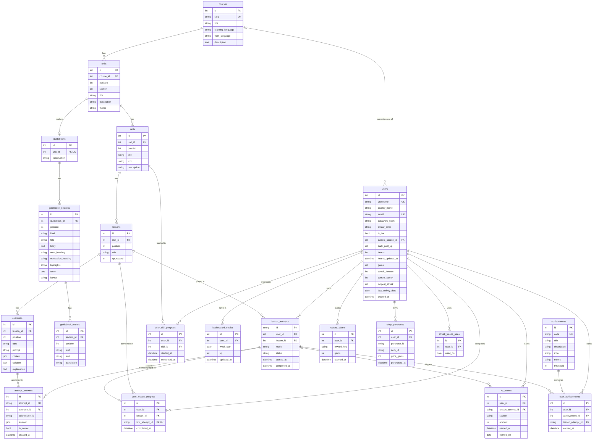

# Architecture — "Lingo" (Duolingo-inspired language-learning app)

> Status: **Phase 3 — full lesson loop implemented** (backend + frontend). §14–§16 list where
> implementation refined the Phase 0 design; §16 documents the lesson engine.

Contents

1. [System architecture](#1-system-architecture)
2. [Frontend architecture](#2-frontend-architecture)
3. [Backend architecture](#3-backend-architecture)
4. [Database architecture](#4-database-architecture)
5. [API architecture](#5-api-architecture)
6. [Exercise architecture](#6-exercise-architecture)
7. [Gamification rules](#7-gamification-rules)
8. [State management](#8-state-management)
9. [Testing strategy](#9-testing-strategy)
10. [Architectural decisions and trade-offs](#10-architectural-decisions-and-trade-offs)
11. [Design system](#11-design-system)
12. [Interview cheat-sheet](#12-interview-cheat-sheet)
13. [Known risks before Phase 1](#13-known-risks-before-phase-1)
14. [Phase 1 implementation notes](#14-phase-1-implementation-notes)
15. [Phase 2 implementation notes](#15-phase-2-implementation-notes)
16. [Phase 3 — lesson engine](#16-phase-3--lesson-engine)

---

## 1. System architecture

A single, explainable **modular monolith**: one Next.js frontend, one FastAPI backend, one SQLite file.

```
Browser
  │  (React UI, lesson reducer, TanStack Query cache)
  ▼
Next.js frontend (App Router, client-rendered feature pages)
  │  typed fetch client generated from OpenAPI
  ▼  REST / JSON  (http://localhost:8000/api/...)
FastAPI routers          ← HTTP only: parse, call one service, return schema
  ▼
Service layer            ← use-cases + transaction boundary ("complete a lesson")
  ▼
Domain layer             ← pure rules: hearts, streak, XP, unlocks, checkers (no DB, no HTTP)
  ▼
Repositories             ← named SQLAlchemy queries
  ▼
SQLAlchemy 2.0 ORM models
  ▼
SQLite (WAL, foreign_keys=ON)
```

### Core principles

| # | Rule | Why |
|---|------|-----|
| 1 | Route handlers are thin (≈5–10 lines). | HTTP concerns don't leak into rules; rules are testable without HTTP. |
| 2 | Business logic lives in services (orchestration) and domain (pure rules). | One place to read/test each rule. |
| 3 | SQLAlchemy models = persistence shape; Pydantic schemas = API contract. | The DB can be refactored without breaking clients and vice versa; solutions never leak by accident. |
| 4 | All frontend HTTP goes through one generated, typed client. | No ad-hoc `fetch` calls; contract drift becomes a compile error. |
| 5 | React UI components contain no business rules. | Components render props; rules live in reducers/hooks/backend. |
| 6 | Lesson interaction state ≠ server state. | Reducer for the moment-to-moment lesson; TanStack Query for cached server data. |
| 7 | The database is the source of truth for all persistent learner state. | The client never decides XP, hearts or unlocks; it displays what the server returns. |
| 8 | Time comes from an injected `Clock`. | Streak/daily/weekly/regeneration logic is deterministic in tests. |

### Authentication

A learner signs in with email and password; the API issues a signed session token, and the
FastAPI dependency `get_current_user()` resolves the learner from it on every request (401
otherwise). Every route that needs a learner depends on that one function, which is why adding
authentication changed a single dependency rather than every router. Accounts are created by
sign-up and used by login — one system, one `users` table. OAuth, email verification and password
reset are out of scope (the assessment allows simplified authentication). Details in §21.

---

## 2. Frontend architecture

### Stack

Next.js (App Router) · TypeScript (strict) · Tailwind CSS v4 · Framer Motion (`motion`) ·
TanStack Query v5 · `openapi-typescript` + `openapi-fetch` for the typed client.
Font: **Nunito** (Google Fonts, OFL) — rounded and friendly, an open alternative to proprietary fonts.

### Folder structure

```
frontend/
├── src/
│   ├── app/                         # ROUTING + PAGE COMPOSITION ONLY
│   │   ├── layout.tsx               # <html>, font, theme boot script, <Providers>
│   │   ├── providers.tsx            # QueryClientProvider, MotionConfig, ToastProvider
│   │   ├── globals.css              # Tailwind import, dark-theme token overrides, `tactile`
│   │   ├── page.tsx                 # landing page
│   │   ├── (entry)/                 # public: login, welcome (sign-up), demo
│   │   ├── (main)/                  # signed-in app shell (AuthGate + AppShell)
│   │   │   └── learn (+ learn/guidebook/[unitId]), leaderboard, quests, shop,
│   │   │       profile, streak, feed, settings
│   │   └── (lesson)/                # signed-in, full-screen, no nav
│   │       ├── lesson/[lessonId]/page.tsx
│   │       └── jump/[unitId]/page.tsx
│   ├── components/                  # REUSABLE, DOMAIN-AGNOSTIC UI
│   │   ├── ui/                      # Button, Card, Modal, BottomSheet, ResponsiveDialog, DialogFrame,
│   │   │                            # Toast, Badge, Pill, Avatar, ProgressRing, ProgressBar, StatCard,
│   │   │                            # IconButton, Skeleton, ErrorState, AudioButton, tones.ts
│   │   ├── icons/                   # BrandLogo, CourseFlag, NavIcons, LookupIcon
│   │   ├── illustrations/           # DuoMascot, Mascot, Chest, Trophy, Flame, Badge (BadgeArt)
│   │   └── layout/                  # AppShell, SideNav, BottomNav, MoreMenu, StickyRail, navItems.ts
│   ├── features/                    # DOMAIN UI + BEHAVIOUR
│   │   ├── entry/                   # LandingView, LoginView, SignupView, DemoLoginView, AuthPage
│   │   ├── auth/                    # AuthGate (route guard)
│   │   ├── path/                    # LearnView, UnitSection, UnitHeader, PathTrack, SkillNode, CoinNode,
│   │   │                            # ChestNode, TrophyNode, LessonIntro, SkillDetailDialog,
│   │   │                            # unitArt.ts (per-unit look), pathLayout.ts
│   │   ├── lesson/                  # LessonScreen, LessonPlayer, JumpAheadScreen
│   │   │   ├── components/          # LessonHeader, LessonFooter, FeedbackBar, ExitLessonDialog,
│   │   │   │                        # OutOfHeartsDialog, LessonStates, celebration/
│   │   │   ├── exercises/           # registry.tsx, ChoiceTile, one component per exercise type
│   │   │   ├── hooks/               # useLessonSession, useLessonKeyboard, …
│   │   │   └── state/lessonMachine.ts
│   │   ├── guidebook/               # GuidebookView, sections.tsx, PhraseCard, Highlighted
│   │   ├── stats/                   # StatsBar, StatPopover, CourseSwitcher, StreakMenu, XpMenu,
│   │   │                            # GemsMenu, HeartsMenu, DailyGoalCard, ReminderBanner
│   │   ├── leaderboard/             # LeaderboardView, LeaderboardRow, LeaguePreviewCard
│   │   ├── profile/                 # ProfileView, AchievementGrid
│   │   └── quests/, shop/, streak/, feed/, settings/
│   ├── hooks/
│   │   ├── api/                     # useAuth, useLearner, useCourse, useLessonApi, useEngagement,
│   │   │                            # useCommunity (TanStack Query hooks, one file per area)
│   │   └── useSession.ts, useSpeech.ts, useSoundEffects.ts, useTheme.ts, useMediaQuery.ts
│   ├── lib/
│   │   ├── api/
│   │   │   ├── schema.d.ts          # GENERATED from OpenAPI — never edited by hand
│   │   │   ├── client.ts            # openapi-fetch instance, bearer token, 401 handling
│   │   │   ├── errors.ts            # error normalisation → ApiError
│   │   │   ├── queryClient.ts
│   │   │   └── queryKeys.ts         # single query-key factory
│   │   ├── auth/session.ts          # session token in localStorage
│   │   ├── sfx.ts, theme.ts, brand.ts, format.ts, ids.ts
│   │   ├── motion.ts                # shared animation variants/springs
│   │   └── cn.ts                    # className helper
│   ├── types/
│   │   └── api.ts                   # friendly aliases: type Lesson = components["schemas"]["LessonOut"]
│   └── styles/
│       └── tokens.css               # CSS custom properties consumed by @theme
├── public/brand, public/sounds      # artwork and sound effects
├── e2e/                             # Playwright specs, fixtures.ts, lesson-driver.ts
├── openapi.json                     # exported contract snapshot (committed)
├── playwright.config.ts
└── .env.example
```

**Rules of placement**

* `app/` files compose features; they never contain JSX longer than a screen or any business rule.
* `components/ui` never imports from `features/` or `hooks/api`.
* `features/*` may import `components/`, `hooks/`, `lib/`, `types/` — never another feature's internals
  (only its public `index.ts`).
* Only `lib/api/client.ts` knows the base URL; only `hooks/api/*` call the client.

### Rendering strategy

Pages are client components inside a server `layout.tsx`. Data is per-learner, highly interactive and
served by a separate origin, so SSR data fetching adds complexity (cookie forwarding, hydration of the
query cache) without a user-visible gain for this assessment. Skeletons cover first paint.

### OpenAPI → TypeScript flow

```
Pydantic schemas (backend/app/schemas)
      │ FastAPI builds
      ▼
OpenAPI 3.1 document  ── `python -m scripts.export_openapi` ──►  frontend/openapi.json (committed)
      │ `npm run gen:api` (openapi-typescript)
      ▼
src/lib/api/schema.d.ts (paths + components types)
      │ openapi-fetch: client.GET("/api/lessons/{lesson_id}", { params: { path: { lesson_id } } })
      ▼
hooks/api/* → features
```

* A backend change that renames a field breaks `tsc` in the frontend instead of breaking at runtime.
* Discriminated unions (`type: "multiple_choice" | ...`) become TS unions, so exercise rendering is
  exhaustively type-checked.
* Exporting to a file (not fetching from a running server) makes generation reproducible and lets a
  CI/pre-push step run `gen:api && git diff --exit-code` to detect drift.

### Responsive strategy (designed per breakpoint, not scaled)

| Width | Shell | Path | Lesson |
|-------|-------|------|--------|
| **< 768 (375 target)** | Top stats bar (flag, streak, gems, hearts) + fixed **bottom tab bar** | single column, zig-zag amplitude ×0.6, nodes 64px | full-height `100dvh`, sticky footer with `env(safe-area-inset-bottom)`, full-width CTA, tiles wrap, feedback sheet covers footer |
| **768–1023** | Icon-only **left rail** | centered column, full amplitude | content max-width 600px, footer CTA right-aligned |
| **≥ 1024 / 1280+** | Labelled **left sidebar** + **right rail** (stats, daily goal, leaderboard preview) | centered 600px column | same as tablet, keyboard shortcuts hinted (Enter, 1–9) |

Touch: every target ≥ 48×48px, no hover-only affordances, inputs use `font-size ≥ 16px` (prevents iOS
zoom), `touch-action: manipulation` on tiles to remove double-tap delay.

---

## 3. Backend architecture

### Folder structure

```
backend/
├── app/
│   ├── main.py                      # create_app(settings, clock): routers, CORS, error handlers
│   ├── core/
│   │   ├── config.py                # Settings (pydantic-settings) from env
│   │   ├── clock.py                 # Clock protocol, SystemClock, FixedClock, local_date()
│   │   └── errors.py                # category → HTTP status table + {"error": {...}} handlers
│   ├── db/
│   │   ├── database.py              # Base (naming convention), engine (FK pragma, WAL), sessions
│   │   └── types.py                 # UTCDateTime, str_enum (portable CHECK-constrained enums)
│   ├── models/                      # SQLAlchemy ORM (persistence shape only)
│   │   ├── content.py               # Course, Unit, Skill, Lesson, Exercise
│   │   ├── guidebook.py             # Guidebook, GuidebookSection, GuidebookEntry
│   │   ├── user.py                  # User
│   │   ├── progress.py              # LessonAttempt, AttemptAnswer, UserLessonProgress, UserSkillProgress
│   │   └── gamification.py          # XpEvent, LeaderboardEntry, Achievement, UserAchievement,
│   │                                # StreakFreezeUse, ShopPurchase, RewardClaim
│   ├── schemas/                     # Pydantic API contracts (request/response)
│   │   ├── common.py                # ApiModel, ErrorResponse, HeartsOut, StreakOut, DailyGoalOut
│   │   ├── exercise.py              # ExerciseOut / AnswerIn discriminated unions
│   │   └── auth.py, user.py, course.py, lesson.py, progress.py, gamification.py, engagement.py
│   ├── api/
│   │   ├── deps.py                  # session, clock, ServiceContext, current user, service factories
│   │   ├── responses.py             # documented error responses for OpenAPI
│   │   └── routers/                 # health, auth, users, courses (+skills, guidebook), lessons,
│   │                                # progress, gamification (hearts/leaderboard/profile),
│   │                                # engagement (streak/shop/quests/chest/feed), test_support
│   ├── services/                    # use-cases; each mutating method owns its commit
│   │   ├── context.py               # ServiceContext(session, clock, timezone)
│   │   ├── course_progress.py       # CourseProgress read model: every lock/unlock decision
│   │   ├── user_service.py, course_service.py, lesson_service.py, progress_service.py
│   │   ├── answer_service.py        # check answer (idempotent), heart deduction
│   │   ├── completion_service.py    # complete lesson (idempotent orchestration)
│   │   ├── attempts.py              # shared "attempt belongs to user + lesson" rule
│   │   ├── hearts_service.py        # pure read with regeneration; lose; refill
│   │   ├── stats_service.py         # total/daily XP, displayed streak
│   │   ├── xp_service.py            # the ONLY writer of XpEvent + LeaderboardEntry
│   │   ├── auth_service.py          # sign-up, login, session tokens
│   │   ├── achievement_service.py, leaderboard_service.py, profile_service.py
│   │   └── guidebook_service.py, streak_service.py, shop_service.py, quest_service.py,
│   │       reward_service.py, feed_service.py
│   ├── domain/                      # PURE functions/values; no Session, no FastAPI, no clock
│   │   ├── enums.py, rules.py, errors.py
│   │   ├── hearts.py                # regenerate(), lose_heart(), refill()
│   │   ├── streak.py                # record_activity(), displayed_streak()
│   │   ├── xp.py                    # completion_awards(), accuracy()
│   │   ├── unlocks.py               # skill_statuses(), lesson_statuses()
│   │   ├── leaderboard.py           # week_start(), rank_standings()
│   │   ├── achievements.py          # newly_earned()
│   │   ├── text.py                  # normalize(), match_text()
│   │   ├── auth.py                  # password hashing, signed tokens
│   │   ├── challenge.py, quests.py, rewards.py, shop.py, feed.py
│   │   └── exercises/
│   │       ├── base.py              # ExerciseChecker ABC, CheckResult
│   │       ├── registry.py          # CHECKERS: type → checker
│   │       └── multiple_choice.py, word_bank.py, match_pairs.py, fill_blank.py, type_answer.py
│   ├── repositories/                # named queries per aggregate; no rules
│   │   └── content_, user_, attempt_, progress_, xp_, achievement_, reward_repository.py
│   └── seed/
│       ├── specs.py                 # authoring format (words + sentences per lesson)
│       ├── spanish_course.py        # the course content (Section 1: 10 units, see §22)
│       ├── guidebooks.py            # one guidebook per unit
│       ├── builder.py               # lesson spec → 7 exercises covering all 5 types
│       ├── people.py                # learner, rivals (weekly pace), achievement catalog
│       ├── seeder.py                # idempotent upserts, rival week, demo progress
│       └── __main__.py              # `python -m app.seed [--reset] [--no-demo]`
├── scripts/export_openapi.py        # → frontend/openapi.json
├── tests/
│   ├── conftest.py                  # in-memory app per test, FixedClock, seeded content, signed-in client
│   ├── helpers.py                   # Api driver; correct/wrong answers derived from solutions
│   ├── unit/                        # domain: checkers, text, streak, hearts, unlocks, xp, weeks
│   └── integration/                 # HTTP: lesson loop, idempotency, time rules, contract
├── requirements.txt, requirements-dev.txt
├── pyproject.toml                   # pytest + ruff + mypy (strict) config
└── .env.example
```

### Layer responsibilities

| Layer | Knows about | Must not know about | Example |
|-------|-------------|---------------------|---------|
| Router | FastAPI, schemas, a service | SQL, rules | `return service.check_answer(user, lesson_id, body)` |
| Schema | Pydantic | ORM | `CheckAnswerIn`, `LessonOut` |
| Service | repositories, domain, Session, Clock | HTTP status codes (raises `DomainError`s) | open transaction, load attempt, call checker, apply heart rule, persist |
| Domain | plain Python / Pydantic value objects | DB, HTTP, `datetime.now()` | `advance_streak(state, today) -> StreakState` |
| Repository | SQLAlchemy | rules | `attempt_repo.get_active(user_id, lesson_id)` |
| Model | SQLAlchemy | API shape | `class LessonAttempt(Base)` |

Example of the target thinness:

```python
@router.post("/{lesson_id}/check", summary="Check one answer (idempotent per submission_id)",
             responses=errors(404, 409))
def check_answer(
    lesson_id: int, body: CheckAnswerIn, user: CurrentUser, service: AnswerServiceDep
) -> CheckAnswerOut:
    return service.check(user, lesson_id, body)
```

### Transactions and consistency

* `get_session` yields one `Session` per request. **Mutating service methods are the transaction
  boundary**: they validate everything first, then write, then `commit()` once; any exception →
  rollback. A rejected request therefore never has side effects (e.g. never costs a heart).
* Duplicate/concurrent requests are made safe by **unique constraints**, not locks: SQLite serialises
  writers, and if a duplicate request loses the race its insert violates an idempotency key
  (`attempt_answers(attempt_id, submission_id)`, `user_lesson_progress(user_id, lesson_id)`,
  `xp_events(lesson_attempt_id, source)`, the one-active-attempt partial index). The service rolls
  back and answers from the stored result. *(Phase 0 proposed `BEGIN IMMEDIATE`; constraints alone
  give the same guarantee with less machinery — see §14.)*
* SQLite foreign keys are **off by default**: the engine sets `PRAGMA foreign_keys=ON` on every
  connection via a `connect` event listener. WAL mode for concurrent reads during writes.
* Schema is created with `Base.metadata.create_all()` and a seed command. Alembic is a documented
  future step (see §10).

### Error model

```json
{ "error": { "code": "LESSON_LOCKED", "message": "This lesson is locked.", "details": {"lesson_id": 12} } }
```

* Errors are `DomainError` subclasses in `domain/errors.py`, each with a `code` and default message,
  grouped in four categories: `NotFound`, `AccessDenied`, `Conflict`, `InvalidInput`. Services and
  domain rules raise them without knowing HTTP.
* `core/errors.py` maps **categories** to status codes in one table (404/403/409/422) and serialises
  the envelope. Routers never build error JSON; a new error never touches a router.
* `RequestValidationError` → `422 VALIDATION_ERROR` with Pydantic errors in `details.fields`.
* Unknown exceptions → `500 INTERNAL_ERROR` (message generic, stack trace only in logs).
* Every route declares `responses={...: {"model": ErrorResponse}}` so errors appear in OpenAPI and in
  the generated TS types.

### Clock / time abstraction

```python
class Clock(Protocol):
    def now(self) -> datetime: ...          # always timezone-aware UTC

class SystemClock:      now() -> datetime.now(UTC)
class FixedClock:       now() -> self._now ; advance(timedelta) ; set(datetime)   # tests only

def local_date(instant: datetime, tz: ZoneInfo) -> date     # "learning day"
```

* `get_clock()` is a FastAPI dependency; services receive the clock in their constructor.
  Tests override it with `app.dependency_overrides[get_clock] = lambda: fixed_clock`.
* Domain functions receive `today: date` / `now: datetime` as **arguments** — they never read a clock.
* `datetime.now()` / `date.today()` appear in exactly one place: `SystemClock`. A test greps for it.

**Timezone strategy (one rule, documented):**

* All timestamps are stored as **UTC** (`DateTime(timezone=True)`, normalised on write).
* Calendar concepts — *learning day* (streak, daily XP) and *learning week* (leaderboard) — are
  computed in a single configured **application timezone** `APP_TIMEZONE` (IANA name, default `UTC`).
* Computed local dates that are queried by day (`XpEvent.earned_on`, `User.last_activity_date`,
  `LeaderboardEntry.week_start`) are **stored at write time**, so changing the setting later does not
  rewrite history.
* Trade-off: a per-learner timezone column is the "real product" answer; with one demo learner it adds
  complexity without visible benefit. Adding it later = add `users.timezone`, pass it to `local_date`.

---

## 4. Database architecture

**Guiding principle: store facts, compute states.** A table either stores content, a learner fact
(something that happened), or a learner balance that can't be derived (hearts, gems). States like
"skill is available", "lesson is locked", "daily XP", "total XP", "rank" are computed. The two
deliberate exceptions (streak state, weekly leaderboard XP) are documented with how they stay consistent.

### Entity–relationship diagram

Generated from the SQLAlchemy models (`backend/app/models`), all 20 tables:



### Conventions

* Integer surrogate PKs (`id INTEGER PRIMARY KEY`), except `lesson_attempts.id` (UUID string, because
  the client holds it and it should not be enumerable).
* `created_at`/timestamps: `DateTime(timezone=True)`, UTC.
* SQLAlchemy `MetaData(naming_convention=...)` so constraints have stable names (`uq_lessons_skill_id_position`).
* Enumerations are stored as strings with a `CHECK` constraint (`Enum(..., native_enum=False, create_constraint=True)`).
* `position` columns are 1-based, unique within the parent, and define all ordering.
* **Content** cascades downward (`ON DELETE CASCADE`). **Learner rows** cascade from `users`.
  Learner rows referencing **content** use `ON DELETE RESTRICT`: deleting content that learners have
  progress on must be a deliberate migration, never an accident.

### Content tables

#### `courses` — a language course (one seeded: Spanish for English speakers)
| Column | Type | Null | Notes |
|---|---|---|---|
| id | INTEGER | PK | |
| slug | VARCHAR(64) | no | **UNIQUE** (`es-en`) |
| title | VARCHAR(120) | no | "Spanish" |
| learning_language | VARCHAR(8) | no | BCP-47 code `es` |
| from_language | VARCHAR(8) | no | `en` |
| description | TEXT | yes | |

Why: root of the content tree; lets the schema support more courses without change.

#### `units` — themed group of skills (rendered as a coloured banner on the path)
| Column | Type | Null | Notes |
|---|---|---|---|
| id | INTEGER | PK | |
| course_id | INTEGER | no | FK → courses.id **ON DELETE CASCADE** |
| position | INTEGER | no | CHECK ≥ 1 |
| title | VARCHAR(120) | no | "Unit 1" |
| description | VARCHAR(255) | yes | "Order food, describe people" |
| theme | VARCHAR(16) | no | design-token name: `green`, `purple`, `blue`… (no raw colours in DB) |

Constraints: **UNIQUE(course_id, position)** (also serves as the lookup index).

#### `skills` — a node on the learning path
| Column | Type | Null | Notes |
|---|---|---|---|
| id | INTEGER | PK | |
| unit_id | INTEGER | no | FK → units.id **CASCADE** |
| position | INTEGER | no | CHECK ≥ 1 |
| title | VARCHAR(120) | no | "Basics", "Food" |
| icon | VARCHAR(32) | no | key into frontend icon set |
| description | VARCHAR(255) | yes | |

Constraints: **UNIQUE(unit_id, position)**.
Prerequisites: the path is **linear** — skill *n* requires skill *n-1* in global order
(`unit.position, skill.position`). No prerequisite table (YAGNI); a `skill_prerequisites` join table is the
extension point if a branching tree is ever needed.

#### `lessons` — one playable session inside a skill
| Column | Type | Null | Notes |
|---|---|---|---|
| id | INTEGER | PK | |
| skill_id | INTEGER | no | FK → skills.id **CASCADE** |
| position | INTEGER | no | CHECK ≥ 1 |
| title | VARCHAR(120) | yes | |
| xp_reward | INTEGER | no | default 10, CHECK > 0 |

Constraints: **UNIQUE(skill_id, position)**.

#### `exercises` — one challenge inside a lesson (single polymorphic table)
| Column | Type | Null | Notes |
|---|---|---|---|
| id | INTEGER | PK | |
| lesson_id | INTEGER | no | FK → lessons.id **CASCADE** |
| position | INTEGER | no | CHECK ≥ 1 |
| type | VARCHAR(32) | no | CHECK IN (`multiple_choice`,`word_bank`,`match_pairs`,`fill_blank`,`type_answer`) |
| prompt | VARCHAR(255) | no | instruction shown above the exercise ("Translate this sentence") |
| content | JSON | no | **learner-visible** payload, shape defined by the type's `Content` model |
| solution | JSON | no | **server-only** payload, shape defined by the type's `Solution` model |
| explanation | TEXT | yes | optional tip shown in feedback |

Constraints: **UNIQUE(lesson_id, position)**.
Why JSON instead of a table per type: the five types share identity, ordering, prompt and lifecycle;
only their payloads differ. Payload integrity is enforced in code: the seed loader validates every row's
`content`/`solution` against the registered checker's Pydantic models, so malformed content fails at seed
time, not in front of a learner. Splitting `content` from `solution` makes "never send the solution" a
structural property: public schemas simply have no `solution` field.

### Learner tables

#### `users` — learner identity, preferences and non-derivable balances
| Column | Type | Null | Notes |
|---|---|---|---|
| id | INTEGER | PK | |
| username | VARCHAR(32) | no | **UNIQUE** |
| display_name | VARCHAR(64) | no | |
| avatar_color | VARCHAR(16) | no | design-token name for generated avatar |
| is_bot | BOOLEAN | no | default false; seeded leaderboard competitors |
| current_course_id | INTEGER | yes | FK → courses.id **ON DELETE SET NULL** |
| daily_goal_xp | INTEGER | no | default 20, CHECK IN (10, 20, 30, 50) |
| hearts | INTEGER | no | default 5, CHECK BETWEEN 0 AND 5 — stored count *as of* `hearts_updated_at` |
| hearts_updated_at | DATETIME | no | anchor for lazy regeneration |
| gems | INTEGER | no | default 0, CHECK ≥ 0 |
| current_streak | INTEGER | no | default 0, CHECK ≥ 0 — **materialised state**, see below |
| longest_streak | INTEGER | no | default 0, CHECK ≥ current_streak |
| last_activity_date | DATE | yes | learning day of last completed lesson |
| created_at | DATETIME | no | |

What is **not** on `users`: total XP, daily XP, weekly XP, lessons completed, unlocked skills — all derived.

*Why streak is stored (deliberate exception):* it could be derived from completed-attempt dates, but
`longest_streak` must be remembered anyway and the incremental rule ("same day: unchanged; yesterday:
+1; gap: reset") is the clearest thing to explain and test. Consistency: the three streak columns are
written **only** by `CompletionService` through the pure `record_activity()` function, inside the
completion transaction. Staleness is handled at read time by `displayed_streak()` (a stored streak of 9
with `last_activity_date` three days ago displays as 0) — no nightly job.

#### `lesson_attempts` — a learner playing one lesson once (integrity anchor)
| Column | Type | Null | Notes |
|---|---|---|---|
| id | VARCHAR(36) | PK | UUID4, generated server-side |
| user_id | INTEGER | no | FK → users.id **CASCADE** |
| lesson_id | INTEGER | no | FK → lessons.id **RESTRICT** |
| status | VARCHAR(11) | no | CHECK IN (`in_progress`, `completed`) |
| started_at | DATETIME | no | |
| completed_at | DATETIME | yes | set iff status = completed (CHECK) |

Indexes: `(user_id, lesson_id)`; **partial UNIQUE (user_id, lesson_id) WHERE status = 'in_progress'**
(SQLite partial index) → at most one active attempt per learner per lesson; "start" therefore resumes.
Mistake count, XP awarded and solved exercises are **derived** from `attempt_answers` / `xp_events`.

#### `attempt_answers` — every checked answer (audit + idempotency + resume)
| Column | Type | Null | Notes |
|---|---|---|---|
| id | INTEGER | PK | |
| attempt_id | VARCHAR(36) | no | FK → lesson_attempts.id **CASCADE** |
| exercise_id | INTEGER | no | FK → exercises.id **RESTRICT** |
| submission_id | VARCHAR(36) | no | client-generated UUID = idempotency key |
| answer | JSON | no | validated submitted payload |
| is_correct | BOOLEAN | no | |
| created_at | DATETIME | no | |

Constraints: **UNIQUE(attempt_id, submission_id)**; index `(attempt_id, exercise_id)`.
A retried request with the same `submission_id` returns the stored result and **does not deduct a heart again**.

#### `user_lesson_progress` — the fact "learner completed lesson X (first time at T)"
| Column | Type | Null | Notes |
|---|---|---|---|
| id | INTEGER | PK | |
| user_id | INTEGER | no | FK → users.id **CASCADE** |
| lesson_id | INTEGER | no | FK → lessons.id **RESTRICT** |
| first_attempt_id | VARCHAR(36) | no | FK → lesson_attempts.id (the attempt that earned completion XP) |
| completed_at | DATETIME | no | |

Constraints: **UNIQUE(user_id, lesson_id)** — this unique key *is* the "completion XP only once" guarantee.
Replays live in `lesson_attempts`; this row is never duplicated or updated.

#### `user_skill_progress` — skill-level milestones
| Column | Type | Null | Notes |
|---|---|---|---|
| id | INTEGER | PK | |
| user_id | INTEGER | no | FK → users.id **CASCADE** |
| skill_id | INTEGER | no | FK → skills.id **RESTRICT** |
| started_at | DATETIME | no | first lesson completion in this skill |
| completed_at | DATETIME | yes | when the last lesson of the skill was first completed |

Constraints: **UNIQUE(user_id, skill_id)**.
Why it exists although lesson counts are derivable: `completed_at` is a *milestone fact* that (a) unlocks
the next skill with an O(1) lookup and (b) stays true if content is later extended with extra lessons
(a learner who finished a skill shouldn't be re-locked). `lessons_completed / total_lessons` is computed
from `user_lesson_progress` at read time — not stored.

#### `xp_events` — append-only XP ledger (source of truth for all XP numbers)
| Column | Type | Null | Notes |
|---|---|---|---|
| id | INTEGER | PK | |
| user_id | INTEGER | no | FK → users.id **CASCADE** |
| lesson_attempt_id | VARCHAR(36) | yes | FK → lesson_attempts.id **CASCADE** (NULL for seeded bot history) |
| source | VARCHAR(24) | no | CHECK IN (`lesson_completion`, `perfect_bonus`, `seed`) |
| amount | INTEGER | no | CHECK > 0 |
| earned_at | DATETIME | no | UTC instant |
| earned_on | DATE | no | learning day in `APP_TIMEZONE` (stored at write time) |

Constraints: **UNIQUE(lesson_attempt_id, source)** (idempotency: an attempt can earn each XP source once);
index `(user_id, earned_on)`.
Derived from it: total XP (`SUM`), daily XP (`SUM WHERE earned_on = today`), 7-day chart (`GROUP BY earned_on`).

#### `leaderboard_entries` — weekly league standing (deliberate cache)
| Column | Type | Null | Notes |
|---|---|---|---|
| id | INTEGER | PK | |
| user_id | INTEGER | no | FK → users.id **CASCADE** |
| week_start | DATE | no | Monday of the learning week in `APP_TIMEZONE` |
| xp | INTEGER | no | CHECK ≥ 0 — cached `SUM(xp_events)` for that week |
| updated_at | DATETIME | no | time the learner reached the current `xp` (tie-breaker) |

Constraints: **UNIQUE(user_id, week_start)**; index `(week_start, xp DESC)`.
Why cached: the leaderboard is the one read that aggregates *all* users; a row per learner-week turns it
into an indexed scan and also represents "joined this week's league" (a learner appears once they earn
XP that week). Consistency: written **only** by `XpService.award()`, in the same transaction as the
`xp_events` insert (upsert `xp = xp + amount`). An integration test asserts
`entry.xp == SUM(xp_events in week)` after every scenario. Rank is never stored.

#### `achievements` — catalog (content)
| Column | Type | Null | Notes |
|---|---|---|---|
| id | INTEGER | PK | |
| code | VARCHAR(48) | no | **UNIQUE** (`first_lesson`) |
| title | VARCHAR(80) | no | |
| description | VARCHAR(255) | no | |
| icon | VARCHAR(32) | no | |
| metric | VARCHAR(24) | no | CHECK IN (`lessons_completed`,`total_xp`,`longest_streak`,`skills_completed`,`perfect_lessons`) |
| threshold | INTEGER | no | CHECK > 0 |

Constraints: **UNIQUE(metric, threshold)**.

#### `user_achievements` — the fact "learner earned achievement A"
| Column | Type | Null | Notes |
|---|---|---|---|
| id | INTEGER | PK | |
| user_id | INTEGER | no | FK → users.id **CASCADE** |
| achievement_id | INTEGER | no | FK → achievements.id **RESTRICT** |
| lesson_attempt_id | VARCHAR(36) | yes | FK → lesson_attempts.id **SET NULL** (which completion triggered it) |
| earned_at | DATETIME | no | |

Constraints: **UNIQUE(user_id, achievement_id)** → earned once, never revoked.
`lesson_attempt_id` lets a repeated (idempotent) completion call return the same "new achievements".

### Source-of-truth summary

| Concept | Source of truth | Derived how |
|---|---|---|
| Total XP | `xp_events` | `SUM(amount)` |
| Daily XP | `xp_events.earned_on` | `SUM WHERE earned_on = today` |
| Weekly XP | `xp_events` | cached in `leaderboard_entries` (same txn) |
| Lesson completed | `user_lesson_progress` row exists | — |
| Lesson available | — | skill available ∧ (position 1 ∨ previous lesson completed) |
| Skill progress | `user_lesson_progress` ⋈ `lessons` | `COUNT / total lessons` |
| Skill completed | `user_skill_progress.completed_at` | milestone written at completion |
| Skill available | — | first skill ∨ previous skill completed |
| Hearts | `users.hearts` + `hearts_updated_at` | lazy regeneration on read |
| Gems | `users.gems` | balance |
| Streak | `users.current_streak/longest/last_activity_date` | `displayed_streak()` at read |
| Achievements | `user_achievements` | evaluated after completion |
| Guidebook | `guidebooks` → `guidebook_sections` → `guidebook_entries` | content, ordered by `position` |
| Streak freezes owned | `users.streak_freezes` (CHECK 0–2) | consumed lazily at the next completion |
| Days a freeze covered | `streak_freeze_uses` | UNIQUE(user, day) |
| Quest progress | — | computed from today's completions and `xp_events` |
| Quest / chest claimed | `reward_claims` | UNIQUE(user, reward_key) |
| Chest available | — | every skill in the unit completed ∧ no claim row |
| Shop purchases | `shop_purchases` | UNIQUE(user, purchase_id); the ledger of gem spending |
| League zone, top finishes | — | computed from rank / past weeks of `xp_events` |
| Rank | — | `ORDER BY xp DESC, updated_at ASC, user_id ASC` |

---

## 5. API architecture

Base path `/api`. JSON only. All responses are Pydantic response models (never ORM objects).
Every endpoint except `/health` and `/auth/*` needs `Authorization: Bearer <token>`; `get_current_user` resolves the signed-in learner from it (401 otherwise).
Common errors on every endpoint: `422 VALIDATION_ERROR`, `500 INTERNAL_ERROR`.

### Endpoint overview

| Method | Path | Purpose | Success |
|---|---|---|---|
| GET | `/api/health` | liveness + DB reachable | 200 |
| POST | `/api/auth/signup` | create an account and sign in | 201 |
| POST | `/api/auth/login` | sign in with email or username | 200 |
| POST | `/api/auth/logout` | sign out (the client discards its token) | 204 |
| GET | `/api/users/me` | identity + top-bar stats | 200 |
| PATCH | `/api/users/me` | *(supporting)* change daily goal | 200 |
| GET | `/api/courses` | list courses | 200 |
| GET | `/api/courses/{course_id}` | course detail + learner summary | 200 |
| GET | `/api/courses/{course_id}/path` | units → skills with learner status | 200 |
| GET | `/api/skills/{skill_id}` | skill + lessons with status (path popover) | 200 |
| GET | `/api/units/{unit_id}/guidebook` | unit guidebook | 200 |
| GET | `/api/lessons/{lesson_id}` | lesson + exercises **without solutions** | 200 |
| POST | `/api/lessons/{lesson_id}/attempts` | *(supporting)* start or resume an attempt | 201 / 200 |
| POST | `/api/lessons/{lesson_id}/check` | check one answer | 200 |
| POST | `/api/progress/lesson/{lesson_id}/complete` | complete attempt, award rewards (idempotent) | 200 |
| GET | `/api/progress` | XP/daily/streak/course progress summary | 200 |
| GET | `/api/hearts` | hearts with regeneration info | 200 |
| POST | `/api/hearts/refill` | spend gems to refill | 200 |
| GET | `/api/leaderboard` | current-week ranking | 200 |
| GET | `/api/profile` | profile, stats, achievements | 200 |
| GET | `/api/streak` | streak with a month calendar | 200 |
| GET | `/api/shop` | shop items and gem balance | 200 |
| POST | `/api/shop/purchase` | buy an item with gems (idempotent) | 200 |
| GET | `/api/quests` | today's quests with progress | 200 |
| POST | `/api/quests/{code}/claim` | claim a completed quest's reward | 200 |
| POST | `/api/units/{unit_id}/chest/claim` | open a completed unit's chest | 200 |
| GET | `/api/feed` | activity feed | 200 |
| POST | `/api/auth/demo` | *(only with `ENABLE_DEMO_LOGIN=true`)* session for the seeded learner | 200 / 404 |
| POST | `/api/test/reset` | *(test-only, `ENABLE_TEST_ROUTES=true`)* reset + reseed DB | 204 |

### Shared shapes

```jsonc
// HeartsOut
{ "current": 4, "max": 5, "next_heart_at": "2026-10-06T14:30:00Z" /* null when full */,
  "regen_minutes": 30, "refill_cost_gems": 50 }

// StreakOut
{ "current": 6, "longest": 12, "active_today": true }

// DailyGoalOut  (key "daily" in responses)
{ "daily_xp": 15, "daily_goal": 20, "daily_goal_completed": false }
```

### Contracts

#### `GET /api/health`
200 `{ "status": "ok", "database": "ok" }` · 503 `SERVICE_UNAVAILABLE` if the DB query fails. No auth.

#### `GET /api/users/me`
200
```json
{ "id": 1, "username": "learner", "display_name": "Alex", "avatar_color": "blue",
  "current_course_id": 1, "total_xp": 230, "gems": 480,
  "hearts": { "...": "HeartsOut" }, "streak": { "...": "StreakOut" }, "daily": { "...": "DailyGoalOut" } }
```
Errors: 401 `NOT_AUTHENTICATED` (no valid session; see §21).

#### `PATCH /api/users/me` *(supporting)*
Request `{ "daily_goal_xp": 30 }` (Literal[10,20,30,50]). 200 → same as `GET /users/me`.

#### `GET /api/courses`
200 `{ "courses": [{ "id": 1, "slug": "es-en", "title": "Spanish", "learning_language": "es", "from_language": "en" }] }`

#### `GET /api/courses/{course_id}`
200 `{ ...course, "unit_count": 3, "skill_count": 9, "lesson_count": 18, "completed_lesson_count": 4 }`
404 `COURSE_NOT_FOUND`.

#### `GET /api/courses/{course_id}/path`
200
```json
{
  "course": { "id": 1, "title": "Spanish" },
  "current_skill_id": 3, "current_lesson_id": 9,
  "units": [{
    "id": 1, "position": 1, "title": "Unit 1", "description": "Greet people", "theme": "leaf",
    "skills": [{
      "id": 3, "position": 3, "title": "Food", "icon": "apple",
      "status": "in_progress",               // locked | available | in_progress | completed
      "lessons_completed": 1, "total_lessons": 3, "progress": 0.33,
      "next_lesson_id": 9                    // null when locked; first lesson when completed (practice)
    }]
  }]
}
```
404 `COURSE_NOT_FOUND`. Built by `CourseService.path()` from the `CourseProgress` read model: a
constant number of queries (content tree via `selectinload`, completed lesson ids, completed skill ids)
and the pure `domain.unlocks` functions. No N+1.

#### `GET /api/skills/{skill_id}`
200
```json
{ "id": 3, "title": "Food", "icon": "apple", "status": "in_progress", "unit_id": 1,
  "lessons": [{ "id": 8, "position": 1, "title": null, "xp_reward": 10, "exercise_count": 7,
                "status": "completed" /* locked | available | completed */ }] }
```
404 `SKILL_NOT_FOUND`. Locked skills are returned (popover shows "complete previous skill") — not 403.

#### `GET /api/lessons/{lesson_id}`
200
```json
{ "id": 9, "skill_id": 3, "title": null, "xp_reward": 10,
  "exercises": [
    { "id": 41, "position": 1, "type": "multiple_choice", "prompt": "Which one is \"the apple\"?",
      "content": { "source_text": null, "options": [{ "id": "a", "text": "la manzana", "emoji": "🍎" }, { "id": "b", "text": "el pan", "emoji": "🍞" }] } },
    { "id": 42, "position": 2, "type": "word_bank", "prompt": "Translate this sentence",
      "content": { "source_text": "I eat bread", "tiles": [{ "id": "t1", "text": "Yo" }, { "id": "t2", "text": "como" }, { "id": "t3", "text": "pan" }, { "id": "t4", "text": "agua" }] } }
  ] }
```
`exercises[]` is a **discriminated union on `type`** of public models — they have no `solution` field.
403 `LESSON_LOCKED` · 404 `LESSON_NOT_FOUND`.

#### `POST /api/lessons/{lesson_id}/attempts` *(supporting — integrity anchor)*
Request: none. Creates an attempt, or **resumes** the active one (refresh-safe).
201 (new) / 200 (resumed)
```json
{ "attempt_id": "2b6f…", "lesson_id": 9, "status": "in_progress", "started_at": "…",
  "solved_exercise_ids": [41], "mistakes": 1, "total_exercises": 7, "hearts": { "...": "HeartsOut" } }
```
403 `LESSON_LOCKED` · 404 `LESSON_NOT_FOUND` · 409 `OUT_OF_HEARTS` (hearts = 0 after regeneration).

#### `POST /api/lessons/{lesson_id}/check`
Request
```json
{ "attempt_id": "2b6f…", "exercise_id": 42, "submission_id": "c1d3…uuid",
  "answer": { "type": "word_bank", "tile_ids": ["t1", "t2", "t3"] } }
```
`answer` is a discriminated union (`multiple_choice{option_id}`, `word_bank{tile_ids[]}`,
`match_pairs{pairs[{left_id,right_id}]}`, `fill_blank{text}`, `type_answer{text}`).
200
```json
{ "submission_id": "c1d3…", "exercise_id": 42, "is_correct": false,
  "correct_answer": "Yo como pan", "explanation": "…", "note": null,
  "hearts": { "...": "HeartsOut" },
  "attempt": { "solved_count": 1, "total_exercises": 6, "mistakes": 2, "can_complete": false } }
```
`note` carries soft feedback such as "Watch your accents: Hasta mañana." (accepted, but nudged).
Validation & errors (all checked **before** any write — a rejected request never costs a heart):
* 404 `LESSON_NOT_FOUND` / `ATTEMPT_NOT_FOUND` (or attempt belongs to another user — same 404, no leak)
* 404 `EXERCISE_NOT_FOUND` — the exercise is not part of this lesson
* 409 `ATTEMPT_INVALID` — the attempt belongs to a different lesson
* 409 `ALREADY_COMPLETED` — the attempt is already completed
* 409 `EXERCISE_ALREADY_SOLVED` — this exercise already has a correct answer in the attempt
* 409 `OUT_OF_HEARTS` — hearts are 0 after regeneration (refill first); `details.next_heart_at`
* 409 `DUPLICATE_SUBMISSION` — `submission_id` reused with a different exercise or answer
* 422 `INVALID_ANSWER` — wrong answer type for the exercise, unknown option/tile ids, reused tiles,
  incomplete match set, empty text
* Same `submission_id` + same payload again → **200 with the stored result, no side effects**.

#### `POST /api/progress/lesson/{lesson_id}/complete`
Request `{ "attempt_id": "2b6f…" }`
200
```json
{ "attempt_id": "2b6f…", "lesson_id": 9, "first_completion": true,
  "xp_awarded": 15, "xp_breakdown": [{ "source": "lesson_completion", "amount": 10 }, { "source": "perfect_bonus", "amount": 5 }],
  "gems_awarded": 5, "mistakes": 0, "accuracy": 1.0, "total_xp": 245, "gems": 485,
  "daily": { "daily_xp": 30, "daily_goal": 20, "daily_goal_completed": true },
  "streak": { "current": 7, "longest": 12, "active_today": true },
  "hearts": { "...": "HeartsOut" },
  "skill_progress": { "skill_id": 3, "status": "completed", "lessons_completed": 2, "total_lessons": 2, "progress": 1.0 },
  "unlocked_skill_id": 4, "next_lesson_id": 10,
  "new_achievements": [{ "code": "first_lesson", "title": "First Steps", "description": "…", "icon": "footprints" }] }
```
Idempotency: calling again with the same completed attempt returns **200 with an identical body**
(rebuilt from `xp_events` / `user_achievements` / `user_skill_progress` linked to the attempt) and
changes nothing.
Errors: 404 `LESSON_NOT_FOUND`/`ATTEMPT_NOT_FOUND` · 403 `LESSON_LOCKED` · 409 `ATTEMPT_INVALID`
(attempt of another lesson) · 409 `LESSON_NOT_FINISHED` (`details.unsolved_exercise_ids`).
Why under `/progress` rather than `/lessons`: it mutates learner progress (XP, streak, unlocks) — the
`check` endpoint mutates only attempt state.

#### `GET /api/progress`
200
```json
{ "total_xp": 245, "daily": { "...": "DailyGoalOut" }, "streak": { "...": "StreakOut" },
  "lessons_completed": 5, "skills_completed": 2,
  "courses": [{ "course_id": 1, "lessons_completed": 5, "total_lessons": 18, "skills_completed": 2,
                "total_skills": 9, "progress": 0.2778 }],
  "last_7_days": [{ "date": "2026-09-30", "xp": 0 }, { "date": "2026-10-06", "xp": 30 }] }
```

#### `GET /api/hearts`
200 `HeartsOut`. Regeneration is computed on read and **not written** (reads are side-effect free);
the regenerated value is persisted with the next heart change.

#### `POST /api/hearts/refill`
Request: none. 200 `{ "hearts": HeartsOut, "gems": 450 }` (cost: `HEART_REFILL_COST_GEMS` = 50)
409 `HEARTS_FULL` · 409 `INSUFFICIENT_GEMS` (`details.required`, `details.available`).
Naturally idempotent: a double click's second request gets `HEARTS_FULL`, never a double charge.

#### `GET /api/leaderboard`
Query `?limit=30` (1–100).
200
```json
{ "week_start": "2026-10-05", "resets_at": "2026-10-12T00:00:00Z",
  "entries": [{ "rank": 1, "user_id": 7, "display_name": "Mia", "avatar_color": "pink", "xp": 410, "is_current_user": false }],
  "current_user": { "rank": 4, "xp": 245 } }
```
Every league member (learner + rivals) is listed, with 0 XP if they have no entry this week — so a
new week shows the league at 0 rather than an empty board. The current learner is always reported.

#### `GET /api/profile`
200
```json
{ "user": { "id": 1, "username": "learner", "display_name": "Alex", "avatar_color": "blue", "joined_at": "…" },
  "stats": { "total_xp": 245, "current_streak": 7, "longest_streak": 12, "lessons_completed": 5,
             "skills_completed": 1, "weekly_xp": 245, "league_rank": 4 },
  "achievements": [{ "code": "first_lesson", "title": "First Steps", "description": "…", "icon": "…",
                     "metric": "lessons_completed", "earned_at": "…", "progress": 1, "threshold": 1 },
                   { "code": "xp_500", "earned_at": null, "progress": 245, "threshold": 500 }] }
```

---

## 6. Exercise architecture

### Backend: checker strategy registry

Each exercise type is **one module** that declares four Pydantic models and one pure function.

```python
# domain/exercises/base.py
@dataclass(frozen=True)
class CheckResult:
    is_correct: bool
    correct_answer: str             # human-readable solution for the feedback sheet
    note: str | None = None         # e.g. accent nudge on an accepted answer

class ExerciseChecker(ABC, Generic[ContentT, SolutionT, AnswerT]):
    exercise_type: ClassVar[ExerciseType]
    content_model: type[ContentT]   # learner-visible (goes to client)
    solution_model: type[SolutionT] # server-only
    answer_model: type[AnswerT]     # request payload, discriminated by `type`

    def evaluate(self, raw_content, raw_solution, answer) -> CheckResult:   # template method:
        ...                         # answer type check → parse → validate_answer → check
    def validate_definition(self, raw_content, raw_solution) -> None: ...   # seed-time

    @abstractmethod
    def check_definition(self, content, solution) -> None: ...
    @abstractmethod
    def validate_answer(self, content, answer) -> None: ...                 # raises InvalidAnswer
    @abstractmethod
    def check(self, content, solution, answer) -> CheckResult: ...
    @abstractmethod
    def sample_correct_answer(self, content, solution) -> AnswerT: ...      # seed/tests only

# domain/exercises/registry.py — explicit, no import-time magic
CHECKERS = {c.exercise_type: c for c in (MultipleChoiceChecker(), WordBankChecker(), ...)}
```

`AnswerService.check()` contains **no `if type == …`**: it looks up the checker for the exercise
and calls `evaluate`. The API's `ExerciseOut` and `AnswerIn` unions (`schemas/exercise.py`) list the
per-type models explicitly (readable and fully typed for mypy); a test fails if a registered type is
missing from either union, so the OpenAPI document and generated TS types cannot drift.

### Per-type rules

| Type | Public content | Solution (server) | Answer | Correct when |
|---|---|---|---|---|
| `multiple_choice` | `options[{id,text,emoji?}]`, optional `source_text` | `correct_option_id` | `{option_id}` | ids equal; unknown id → 422 |
| `word_bank` | `source_text`, `tiles[{id,text}]` incl. distractors | `accepted[]` (list of token sequences) | `{tile_ids[]}` (ordered) | tile ids → texts, normalised, sequence equals any accepted sequence. **Order matters.** Compared by **text not id**, so duplicate tokens ("the … the") are interchangeable. Duplicate/unknown tile ids → 422 |
| `match_pairs` | `left[{id,text}]`, `right[{id,text}]` (pre-shuffled) | `pairs{left_id: right_id}` | `{pairs[{left_id,right_id}]}` | submitted set == solution set exactly: each left once, each right once, no extras/missing |
| `fill_blank` | `before`, `after` (text around the blank), `translation?`, optional `options[]` | `accepted[]` | `{text}` | `normalize(text)` ∈ normalised accepted |
| `type_answer` | `source_text`, `source_language`, `target_language` | `accepted[]` | `{text}` | `normalize(text)` ∈ normalised accepted; if only an accent-insensitive match → correct with `note` |

### Text normalisation (`domain/text.py`)

1. Unicode **NFKC**; curly quotes/apostrophes → `'`; `¿ ¡` removed.
2. **casefold()** (case-insensitive).
3. Strip punctuation `. , ! ? ; : " ( )` (apostrophes inside words kept: `don't`).
4. Collapse whitespace, trim.
5. `strip_accents=True` variant (NFD + drop combining marks) used only for the lenient second pass.

Content authors list genuinely different valid translations in `accepted[]`; normalisation handles
cosmetic differences. Seeds are deterministic: option/tile shuffling happens at **authoring time**, not
per request, so E2E tests and screenshots are stable.

### Adding a new exercise type (e.g. `listen_select`)

1. Backend: add the enum value; create `domain/exercises/listen_select.py` with 3 models + checker,
   decorated `@register`. Add unit tests.
2. Regenerate OpenAPI + TS types (`npm run gen:api`).
3. Frontend: TypeScript now **fails to compile** until `exerciseRegistry` has a `listen_select` entry
   (mapped type over the union). Add the component + `isComplete`/`toAnswer`.
4. Add seed content. The lesson engine, reducer, services and routes are untouched.

### Frontend: exercise registry

```ts
type ExerciseType = PublicExercise["type"];                  // from generated types
type ExerciseOf<T extends ExerciseType> = Extract<PublicExercise, { type: T }>;
type AnswerOf<T extends ExerciseType>   = Extract<AnswerIn, { type: T }>;

interface ExerciseDefinition<T extends ExerciseType, Draft> {
  Component: React.FC<{ exercise: ExerciseOf<T>; draft: Draft | null;
                        onChange(d: Draft): void; disabled: boolean; feedback: Feedback | null }>;
  emptyDraft(): Draft | null;
  isComplete(draft: Draft | null, exercise: ExerciseOf<T>): boolean;   // enables "Check"
  toAnswer(draft: Draft): AnswerOf<T>;                                 // → API payload
}

export const exerciseRegistry: { [T in ExerciseType]: ExerciseDefinition<T, any> } = { ... };
```

`ExerciseRenderer` looks up the definition by `exercise.type` and renders it. Components own only their
own *presentation* state (e.g. which match card is highlighted); the *draft* answer lives in the reducer.

---

## 7. Gamification rules

All constants live in `backend/app/domain/rules.py` (not env vars — they are product rules, versioned with code).

| Constant | Value |
|---|---|
| `MAX_HEARTS` | 5 |
| `HEART_REGEN_MINUTES` | 30 (one heart per interval) |
| `HEART_REFILL_COST_GEMS` | 50 |
| `DEFAULT_LESSON_XP` | 10 (per-lesson `xp_reward`) |
| `PERFECT_LESSON_BONUS_XP` | 5 |
| `FIRST_COMPLETION_GEMS` | 5 |
| `DAILY_GOAL_OPTIONS` | 10, 20 (default), 30, 50 |
| Seeded learner | 5 hearts, 500 gems |

### Hearts
* Range 0–5 (DB `CHECK`). A **wrong** answer costs exactly 1; a correct answer costs nothing.
* A wrong answer is only accepted when hearts > 0 (after regeneration), so hearts never go negative.
* At 0 hearts: `check` and `attempts` (start) return `409 OUT_OF_HEARTS`. The attempt stays
  `in_progress`; after a refill or regeneration the learner continues exactly where they were.
* **Regeneration (lazy):** `regenerate(hearts, updated_at, now)`: if hearts < 5, gain
  `floor((now − updated_at) / 30 min)` hearts capped at 5; `updated_at` advances by the consumed whole
  intervals (partial progress kept), or to `now` when full. Applied on every read/write of hearts —
  no background job. `next_heart_at = updated_at + 30 min` when < 5.
* When hearts drop from 5 → 4, `updated_at = now` (regen clock starts at the first loss).
* **Refill:** costs 50 gems (`HEART_REFILL_COST_GEMS`), sets hearts to 5. `HEARTS_FULL` if already 5; `INSUFFICIENT_GEMS` otherwise.
* Idempotent retry of a `check` (same `submission_id`) never deducts twice.

### XP
* Awarded **only** by `POST …/complete`, never by `check`.
* **First completion** of a lesson (no `user_lesson_progress` row yet): `lesson.xp_reward` (10)
  + `PERFECT_LESSON_BONUS_XP` (5) if the attempt has zero wrong answers. +5 gems.
* **Replay** of a completed lesson: **0 XP**, 0 gems (still counts toward the streak — see below).
* Each award is an `xp_events` row with `UNIQUE(lesson_attempt_id, source)`; combined with
  `UNIQUE(user_id, lesson_id)` on `user_lesson_progress` and the attempt status check, duplicate XP is
  impossible even under retries/races.

### Lesson completion
Preconditions (in order): attempt exists and belongs to the learner → attempt is for this lesson →
lesson not locked → status `completed` ⇒ return the stored result (idempotent) → **every exercise of the
lesson has ≥ 1 correct `attempt_answers` row** else `409 LESSON_NOT_FINISHED`.
Effects (one transaction): mark attempt completed → if first completion: insert
`user_lesson_progress`, award XP + gems, upsert `user_skill_progress` (`started_at`, and `completed_at`
when all lessons are now completed) → advance streak → evaluate achievements → commit.

### Lesson flow & mistakes
Exercises are served in `position` order. A wrongly answered exercise is **re-queued at the end** (client
side) and must eventually be answered correctly; completion requires all solved. Progress bar = solved / total.

### Streak
Learning day = `local_date(now, APP_TIMEZONE)`. Activity = **completing any lesson attempt** (first or replay).
```
advance_streak(current, longest, last_date, today):
    last_date == today       → unchanged
    last_date == today − 1   → current + 1
    otherwise (None or gap)  → 1
    longest = max(longest, current); last_date = today
displayed_streak(current, last_date, today):
    current if last_date in {today, today − 1} else 0
```
`active_today = last_date == today` (lit vs. unlit flame). No streak freezes (documented extension).

### Daily XP & daily goal
`daily_xp = SUM(xp_events.amount WHERE earned_on = today)`; `met = daily_xp ≥ daily_goal_xp`.
Resets implicitly at local midnight (it's a query, not a counter). Goal is user-editable (10/20/30/50).

### Skill & lesson unlocking
Global skill order = `(unit.position, skill.position)`.
* Skill status: `completed` if `user_skill_progress.completed_at` set; else `in_progress` if any of its
  lessons completed; else `available` if it is the first skill, the previous skill is completed, **or** it is the first skill of its unit ("Jump here": any unit can be started; the rest of that unit still unlocks skill by skill);
  else `locked`.
* Lesson status within a non-locked skill: `completed` if completed; `available` if position 1 or the
  previous lesson is completed; else `locked`. Completed lessons are always replayable.
* Enforcement: `GET /lessons/{id}` and `POST /lessons/{id}/attempts` raise `403 LESSON_LOCKED` — the UI
  lock is cosmetic, the server is authoritative.
* Implemented once as pure functions in `domain/unlocks.py`, used by path, skill and lesson services.

### Achievements
Catalog rows `(metric, threshold)`. After each completion, `AchievementService` computes the learner's
metrics (`lessons_completed`, `total_xp`, `longest_streak`, `skills_completed`, `perfect_lessons`) and
inserts `user_achievements` for every catalog entry with `metric ≥ threshold` not yet earned. Earned
rows are never deleted. Seeded catalog: First Steps (1 lesson), Bookworm (10 lessons), Century (100 XP),
Scholar (500 XP), On Fire (3-day streak), Week Warrior (7-day streak), Flawless (1 perfect lesson),
Skill Master (1 skill).

### Leaderboard
* One weekly league of the learner + ~12 deterministic seeded bots (`is_bot = true`, fixed names, fixed
  seeded XP per weekday relative to the seed date).
* Week = ISO week, **Monday 00:00 → next Monday 00:00 in `APP_TIMEZONE`**; `week_start` stored per entry.
* **Rollover is lazy:** a new week simply has no rows yet; the first XP of the week creates the entry.
  Old weeks remain as history. No cron.
* Ranking: `xp DESC, updated_at ASC (reached it first), user_id ASC` → fully deterministic.
* Learner without an entry this week is shown with 0 XP at the bottom.

---

## 8. State management

Three kinds of state, three homes:

| Kind | Examples | Home |
|---|---|---|
| **Server state** (persistent, shared, cacheable) | user, path, skill, lesson content, hearts, progress, leaderboard, profile | **TanStack Query** |
| **Lesson session state** (ephemeral, interaction-driven, needs exact transitions) | queue, current exercise, draft answer, phase, feedback, mistakes | **`useReducer` state machine** (`lessonMachine.ts`) |
| **Presentation state** | popover open, selected match card, hover | component `useState` |

### TanStack Query

* Query keys from one factory: `qk.user()`, `qk.path(courseId)`, `qk.skill(id)`, `qk.lesson(id)`,
  `qk.hearts()`, `qk.progress()`, `qk.leaderboard()`, `qk.profile()`.
* `staleTime` 30s default; lesson content `Infinity` (immutable during a session).
* Mutations: `useStartAttempt`, `useCheckAnswer`, `useCompleteLesson`, `useRefillHearts`.
  * `check` → `setQueryData(qk.hearts(), res.hearts)` (no refetch needed).
  * `complete` → `setQueryData` for hearts, then `invalidateQueries` for user, path, progress,
    leaderboard, profile, skill.
* No optimistic XP/heart updates: the server decides, the UI animates the server's answer
  (latency is small; correctness and explainability win).
* `retry`: queries 1, mutations 0 — except `check`, which is safe to retry because of `submission_id`.

### Lesson reducer (state machine)

```
            ATTEMPT_READY                ANSWER_CHANGED (loops)
 loading ──────────────► answering ◄──────────────┐
    │                       │ CHECK_REQUESTED      │
    │ LOAD_FAILED           ▼                      │
    ▼                    checking ── CHECK_FAILED ─┤ (toast, back to answering)
  error                     │ CHECK_SUCCEEDED      │
                            ▼                      │
                        feedback ── CONTINUE ──────┘ (queue not empty; wrong ⇒ re-queue)
                            │ CONTINUE (queue empty)
                            ▼
                       completing ── COMPLETE_FAILED ─► error (retry → completing)
                            │ COMPLETE_SUCCEEDED
                            ▼
                         complete

 any answering/checking + OUT_OF_HEARTS ─► out_of_hearts ── HEARTS_REFILLED ─► answering
```

```ts
type LessonState = {
  phase: "loading" | "answering" | "checking" | "feedback" | "out_of_hearts"
       | "completing" | "complete" | "error";
  attemptId: string | null;
  exercises: Record<number, PublicExercise>;
  queue: number[];                 // exercise ids, head = current
  solvedIds: number[];
  totalExercises: number;
  draft: unknown | null;           // shape owned by the exercise definition
  submissionId: string | null;     // generated on CHECK_REQUESTED, reused on retry
  feedback: { isCorrect: boolean; correctAnswer: string | null; note: string | null; explanation: string | null } | null;
  mistakes: number;
  hearts: HeartsOut;
  result: CompleteLessonResponse | null;
  error: ApiErrorShape | null;
};
```

* The reducer is **pure** (no fetch); `useLessonSession(lessonId)` wires mutations to dispatches.
* Refresh during a lesson: `POST /attempts` resumes; `solved_exercise_ids` rebuilds the queue
  (unsolved exercises in position order). Draft answers are intentionally not persisted.
* Completion triggers automatically when the queue empties after `CONTINUE`.
* Exit (✕) asks for confirmation ("Quit lesson? You can pick up where you left off."). The attempt
  stays `in_progress` server-side and is resumed by the next `POST /attempts`.

---

## 9. Testing strategy

Tests map to evaluation criteria (see `evaluation-checklist.md`).

### Backend — pytest

Infrastructure (`tests/conftest.py`), one fixture per concern:
* `clock`: a `FixedClock`, passed to `create_app`.
* `settings`: in-memory SQLite, low password work factor.
* `app`: a fresh app with the **real seed** run into its database (proves seed validity).
* `anonymous` / `client`: a `TestClient` without and with the seeded learner's session.
* `db`: a session on the app's database, for asserting rows.
* `api`: the `Api` driver from `tests/helpers.py`.
* Helpers: `Api.play(lesson_id, mistakes=…)` in `tests/helpers.py`, which answers via the seed's solutions.

**Unit (pure domain, fast, table-driven with `pytest.mark.parametrize`):**
| Area | Cases |
|---|---|
| `text.normalize` | case, punctuation, `¿¡`, whitespace, curly apostrophes, accent-lenient pass |
| each checker | correct, incorrect, alternative accepted answers, word order matters, duplicate tokens, distractor tiles, duplicate/unknown ids → InvalidAnswer, partial/extra/duplicate match pairs |
| `hearts` | deduct 1, never < 0, regen 0/1/partial/many intervals, cap at 5, `next_heart_at`, refill |
| `streak` | first ever, same day, next day, 2-day gap, longest update, displayed decay, timezone boundary (23:30 vs 00:30 local) |
| `xp` | first completion, perfect bonus, replay = 0 |
| `unlocks` | first skill available, sequential unlock, unit boundary, lesson order inside skill, completed replayable |
| `leaderboard` | `week_start` on Sunday/Monday boundary, tie-breaks |
| `achievements` | threshold crossing, already-earned not re-awarded |
| registry | every `ExerciseType` has a checker; every seeded exercise validates |

**Integration (HTTP through TestClient, real DB):**
| Area | Cases |
|---|---|
| DB/seed | tables created, FK enforcement on, seed idempotent with `--reset`, constraint violations rejected |
| users/path | `/users/me`, `/courses/{id}/path` statuses for fresh learner |
| lesson | `GET /lessons` contains **no `solution` key anywhere** (recursive assertion); locked → 403 |
| check | correct/incorrect, heart loss, same `submission_id` twice → one heart lost, type mismatch 422, foreign exercise 422, at 0 hearts → 409 |
| complete | before all solved → 409; success awards XP once; **second call → same body, XP unchanged**; replay attempt → 0 XP but streak counted |
| progression | finishing last lesson completes skill and unlocks next skill & its first lesson |
| streak/daily | advance `FixedClock` across days: +1, gap reset, daily XP resets at midnight |
| hearts | regen after 30/60 min, refill success/full/insufficient gems |
| leaderboard | ordering, current user included, week rollover via clock, `entry.xp == SUM(events)` |
| profile/achievements | earned after first lesson, not duplicated |
| errors | every error matches `{"error":{code,message,details}}` |
| architecture guard | no `datetime.now(`/`date.today(` outside `core/clock.py` (grep test) |

Tooling: `ruff` (lint+format), `mypy --strict` on `app/`, `pytest --cov=app` (target ≥ 85% on `domain/` + `services/`).

### Frontend / E2E — Playwright

* `playwright.config.ts` `webServer` starts the backend (`ENABLE_TEST_ROUTES=true`, fresh SQLite file)
  and `next dev`/`next start`. Each spec calls `POST /api/test/reset` in `beforeEach` → isolated state.
* Answers come from the seed JSON (imported by the test), so tests never hard-code UI guesses.
* Selectors: roles and accessible names first (`getByRole('button', { name: 'Check' })`), `data-testid`
  only for non-semantic things (path nodes, heart counter).
* Projects: `desktop-chromium` (1280×800) and `mobile` (iPhone 13 / 390px) for the core loop.

Specs:
1. **core-loop**: Learn → first skill → Start → multiple_choice correct → word_bank wrong (heart 5→4,
   red feedback, correct answer shown) → … every exercise type → lesson complete screen (XP shown) →
   back to path: skill progress updated, top-bar XP updated → Profile shows XP/achievement →
   Leaderboard shows learner with new XP.
2. **locked-skill**: clicking a locked node shows locked popover, no Start; direct URL to locked lesson shows locked state.
3. **zero-hearts**: answer wrong 5× → out-of-hearts modal → refill with gems → continue.
4. **duplicate-completion**: replay a completed lesson → "0 XP / practice" result, total XP unchanged.
5. **refresh-during-lesson**: solve 2 exercises, reload → resumes at exercise 3 with progress bar intact.
6. **api-error**: `page.route` makes `/check` return 500 → error toast, answer preserved, retry works.
7. **responsive smoke**: mobile project — bottom nav visible, lesson footer CTA reachable, no horizontal scroll.

*(Recommended addition, low cost: Vitest for `lessonReducer` and `exerciseRegistry.isComplete` — pure
functions with many transitions are cheaper to cover as unit tests than through a browser.)*

---

## 10. Architectural decisions and trade-offs

| # | Decision | Alternatives | Why / trade-off |
|---|---|---|---|
| D1 | Modular monolith (Next.js + FastAPI + SQLite) | microservices, BaaS | Smallest thing that shows clean layering; trivially runnable by the evaluator. |
| D2 | SQLite | Postgres | Zero setup, file-based, real SQL with FKs, CHECKs, partial indexes. Trade-off: single writer (fine for one learner; duplicates are stopped by unique constraints). Swap = change `DATABASE_URL` + driver, since SQLAlchemy abstracts it. |
| D3 | SQLAlchemy 2.0 typed ORM (`Mapped[...]`) | raw SQL, SQLModel | Typed models, relationship mapping, portable SQL; SQLModel blurs model/schema separation that we want explicit. |
| D4 | Separate Pydantic schemas | return ORM objects | Contract stability, no accidental field leaks (solutions!), drives OpenAPI. Cost: some mapping code. |
| D5 | Service + pure domain + repository layers | fat routers | Rules are unit-testable without DB/HTTP; routers trivially readable. Cost: more files — kept proportionate (no generic repository base class, no DI container). |
| D6 | `create_all` + seed, no Alembic in v1 | Alembic from day 1 | Fewer moving parts for a fresh-DB demo. Trade-off acknowledged: any schema change = reseed. Alembic is the first thing to add for real deployment. |
| D7 | Single polymorphic `exercises` table with `content`/`solution` JSON | table per type, EAV | One lesson engine; types extensible without migrations; content vs. solution split prevents leaks. Trade-off: JSON shape not enforced by DB → enforced by Pydantic at seed and read. |
| D8 | Checker strategy registry | if/elif chain | Open/closed: new type = new module; each checker unit-tested alone. |
| D9 | `LessonAttempt` + `AttemptAnswer` | trust client `/complete` | Server can prove every exercise was solved in a real attempt; enables resume, audit and idempotent retries. Lightweight: 2 tables, no tokens/signatures. |
| D10 | Client `submission_id` idempotency key | none / server dedupe by time | Exactly-once heart deduction under retries with one unique constraint. |
| D11 | XP ledger (`xp_events`) | `users.total_xp` counter | Daily/weekly/total XP are all queries over facts; idempotency via unique key; auditable. Cost: SUM queries (indexed, tiny data). |
| D12 | Cached `leaderboard_entries.xp` and stored streak | fully derived | Explicit, documented exceptions with a single writer + same transaction + reconciliation test. |
| D13 | Lazy heart regeneration & lazy week rollover | cron/background jobs | No scheduler in a monolith demo; deterministic with Clock; correct whenever observed. |
| D14 | Injected `Clock`, single `APP_TIMEZONE` | `datetime.now()` everywhere, per-user tz | Deterministic tests; one rule to explain. Per-user tz is a column away. |
| D15 | TanStack Query for server state; reducer for lesson | Redux/Zustand for everything | Caching/invalidation solved by the library; lesson flow is a state machine that should be pure and local. No global store needed. |
| D16 | OpenAPI → generated TS types + `openapi-fetch` | hand-written types, tRPC, GraphQL | Backend is the single source of contract truth; drift = compile error. |
| D17 | Server authoritative, no optimistic gamification | optimistic UI | Hearts/XP correctness > ~100 ms latency; UI still animates instantly on response. |
| D18 | Linear skill unlocks (order-based) | prerequisite graph | Matches the product's path; graph is an additive table later. |
| D19 | Replay = 0 XP (counts for streak) | small practice XP | Literal "no duplicate completion XP" rule; one constant to change if practice XP is wanted. |
| D20 | `match_pairs` submitted as a full set | per-tap server checks | Keeps "solutions never leave the server" uniform; trade-off: no instant per-pair red flash (see risks). |

---

## 11. Design system

Original tokens inspired by the playful, tactile language of modern language apps — **not** copied
brand values. Defined once as CSS variables in `styles/tokens.css`, exposed to Tailwind v4 via `@theme`;
features use tokens/primitives only (lint rule: no arbitrary hex colours in `features/`).

### Colour tokens

| Token | Base (500) | Shadow / pressed (600) | Tint (100) | Use |
|---|---|---|---|---|
| `leaf` (primary) | `#5BC51A` | `#45A00F` | `#E6F8D8` | primary CTA, correct, completed |
| `cherry` (danger) | `#F2484C` | `#C93338` | `#FFE3E3` | hearts, wrong answers |
| `sun` (reward) | `#FFC320` | `#DB9C00` | `#FFF4CC` | XP, crowns, gold completed nodes |
| `sky` (info) | `#22AEEF` | `#1789C2` | `#DDF3FD` | secondary actions, selection, gems |
| `grape` (accent) | `#B06AF0` | `#8A48C9` | `#F1E4FD` | unit themes, achievements |
| `ember` (streak) | `#FF9324` | `#E0700A` | `#FFEAD1` | streak flame |
| `ink` | `#33424A` | — | — | primary text |
| `slate` | `#7F8F98` | — | — | secondary text |
| `cloud` | `#E2E8EC` | `#C9D2D8` | — | borders, disabled, locked nodes |
| `canvas` | `#FFFFFF` | — | `#F6F8F9` | backgrounds |

Contrast: text on coloured buttons is white bold ≥ 15px (meets WCAG AA large text); body text `ink` on white ≈ 10:1.

### Shape, type, depth, motion

* **Radius:** `sm 10px` · `md 14px` (buttons, tiles) · `lg 18px` (cards) · `xl 24px` (modals) · `full` (nodes, pills).
* **Border:** 2px `cloud` on cards/tiles; selected tile = `sky` border + `sky-100` fill.
* **Depth ("3D"):** solid offset shadow, no blur: `box-shadow: 0 4px 0 var(--btn-shadow)`;
  path nodes `0 6px 0`. Cards use `0 2px 0 cloud`.
* **Type:** Nunito 600/700/800/900. Scale: 13 / 15 / 17 / 20 / 24 / 32. Buttons uppercase 15px/800 tracking-wide.
* **Spacing:** 4px grid; tap targets ≥ 48px.
* **Motion** (`lib/motion.ts`): spring `stiffness 500, damping 30` for presses; feedback sheet
  slide-up `y: 100% → 0`; wrong answer shake `x: [0,-8,8,-6,6,0]` 350ms; heart loss: scale-pop + crack;
  progress bar width spring; XP count-up on completion; current path node gentle bob + "START" bubble;
  completion confetti built from original SVG particles. `prefers-reduced-motion` → fades only.

### Button states

| State | Visual |
|---|---|
| default | colour 500, `0 4px 0` shadow 600 |
| hover (pointer only) | `brightness(1.05)`, `translateY(-1px)`, shadow `0 5px 0` |
| active | `translateY(4px)`, shadow `0 0 0` (physically pressed) |
| disabled | `cloud` bg, `slate` text, no shadow, `cursor-not-allowed` |
| focus-visible | 3px `sky` outline offset 2px |

Variants: `primary` (leaf), `secondary` (sky), `danger` (cherry), `reward` (sun), `ghost` (white, cloud border + shadow), `locked`.
Sizes: `md` (48px), `lg` (56px, lesson CTA).

### Primitives (`components/ui`)

| Primitive | Responsibility |
|---|---|
| `Button` | variants/sizes above, `loading` spinner, full-width option, `asChild`-like `href` support |
| `IconButton` | square/round tactile icon action with required `aria-label` |
| `Card` | rounded, bordered, optional `interactive` (tactile hover/press) |
| `Modal` | focus-trapped dialog, spring scale-in, ESC/overlay close, mobile = bottom sheet |
| `Toast` | provider + `useToast()`; info/success/error; auto-dismiss |
| `Badge` | pill with icon + value (streak, gems, hearts, XP) |
| `ProgressRing` | SVG ring, animated `strokeDashoffset`, children in centre (path nodes) |
| `ProgressBar` | rounded thick bar with highlight stripe (lesson header, daily goal) |
| `StatCard` | icon + big number + label (profile, completion screen) |
| `Skeleton` | shimmer placeholders matching card/node shapes |
| `FeedbackBar` | full-width bottom sheet: correct (leaf tint, check icon) / incorrect (cherry tint, solution text) + CTA |
| `Tooltip/Popover` | path skill popover with arrow |

### Learning path UX

* Vertical column; nodes offset horizontally in a smooth zig-zag (`[0, 1, 2, 1, 0, −1, −2, −1] × 45px`,
  ×0.6 on mobile) computed in `pathLayout.ts` (pure, tested).
* **Unit header**: full-width rounded banner in the unit's theme colour with "UNIT n" + description.
* **Connectors**: soft dotted SVG curve between consecutive nodes; solid/coloured once the source node is completed.
* **Skill node** (72px round, tactile) by status:
  * `locked` — cloud grey, lock icon, no ring, popover: "Complete all levels above to unlock this!"
  * `available` — theme colour, skill icon, bouncing **START** bubble if it's the current skill
  * `in_progress` — theme colour + **ProgressRing** (lessons_completed/total) + "n/m" label
  * `completed` — sun gold with crown/check, ring full; popover offers "Practice +0 XP"
* **Popover** (click/tap): title, "Lesson n of m", progress, CTA "Start +10 XP" / "Practice" / locked text.
* On load, scroll the current node into view. Keyboard: nodes are buttons in tab order.

### Lesson UX

```
┌─────────────────────────────────────────────┐
│ ✕   [██████████░░░░░░░░░░░]       ♥ 4        │  header: exit, spring progress bar, hearts
│                                             │
│   Translate this sentence                   │  prompt (h1, 24px, 800)
│   [exercise component]                      │  center: max-w 600
│                                             │
├─────────────────────────────────────────────┤
│ (Skip)                        [  CHECK  ]   │  footer: disabled until isComplete(draft)
└─────────────────────────────────────────────┘
After check → FeedbackBar slides up and replaces the footer:
  correct:  leaf tint · ✓ "Nicely done!" · [CONTINUE] (leaf)
  wrong:    cherry tint · ✕ "Correct solution:" + answer + explanation · [GOT IT] (cherry)
            + header heart pops and count animates 5 → 4; exercise shakes
```
Completion screen: celebratory illustration (original SVG), "Lesson complete!", three StatCards
(Total XP, Accuracy, Streak) counting up, newly earned achievements, CTA "Continue" → `/learn`.
Out-of-hearts: modal with broken-heart illustration, "Refill (50 gems)" and "Quit lesson".
Keyboard: Enter = Check/Continue, 1–9 select options/tiles.

---

## 12. Interview cheat-sheet

1. **Why SQLite?** Zero-setup, real relational guarantees (FKs, CHECK, partial unique indexes), single
   file the evaluator can inspect. Weakness: one writer at a time — irrelevant for one learner, handled
   by unique constraints on every idempotency key. Swapping to Postgres is a URL change thanks to SQLAlchemy.
2. **Why SQLAlchemy + separate Pydantic schemas?** Models describe storage; schemas describe the
   contract. The lesson response *cannot* leak a solution because the schema has no such field.
3. **Why a service layer + pure domain?** Routers handle HTTP, services orchestrate a use-case in one
   transaction, domain functions hold rules as pure functions → most tests need no DB at all.
4. **How is duplicate XP prevented?** Three layers: attempt status (completed attempts return the
   stored result), `UNIQUE(user_id, lesson_id)` on lesson progress, `UNIQUE(attempt_id, source)` on the
   XP ledger — all in one transaction; a losing concurrent duplicate rolls back and replays the result.
5. **Why can't a client just call `/complete`?** Completion requires a server-created attempt in which
   every exercise of that lesson has a server-checked correct answer.
6. **How is a retried answer prevented from costing two hearts?** Client sends a `submission_id`; it's
   unique per attempt; a retry returns the stored result.
7. **Why one exercise table with JSON?** Shared lifecycle, polymorphic payloads; content/solution split;
   Pydantic validates payloads at seed time.
8. **How does answer validation work / how to add a type?** Registry of checker strategies keyed by
   type; normalisation helper; adding a type = one backend module + one frontend component; TS
   exhaustiveness forces the frontend to register it.
9. **How is the streak calculated?** Incremental rule on lesson completion (same day / yesterday / gap)
   with local learning day from the injected clock; display decays at read time — no cron.
10. **How do hearts regenerate without a job?** Store count + anchor timestamp; compute elapsed whole
    intervals when read (pure); persist only when hearts change.
11. **How does unlocking work?** Pure function over global skill order + completed set; server enforces
    with 403, UI only reflects it.
12. **Why TanStack Query *and* a reducer?** Different problems: cache/invalidate server data vs.
    deterministic multi-step interaction. Mixing them makes the lesson flow hard to reason about.
13. **Why generate TS types from OpenAPI?** One source of truth; renamed fields fail at compile time.
14. **Why a Clock abstraction?** Every time-dependent rule (streak, daily XP, regen, week) is tested by
    moving a fixed clock, not by sleeping or mocking `datetime`.
15. **What's derived vs stored?** Store facts (completions, answers, XP events, balances); compute
    states (unlocks, totals, rank). Two caches (streak, weekly XP) with one writer each and a reconciliation test.

---

## 13. Known risks before Phase 1

| Risk | Impact | Mitigation |
|---|---|---|
| Project folder is not a git repository yet | No safety net for Phase 1 changes | User runs `git init` before Phase 1 (assistant won't commit). |
| Path contains spaces (`Duolingo Web App`) | Quoting issues in npm scripts / Playwright `webServer` commands on Windows | Quote paths; prefer relative `cwd` options; verify early in Phase 1. |
| Library version drift (Next.js 15→16, Tailwind v4 CSS-first config, `framer-motion` → `motion`) | Docs/snippets mismatch | Pin exact versions in Phase 1; note them here. |
| SQLite FK enforcement is opt-in | Silent orphan rows | Connect-event `PRAGMA foreign_keys=ON` + a test asserting it's on. |
| Bots' leaderboard XP is seeded relative to the seed date | After a week rollover bots show 0 XP | **Mitigated in Phase 1:** the board always lists every member (never empty) and `python -m app.seed` (idempotent) gives rivals XP for the new week. |
| Replay = 0 XP may feel unrewarding / conflict with evaluator expectation | UX/criteria ambiguity | Single constant; decision D19 documented — confirm with user. |
| `match_pairs` lacks per-tap instant feedback | Less faithful UX | Show local "selected/paired" animations; full-set check on submit. Alternative (if desired): treat pairs as non-secret and verify locally, still re-checked server-side. |
| Seed content volume (all 5 types across ~15 lessons) is real work | Thin demo | Author content JSON early in Phase 1 with validation tests. |
| Generated types require exporting OpenAPI after backend changes | Stale types | `npm run gen:api` script + drift check in test script. |
| No audio/TTS | Less faithful to the product | Optional later: Web Speech API "speaker" button (no assets needed). |
| Frontend unit tests not in stated stack | Reducer bugs found late via E2E | Recommend adding Vitest (tiny) — needs user approval. |
| Accessibility of tactile/animated UI | UX criterion | Roles/labels from the start, focus-visible styles, reduced-motion support. |
| Abandoned in-progress attempts accumulate | Minor clutter | One active per lesson (partial unique index); harmless. |

---

## 14. Phase 1 implementation notes

The Phase 0 architecture was implemented as designed. These are the deliberate refinements made while
implementing it — each is the minimum change, and the sections above have been updated to match.

| # | Area | Phase 0 | Phase 1 | Why |
|---|---|---|---|---|
| P1 | Refill price | 100 gems | **50 gems** (`HEART_REFILL_COST_GEMS`) | Phase 1 requirement; one named constant. |
| P2 | Concurrency | `BEGIN IMMEDIATE` + unique constraints | **Unique constraints only**; a losing duplicate rolls back and replays the stored result | Same exactly-once guarantee, less SQLite-specific machinery; pysqlite transaction control is awkward to make explicit. |
| P3 | Hearts on read | regenerate and persist | **Regenerate on read, never write**; persist on the next heart change | Reads stay side-effect free (same rule as the streak); simpler and easier to test. |
| P4 | Attempt status | `in_progress`, `completed`, `abandoned` | `in_progress`, `completed` | Nothing ever abandoned an attempt (resume replaces it) — YAGNI. |
| P5 | Error codes | `ATTEMPT_LESSON_MISMATCH`, `EXERCISE_NOT_IN_LESSON`, `ANSWER_TYPE_MISMATCH`, `ATTEMPT_NOT_ACTIVE` | `ATTEMPT_INVALID`, `EXERCISE_NOT_FOUND`, `INVALID_ANSWER`, `ALREADY_COMPLETED`, plus `DUPLICATE_SUBMISSION` | Aligned with the Phase 1 error vocabulary; errors are mapped by category in one table. |
| P6 | Exercise unions | assembled from the registry | **explicit** in `schemas/exercise.py` + guard test | Fully typed under `mypy --strict`, readable; the test keeps registry and unions in sync. |
| P7 | Seed content | JSON files | **Python specs + deterministic builder** | Each lesson is authored as 4 words + 3 sentences; the builder produces 7 exercises covering all 5 types and validates them through the checkers. Typed, compact, impossible to forget a type. |
| P8 | Course size | 2 units / 6 skills / 15 lessons | **3 units / 9 skills / 18 lessons / 126 exercises** | Phase 1 requirement. |
| P9 | Leaderboard rollover | rivals' XP seeded once | Board lists **every league member** (0 XP when no entry); the seed gives rivals deterministic XP for the current week, once per week | A new week never shows an empty board; re-running the seed in a new week refreshes rivals (idempotent). |
| P10 | Demo progress | not specified | `python -m app.seed` plays 3 lessons **through the real services** with a FixedClock in the past (skill 1 completed, skill 2 started, 2-day streak) | Seeded state obeys exactly the same rules as real play; `--no-demo` / the test reset start fresh. |
| P11 | Timestamps | `DateTime(timezone=True)` | `UTCDateTime` type decorator | SQLite returns naive datetimes; the decorator guarantees aware UTC everywhere. |
| P12 | Test client | httpx | **httpx2** | Starlette 1.x deprecates httpx for its TestClient. |

### Running the backend

```bash
cd backend
py -3.11 -m venv .venv
.venv\Scripts\pip install -r requirements-dev.txt
.venv\Scripts\python -m app.seed --reset        # create + seed data/app.db (with demo progress)
.venv\Scripts\python -m uvicorn app.main:app --reload --port 8000
.venv\Scripts\python -m pytest                  # 199 tests
.venv\Scripts\ruff check app tests ; .venv\Scripts\mypy
```

---

## 15. Phase 2 implementation notes

Frontend foundation: design system, app shell, stats, learning path, skill dialog, leaderboard,
profile, settings and a lesson-route placeholder — all powered by the real API.

### Pinned versions (exact, in `frontend/package.json`)

| Package | Version | Note |
|---|---|---|
| next / react / react-dom | 16.3.8 / 19.3.0 / 19.3.0 | App Router, Turbopack default |
| typescript | **5.9.3** | TS 7.0 is current, but `openapi-typescript` requires `^5` |
| tailwindcss + @tailwindcss/postcss | 4.3.3 | CSS-first `@theme` tokens |
| @tanstack/react-query | 5.104.1 | server state |
| motion | 14.0.0 | the renamed Framer Motion (`motion/react`) |
| lucide-react | 1.52.0 | icons |
| openapi-typescript / openapi-fetch | 7.13.0 / 0.17.0 | contract → types → typed fetch |
| eslint / eslint-config-next | **9.39.5** / 16.3.8 | ESLint 10 crashes `eslint-plugin-react` (bundled by the Next config) |
| @playwright/test | 1.63.0 | Chromium only |

### Data flow

```
openapi.json ──gen:api──► lib/api/schema.d.ts ──► lib/api/client.ts (openapi-fetch + request())
                                                        │ throws ApiError (http | validation | network | unknown)
                                                        ▼
                                hooks/api/*  (TanStack Query, keys from lib/api/queryKeys.ts)
                                                        ▼
                                features/*  ──► components/ui  (ErrorState translates ApiError → friendly copy)
```

* `types/api.ts` only **aliases** generated schemas — no hand-written API interfaces.
* `request()` is the single place responses are unwrapped; `friendlyError()` the single place
  errors become copy. Learner-facing backend messages (e.g. `LESSON_LOCKED`) are shown; anything
  else becomes "Something went wrong" — never status codes or exception text.
* Query defaults: `staleTime` 30 s; retry only network/5xx (max 2); lesson content `staleTime: ∞`.
* `invalidateLearnerState(queryClient)` invalidates user, progress, hearts, course (path + skills),
  leaderboard and profile — the hook Phase 3 calls after answers/completion. Lesson content is
  immutable and excluded.
* Hearts regenerate server-side; `useHeartRegenRefresh` schedules one refetch at
  `hearts.next_heart_at` instead of polling.

### Learning path

* `pathLayout.ts` (pure): x as a **fraction of track width** from a sine-like wave indexed by the
  skill's position in the *whole course* (the snake continues across units); y in px. Nodes use
  `left: x%`; connectors are drawn in an SVG with `viewBox="0 0 100 H"`,
  `preserveAspectRatio="none"` and `vector-effect: non-scaling-stroke`. Result: responsive geometry
  with **no DOM measurement**, identical on server and client, no layout shift (the skeleton uses
  the same function).
* Node visuals come from the backend status only (`skillPresentation.ts` maps status → colour,
  label, badge). Locked = grey + padlock; available = unit colour + empty ring; in progress = unit
  colour + partial ring + "n/m"; completed = gold + crown + full ring. The current skill
  (`current_skill_id` from the API) gets the bouncing START/CONTINUE bubble — the only looping
  animation.
* Labels sit beside nodes (towards the centre) so they never collide with the bubble or connectors.
* Unit banners are sticky under the shell chrome (`--shell-top` per breakpoint).
* Clicking a node opens `SkillDetailDialog` — **Modal ≥768px, BottomSheet below** (drag to dismiss).
  Summary renders instantly from path data; the lesson list streams in from `GET /api/skills/{id}`.
  Start navigates to `/lesson/{next_lesson_id}`; locked skills explain which skill unlocks them.

### Design system

* `styles/tokens.css` disables Tailwind's default palette (`--color-*: initial`) — features can only
  use the named tokens (leaf, sun, cherry, sky, grape, ember, ink, muted, line, locked…).
* `tactile` utility: solid offset edge (`--tactile-edge`), lifts 1px on hover (pointer devices
  only), presses down on `:active`; disabled buttons drop the edge. Used by buttons, path nodes,
  setting tiles.
* Primitives: Button/ButtonLink, IconButton (label required by type), Card, Badge, Pill, Modal,
  BottomSheet, ResponsiveDialog, ProgressRing, ProgressBar, StatCard, Avatar, Skeleton, Toast,
  ErrorState. Modal/BottomSheet share `DialogFrame` (portal, Escape, focus trap + restore,
  scroll lock, `focus({preventScroll})`).
* Motion: `MotionConfig reducedMotion="user"` + a CSS `prefers-reduced-motion` guard; entrance
  `whileInView` once per node; stat pills bounce/shake/pulse only when their value changes
  (`useValueChange`, no refs/effects).

### Responsive shell (`AppShell` with slots)

| Width | Navigation | Stats | Extra |
|---|---|---|---|
| < 768 | bottom tab bar (56px targets, safe-area) | sticky header with flag | dialogs are bottom sheets |
| 768–1023 | 88px icon rail | sticky strip above content | |
| 1024–1279 | 240px labelled sidebar | sticky strip | |
| ≥ 1280 | labelled sidebar | right rail | daily goal + league preview cards |

`AppShell` (in `components/layout`) receives the stats/rail widgets as **slots** from
`app/(main)/layout.tsx`, so generic layout code never imports features.

### Testing

Playwright starts the real FastAPI (`:8001`, `data/e2e.db`, test routes on) and a production
Next build (`:3100`, `.next-e2e`). Every test resets the database through `POST /api/test/reset`
and compares the UI against live API responses (no hard-coded stats). Projects: `desktop`
(1440×900) and `mobile` (Pixel 7) + a 375px phone spec. 26 tests.

### Phase 2 refinements to earlier docs

| Phase 0 plan | Phase 2 | Why |
|---|---|---|
| Skill popover anchored to node | Modal / bottom sheet | Phase 2 requirement; better on touch |
| Labels under nodes | Labels beside nodes | Avoids collisions with START bubble |
| Settings not planned | Settings page with real daily-goal update (`PATCH /api/users/me`) | Uses an existing endpoint; demonstrates mutations + toasts |
| Lesson page in Phase 3 | Placeholder that loads the real lesson (locked → backend 403 shown) | Start Lesson has a real destination without faking a lesson |

---

## 16. Phase 3 — lesson engine

The core loop — path → start/resume attempt → exercise → `POST /check` → feedback → continue →
`POST /complete` → celebration → path — runs entirely against the real API. The browser never
decides correctness, hearts, XP, streak or unlocks.

### Frontend structure (`frontend/src/features/lesson/`)

```
LessonScreen.tsx         loads lesson content (GET /lessons/{id}), mounts a fresh player per run
LessonPlayer.tsx         composes the screen for the current phase (no business logic)
state/lessonMachine.ts   pure reducer: phases, events, queue, idempotency key, review history
hooks/useLessonSession   runs the side effect each phase calls for and dispatches the outcome
hooks/                   useCountdown, useCountUp, useLessonKeyboard (Enter), useNumberKeys (1–9)
exercises/registry.tsx   type → { Component, isComplete, answerLanguage } (exhaustive mapped type)
exercises/*Exercise.tsx  one component per type + shared ChoiceTile / PromptBubble
components/              LessonHeader, ChallengeStatus, ExerciseStage, LessonFooter, FeedbackBar,
                         OutOfHeartsDialog, ExitLessonDialog, ChallengeFailed, LessonStates,
                         celebration/ (LessonComplete, RewardTile, ProgressSummary,
                         AchievementUnlocks, ReviewList, Confetti)
```
API mutations live in `hooks/api/useLessonApi.ts` (`useStartAttempt`, `useCheckAnswer`,
`useCompleteLesson`, `useRefillHearts`).

### Lesson state machine

```
            ATTEMPT_READY                       ANSWER_CHANGED
 loading ─────────────────► answering ◄───────────────┐
    │ START_FAILED              │ CHECK_STARTED        │
    ▼                           ▼                      │
  error / out_of_hearts     checking ─ CHECK_FAILED ───┘ (error kept, same submission id)
                                │ CHECK_SUCCEEDED
                                ▼
                       correct │ incorrect ── CONTINUE ──► answering (next / re-queued)
                                │                     ├──► out_of_hearts  (heart lost → 0)
                                │                     └──► challenge_failed
                                ▼ CONTINUE (queue empty)
                           completing ── COMPLETE_FAILED ──► error ── RETRY ──► completing
                                │ COMPLETE_SUCCEEDED
                                ▼
                             complete
 TIME_UP (Legendary clock) from any playing phase ──► challenge_failed
```
* Phase is a **discriminated union** (`{name: "incorrect", check}`…) — there are no independent
  booleans (`isChecking`, `showFeedback`, …) that could contradict each other.
* Every event is accepted only in specific phases. Late responses, double clicks and React
  StrictMode's double effects are therefore harmless (a second `COMPLETE_SUCCEEDED` is ignored).
* The reducer is pure; `useLessonSession` performs effects keyed on the phase
  (`loading` → start/resume, `completing` → complete) and user actions (check, refill).
* A wrong answer re-queues the exercise at the end (shown with a "Previous mistake" badge).

### Answer submission flow & idempotency

1. The exercise component reports a draft answer (`ANSWER_CHANGED`). `isComplete` (UI readiness
   only — e.g. every pair made) enables **Check**.
2. `check()` takes the current `submissionId` or generates one (`crypto.randomUUID`), dispatches
   `CHECK_STARTED` (UI locks), and posts `{attempt_id, exercise_id, submission_id, answer}`.
3. Success → `correct`/`incorrect` with the server's verdict, `correct_answer`, structured
   `reveal`, `heart_lost`, hearts and attempt progress. The hearts are written into the TanStack
   cache so every heart counter agrees.
4. Failure (network/5xx) → back to `answering` **with the same answer and the same
   submission id** and a "your answer wasn't checked" message. Retrying re-sends the same id; if the
   first request actually reached the server, the backend returns the stored result instead of
   deducting another heart (`UNIQUE(attempt_id, submission_id)`). Changing the answer clears the id.
5. Double submission is impossible: Check is disabled outside `answering` and while the mutation
   is pending; the reducer also refuses `CHECK_STARTED` in any other phase.

### Hearts, XP, streak & completion

* Hearts: only the server deducts. `heart_lost` drives the `−1 heart` line and the header's shake
  animation. Continuing after a heart loss that reached 0 → `out_of_hearts`: a non-dismissible
  dialog with **Refill (real `POST /api/hearts/refill`, cost from the API)**, the next-heart time
  and Exit. Insufficient gems are explained instead of failing silently. Starting a lesson with
  0 hearts (409 `OUT_OF_HEARTS`) shows the same dialog; after a refill the attempt is started.
* Completion: when the queue empties the machine enters `completing` and posts
  `/progress/lesson/{id}/complete` once. The response (`xp_awarded`, `xp_breakdown`, `streak`,
  `daily`, `skill_progress`, `unlocked_skill_id`, `new_achievements`, `first_completion`, `mode`)
  is rendered as is. `useCompleteLesson` then invalidates user, path, progress, hearts, profile and
  leaderboard so the path is already fresh when the learner presses Continue — no reload.
* Duplicate completion: the server returns an identical body for an already-completed attempt;
  the UI shows only that response, so XP can never be double-counted on screen either.

### Refresh recovery

All progress lives on the server. Reloading `/lesson/{id}` calls `POST /attempts`, which resumes
the in-progress attempt and returns `solved_exercise_ids`; the queue is rebuilt from the unsolved
exercises in lesson order and the progress bar resumes. If everything was solved but completion
had not been sent, the machine goes straight to `completing`.

### Exercise registry & components

```ts
export const exerciseRegistry: { [T in ExerciseType]: ExerciseDefinition<T> } = {
  multiple_choice: { Component, isComplete, answerLanguage }, …
};
```
* `ExerciseType`, content, answer and reveal types are extracted from the **generated** API unions.
* `ExerciseRenderer` uses the "correlated union" pattern (a generic helper keyed by `type`) so the
  exercise, its answer, its reveal and its registry entry are type-checked together — no casts, no
  switch. Adding a type = backend checker + `gen:api` + one component + one registry entry
  (TypeScript fails until it is registered).
* Components own only presentational state (e.g. the half-made pair in match pairs). Draft answers
  live in the reducer. After a check, components render the verdict from `reveal`: the chosen
  option red and the right one green, wrong pairs red + shake, input borders, etc.
* Word bank answers are tile **ids** (duplicates stay distinct); tiles fly between bank and answer
  line with a shared-layout animation and leave placeholders so nothing reflows.
* Match pairs are paired locally (colour-coded, tap to unpair) and graded as a set by the server —
  per-tap verdicts would require shipping the solution to the browser.
* `ChoiceTile` keeps motion's shake on a wrapper so the button's CSS `tactile` press/lift is never
  overridden by an inline transform. `ExerciseStage` marks exiting exercises `inert`.

### Backend additions for Phase 3

| Change | Why |
|---|---|
| `CheckAnswerOut.reveal` (typed union per exercise type) + `heart_lost` | Structured correct answer *after* a check (highlighting); explicit heart feedback. Each checker gained a `reveal()` method. |
| Content language hints (`options_language`, `tiles_language`, `left/right_language`, `language`) | Lets the client pronounce the right text without guessing. |
| `LessonAttempt.mode` (`standard` / `legendary`), status `failed`, `domain/challenge.py` | Legendary challenge validated server-side (see below). |
| `AttemptOut.expires_at`, `mistake_limit`; progress `status`, `mistakes_remaining` | Drive the challenge UI from server values. |
| `legendary` flags on path skills and skill lessons (derived from completed legendary attempts) | Purple nodes / crowns without a stored flag. |
| Lesson layouts rotate (A/B/C, 5–7 exercises, all 5 types each) | Lessons don't feel identical; the demo lesson shows every type. |
| `GET /api/test/lessons/{id}/answer-key` (test routes only) | Playwright oracle; normal deployments never expose solutions. |

### Bonus: audio (text-to-speech)

`useSpeech` wraps the browser's `SpeechSynthesis` (`es` → `es-ES`, rate 0.9) — no audio files or
services. `AudioButton` (tactile, labelled "Listen to “…”", tap again to stop) appears on Spanish
prompts, the feedback solution, and Spanish options/tiles speak when tapped. Without the API the
button renders disabled with "Audio is not available in this browser" (tested by deleting
`window.speechSynthesis`).

### Bonus: Legendary challenge (`/lesson/{id}?mode=legendary`)

Rules are a table in `domain/challenge.py` (`MODE_RULES`), so another challenge is one more entry:

| | standard | legendary |
|---|---|---|
| Hearts | spent on mistakes | not used |
| Time limit | — | 150 s (`expires_at`) |
| Mistakes | unlimited (hearts) | 3rd mistake ends it (`status = failed`) |
| Requires | unlocked lesson | **completed** lesson (`403 LEGENDARY_LOCKED`) |
| Reward | first completion XP | one-time `legendary_bonus` (+20 XP) per lesson |

The server enforces the clock lazily: any check/complete after `expires_at` marks the attempt
failed (`409 ATTEMPT_FAILED`, `reason: time_up`); a new start never resumes an expired attempt.
The client countdown is display-only. Entry point: "Legendary" button in a completed skill's dialog;
lesson dots get crowns and fully-legendary skills turn purple on the path.

### Bonus: achievement & daily-goal feedback

`new_achievements` from the completion response animate in as "Achievement unlocked!" cards.
The daily goal bar shows `daily_xp / daily_goal`, and a "Daily goal complete!" badge pops when this
lesson's XP crossed the goal (`daily_xp − xp_awarded < goal ≤ daily_xp`). A newly unlocked skill is
named via `GET /api/skills/{unlocked_skill_id}`.

### E2E coverage (Playwright, real API + test DB, desktop and Pixel 7)

`e2e/lesson.spec.ts` with a `LessonDriver` that answers through the real UI: open lesson & attempt
created · MC correct/advance · MC incorrect + heart loss + solution · **retried submission keeps
the same id and costs one heart** (response dropped with `route.fetch()` + `abort`) · word bank
order + tap-to-remove · match pairs pair/unpair/grade · fill blank · type answer with Enter ·
full completion (XP, streak +1, unlock "Food", "On Fire" achievement, review, path updated,
duplicate completion via API returns the same XP) · replay = practice, 0 XP · zero hearts →
non-dismissible dialog → refill · refresh mid-lesson resumes · failed check keeps the answer ·
exit confirmation · audio + no-speech fallback · Legendary win (+20, no hearts) · Legendary
3-mistake failure. Plus `mobile.spec.ts`: lesson at 375 px (no overflow, ≥44 px targets, reachable
Check/Continue). Every test also fails on any uncaught page error (auto fixture). **61 tests pass.**

### Interview answers

* **Why a reducer for the lesson?** The lesson is a sequence of exclusive states with rules about
  which transitions are legal. A pure reducer makes them explicit, testable and impossible to
  contradict (no `isChecking && showFeedback`). Effects are separate and keyed on the phase.
* **Why does the backend validate answers?** Solutions never reach the browser, so they can't be
  read from devtools, and hearts/XP depend on correctness — the authority must be the server.
* **How are duplicate heart deductions prevented?** A client-generated `submission_id` per answer,
  reused on retry; `UNIQUE(attempt_id, submission_id)` makes the server return the stored verdict.
* **How is duplicate XP prevented?** A completed attempt returns its stored result; `UNIQUE(user,
  lesson)` on completions and `UNIQUE(attempt, source)` on the XP ledger; the UI shows only the
  server's numbers.
* **How does refresh recovery work?** Start = create *or resume*; the resumed attempt lists solved
  exercises; the queue is rebuilt from them. Nothing important lives only in React state.
* **Why separate exercise components?** Each type has different interaction but the same contract
  (`answer`, `onChange`, `feedback`, `disabled`); the registry plugs them in without a switch.
* **Why TanStack Query for server state?** Caching, deduplication, retries and invalidation for
  user/path/hearts/leaderboard; the lesson's moment-to-moment state is not server state.
* **How would you scale the lesson engine?** New exercise types via the registry; new challenge
  modes via `MODE_RULES`; prefetch the next lesson; move answer keys/content to a CMS; stateless
  API servers behind a load balancer with Postgres (the idempotency keys already make retries
  safe); speech via a TTS service if browser voices aren't enough.

### Known limitations

* No "practice to earn hearts" mode (Out-of-hearts offers Refill or waiting for regeneration).
* Match pairs can't flash per-pair verdicts while pairing (by design: the solution stays server-side).
* Speech quality depends on the voices installed in the learner's browser/OS.
* The Legendary clock is enforced when the next request arrives, not by a background job.

---

## 17. Phase 3 — product experience (supporting screens, dark mode, engagement)

Goal: turn the lesson engine into a complete product loop (path → lesson → rewards → streak /
quests / league / shop / profile) without breaking the rule that **the backend owns every number**.
Visual concepts were recreated from the reference screenshots with original SVG/CSS; no
proprietary assets, code or private APIs.

### New backend surface (`api/routers/engagement.py`)

| Endpoint | Service | Notes |
|---|---|---|
| `GET /api/streak?month=YYYY-MM` | `StreakService.calendar` | current/longest, practised days, freeze days, freezes owned/max, Streak Society progress; `INVALID_MONTH` → 422 |
| `GET /api/shop` | `ShopService.catalog` | gems + items with `available` and a human `unavailable_reason` |
| `POST /api/shop/purchase` | `ShopService.purchase` | body `{item_id, purchase_id}`; streak freeze (inventory, max 2) or heart refill (same rule as `/hearts/refill`); idempotent per `purchase_id` (`replayed: true` on a retry); `INSUFFICIENT_GEMS` / `ITEM_LIMIT_REACHED` → 409 |
| `GET /api/quests` | `QuestService.daily` | 3 daily quests derived from today's facts |
| `POST /api/quests/{code}/claim` | `QuestService.claim` | `REWARD_NOT_AVAILABLE` / `REWARD_ALREADY_CLAIMED` → 409 |
| `POST /api/units/{id}/chest/claim` | `RewardService.claim_unit_chest` | +20 gems once all of a unit's skills are complete |
| `GET /api/feed` | `FeedService.feed` | deterministic: own streak, rival league activity, own achievements, rotating tips |

The leaderboard response gained `league {name, promotion_spots, demotion_spots}` and a per-row
`zone`; the profile gained `league_name` and `top_finishes` (past weeks finished in the promotion
zone, computed from the XP ledger). The path gained `unit.chest {status, reward_gems}`.

### Data model additions

* `users.streak_freezes` — `CHECK (streak_freezes BETWEEN 0 AND 2)`.
* `streak_freeze_uses(user_id, used_on)` — `UNIQUE(user_id, used_on)`; a fact table so the
  calendar can show *which* days a freeze covered.
* `reward_claims(user_id, reward_key, gems, claimed_at)` — `UNIQUE(user_id, reward_key)`. One
  table for every one-off reward: `quest:{code}:{yyyy-mm-dd}` and `chest:unit:{id}`. The unique key
  *is* the idempotency guarantee: a double-click or retried request hits `IntegrityError`, which the
  service maps to `REWARD_ALREADY_CLAIMED` — no read-then-write race.

**Quests store nothing but claims.** Progress is computed from today's completions and XP ledger
(`domain/quests.py` defines metric + target + reward), so quests can never drift from reality and
"reset at midnight" is just a different `day` in the query.

### Streak freezes (lazy, like streak decay)

`domain/streak.py` stays pure. `freezes_to_consume(state, today, owned)` returns the missed days
when `0 < missed ≤ owned`, else `[]`. Reads (`displayed_streak`) treat a gap covered by freezes as
unbroken *without writing anything*; the next completion actually consumes them
(`CompletionService`: decrement `users.streak_freezes`, insert `streak_freeze_uses`, continue the
streak). So a learner who misses a day with a freeze equipped sees their streak intact, and the
freeze is spent exactly once — by the write path that already owns the transaction.

### League

`domain/leaderboard.league_zone(rank, size, promotion=3, demotion=2)` assigns zones; the UI draws
"Promotion zone"/"Demotion zone" dividers where the zone changes, medals for the top 3, highlights
the current user (`aria-current`) and shows a sleeping-mascot "Don't snooze!" state when the learner
has 0 XP this week. League tiers above the current one render as locked trophies.

### Frontend

* **Navigation** — `components/layout/navItems.ts` is the single list (final structure in §18:
  Learn, Leaderboards, Quests, Shop, Profile + **More** for Feed/Streak/Settings). The top bar's stats are buttons that open a card under the stat on hover (or press): the
  shared `StatPopover` with `StreakMenu`, `XpMenu`, `GemsMenu` and `HeartsMenu` (real refill);
  the streak, XP and gems cards link to `/streak`, `/profile` and `/shop`. `CourseSwitcher` uses the
  same popover: it lists the API's courses and shows other entries as non-functional previews.
* **Screens** — `features/{streak,shop,quests,feed,leaderboard,profile,settings}`. Each handles
  loading (geometry-matched skeletons), error (`ErrorState` + retry), empty and success states.
  Mutations (`usePurchase`, `useClaimQuest`, `useClaimChest`) show toasts and invalidate learner
  state via `invalidateLearnerState`, so every counter on screen refreshes from the server.
* **Illustrations** — `components/illustrations/` (Mascot with moods, Chest, Trophy tiers, Flame,
  hexagonal `BadgeArt`) are original inline SVG using design tokens, so they theme automatically.
* **Profile** — header band, overview grid (streak, XP, league, top-3 finishes, longest streak,
  lessons), friend-streak placeholders, achievement badge grid; each badge opens a detail dialog
  with progress. The completion screen reuses `BadgeArt` for unlocks.
* **Reminder banner** — dismissible, remembered in `localStorage`; "Allow" asks for browser
  notification permission (no push backend — mock by design).

### Dark mode

Tokens, not inversion. `tokens.css` adds semantic `surface` and `scrim` colours; `globals.css`
overrides surface/mist/line/ink/muted and the soft tints under `[data-theme="dark"]`, and a Tailwind
`@custom-variant dark` targets the attribute. Preference (`light | dark | system`) lives in
`localStorage` (`lib/theme.ts`); an inline boot script in `<head>` sets `data-theme` **before first
paint**, so there is no flash; `useTheme` (`useSyncExternalStore`) keeps every tab and the OS
setting in sync. Brand colours stay constant; only neutrals and tints change.

### Sound & motion

`lib/sfx.ts` plays three recordings from `public/sounds` (correct, incorrect, lesson complete)
and falls back to a synthesised Web Audio cue if a file cannot play. The recordings are taken
from the reference product and are not licensed for redistribution (see the README). The lesson player plays one per phase transition; Settings has an on/off switch
(persisted, default on). The speaker button shows a pulsing ring + bouncing bars while speaking.
Motion respects `prefers-reduced-motion` (e.g. the available chest only wiggles when motion is
allowed, and rests between wiggles so it stays an easy target).

### Testing

* Backend: `tests/unit/test_engagement_rules.py` (freezes, shop, quests, reward keys, zones, tips)
  and `tests/integration/test_engagement.py` (every endpoint, idempotent claims, 409s,
  freeze consumption across a missed day, chest availability).
* E2E: `e2e/engagement.spec.ts` (streak calendar + month nav, freeze purchase → gems/inventory,
  disabled refill at full hearts, quest claim once, feed, unit chest payout, reminder dismissal),
  `pages.spec.ts` (league zones/highlight, snooze state, profile badge dialog, goal, dark & light
  persistence, sound toggle, nav, stat links), `mobile.spec.ts` (5 tabs + More sheet, no
  horizontal overflow on every screen at 375 px). Fixtures now reset the database before **every**
  test (auto fixture) and complete lessons through the public API with the test-only answer key.
* Visual QA: a throwaway Playwright capture spec screenshots each screen at 1280/1440 and
  375/390/430, light and dark; the images were compared with the reference screenshots and fixes
  made before deleting the spec.

### Known limitations (this phase)

* Friends, friend quests, friend streaks, Super subscription and special offers are honest
  "Coming soon" placeholders — there is no social graph or payments backend.
* League is a single seeded cohort ("Silver League"); promotion/demotion between tiers at week end
  is not simulated (top finishes are counted, tiers don't change).
* Reminder notifications only request permission; nothing is scheduled.

---

## 18. Phase 3 — final refinement (reference fidelity, entry flow, purchase ledger)

A focused audit against the three primary criteria — functionality, UI/UX similarity, database
design. Nothing was rebuilt; each change below exists for one of those reasons.

### Main Learn screen: three columns, nothing extra

```
┌ PRIMARY NAV (256px) ┬ LEARNING PATH (≤ 592px) ┬ RIGHT RAIL (368px) ┐
│ logo                │ unit banner + Guidebook │ course · streak ·  │
│ LEARN (active pill) │ winding path            │ XP · gems · hearts │
│ LEADERBOARDS        │ skill nodes, mascot     │ Super promo        │
│ QUESTS              │ treasure chest          │ League             │
│ SHOP                │ unit trophy             │ Daily Quests       │
│ PROFILE             │ ── next unit ──         │ Daily goal, course │
│ MORE ▸ Feed/Streak/ │                         │ progress, reminder │
│        Settings     │                         │                    │
│ "Want to learn      │                         │                    │
│  chess?" promo      │                         │                    │
└─────────────────────┴─────────────────────────┴────────────────────┘
```

**Why the sidebar got shorter.** The product had grown to eight destinations, and listing them all
made the screen look like an admin menu. The rule now: the primary navigation shows only the core
loop (five items), and every other screen is reached through **More** (a fly-out on desktop, a
bottom sheet on phones), a stat in the top bar, or a card in the right rail. No feature was removed
— `navItems.ts` has two lists (`PRIMARY_ITEMS`, `MORE_ITEMS`), and both navigations render from
them, so adding a screen is a one-line change that cannot crowd the Learn page.

* `SideNav` (items + `MoreMenu` + `ChessPromo`) and `BottomNav` (same five + More sheet) share
  `navItems.ts`; full-colour icons are original SVGs in `components/icons/NavIcons.tsx`.
* `MoreMenu` is a disclosure (`aria-expanded`), closes on Escape/outside click and returns focus.
* The chess promo is a preview: "Try chess" opens a dialog that says it is coming soon.
* The course header card that used to sit above the path moved to the right rail
  (`CourseProgressCard`); the page keeps a real (visually hidden) `<h1>` with the course title.
* `UnitHeader` shows "Section 1, Unit n", the unit title and a **Guidebook** link to the unit's
  guidebook page (§19).
  ("Section 1" is a constant: the seeded course is one section; the schema has no section level.)
* Each unit's path ends with its treasure chest and a trophy (`TrophyNode`: grey until every skill
  is complete, then gold); a titled divider separates units.
* Right rail order follows the reference: stats, `SuperPromoCard` (mock, links to the shop),
  `LeaguePreviewCard` (sleeping-mascot invitation when the learner has 0 XP this week),
  `QuestsPreviewCard` (real quests), then daily goal, course progress and the reminder.
* Not built: the reference's "Jump here?" placement test — skipping units needs a server-side
  test-out flow (new attempt mode + unlock rule), which is out of scope; unlocking stays strictly
  server-derived.

### Entry flow (`features/entry`, routes `/`, `/login`, `/welcome`)

* `/` — logo, site-language picker, the hero, and two actions: GET STARTED → `/welcome`
  (sign up) and I ALREADY HAVE AN ACCOUNT → `/login`. No app-store or marketing content.
* `/login` — email and password; opens `/learn` (or the page the visitor was sent from).
* `/welcome` — **sign up** (email, password, confirm password); creates the account, signs the
  learner in and opens `/learn`. Each form links to the other. "Log out" (in More) returns to `/`.
* `/demo` — a shareable link that signs the visitor in as the seeded learner and opens `/learn`
  (only where the API enables it; see §21, "Demo link").

The earlier course-selection and daily-goal steps were removed from this flow: there is one
course, the learner is enrolled in it on registration, and the daily goal keeps its default and
can be changed in Settings. See §21 for how accounts and sessions work.

### Brand asset integration point

`lib/brand.ts` holds the brand name and optional `logoSrc` / `markSrc`. `BrandLogo` renders the
original built-in mark unless those are set, so a supplied logo placed in `frontend/public/brand/`
is picked up by every screen with no layout change (`public/brand/README.md`).

### Shop purchases are a ledger with an idempotency key

Previously a purchase only changed `users.gems` / `users.streak_freezes`; a retried request could
charge twice and there was no record of spending. Now:

* `shop_purchases(id, user_id → users ON DELETE CASCADE, purchase_id, item_id, price_gems,
  purchased_at)` with `UNIQUE(user_id, purchase_id)` and `CHECK (price_gems >= 0)`.
* The client creates one `purchase_id` per click (`lib/ids.ts`) and the mutation's automatic
  retries reuse it. The service looks the id up first and returns `replayed: true` without
  charging; the unique constraint covers the concurrent case.
* The gem change, the item effect and the ledger row are committed in **one transaction**
  (`HeartsService.apply_refill` is the non-committing rule shared with `/hearts/refill`).
* The price is copied onto the row (a fact about that purchase), because catalogue prices may
  change later. Gems still cannot go negative (`CHECK (gems >= 0)` + `InsufficientGems`).

All three reward paths now share one pattern — *an append-only fact table with a unique key*:
`xp_events (attempt, source)`, `reward_claims (user, reward_key)`, `shop_purchases (user,
purchase_id)`.

### Fixes found by the audit

* Illustration and stat-icon components applied a default size class *and* the caller's size
  class; which one won depended on CSS order. They now use the default only when no class is
  passed (`className ?? default`), so sizes are what the call site says.
* The right rail's cards could be squeezed by the flex column (the Super card collapsed); rail
  children no longer shrink and the rail scrolls instead.
* Production guard: `Settings` refuses `ENABLE_TEST_ROUTES=true` with `APP_ENV=production`
  (tested), so the answer-key/reset routes cannot be mounted in production by mistake.

### Tests added in this pass

* Backend: retried purchase charged once and recorded once; rejected purchase records nothing;
  missing `purchase_id` → 422.
* E2E: `entry.spec.ts` (landing, site language, course strip, log out), sidebar structure (exactly five primary links + More fly-out, Escape/focus),
  chess promo dialog, right-rail cards, unit banner/guidebook/chest/trophy, current-skill marker.

---

## 19. Phase 3 — guidebooks, motion and settings polish

### Guidebook: course content in the database

The reference product gives every unit a guidebook (key phrases plus grammar, vocabulary or
pronunciation tips) opened from the notebook button on the unit banner. Ours is built the same way
as the rest of the course — as **content rows served by the API**, not markup in the frontend.

```
units 1 ──── 0..1 guidebooks 1 ──── * guidebook_sections 1 ──── * guidebook_entries
             unit_id UNIQUE          (guidebook_id, position) UNIQUE   (section_id, position) UNIQUE
             ON DELETE CASCADE       kind ∈ key_phrases|vocabulary|tip  kind ∈ phrase|term|example
```

* `guidebooks(unit_id UNIQUE → units ON DELETE CASCADE, introduction)` — the unique foreign key is
  what makes "one guidebook per unit" a database rule rather than a convention.
* `guidebook_sections(guidebook_id, position, kind, title, body)` and
  `guidebook_entries(section_id, position, kind, text, translation)` — ordered by `position`,
  unique within the parent, `CHECK (position >= 1)`, kinds stored as constrained enums. This is
  the same shape as units/skills/lessons/exercises, so the seeder's upsert-by-position works
  unchanged and the seed stays idempotent.
* **Why three tables and not a JSON column?** Sections and entries have a fixed, small shape and
  an order; rows give constraints, ordering and cascade for free, and a new section kind is an
  enum value plus a renderer. (Exercises keep JSON because each type's content differs.)
* **Why not learner-specific?** A guidebook is reference material. No progress is stored for it,
  so there is nothing to keep consistent.

`GET /api/units/{unit_id}/guidebook` → `GuidebookService.for_unit` → `ContentRepository.
get_unit_with_guidebook` (one unit, eager-loaded tree, no N+1). Two distinct 404s:
`UNIT_NOT_FOUND` and `GUIDEBOOK_NOT_FOUND`. Content is authored in `seed/guidebooks.py` with the
vocabulary each unit teaches (original text written for this project).

### Guidebook frontend (`features/guidebook`, route `/learn/guidebook/[unitId]`)

It is a page inside the app shell (Learn stays highlighted), not a dialog: guidebooks are long,
scrollable reading and deserve a URL and the Back button.

* `GuidebookView` — Back link, mascot header ("Unit n Guidebook" + introduction), then sections.
* `sections.tsx` — `SECTION_COMPONENTS` maps section kind → renderer with an exhaustive mapped
  type (a new kind in the API fails `tsc` until it has a component). `PhraseSection` renders
  speech-bubble `PhraseCard`s; `TipSection` renders the explanation, a two-column table from the
  `term` entries and speakable examples.
* Loading skeleton, error + retry, and a friendly "No guidebook yet" state for the 404.

**Audio.** Every phrase and example has an `AudioButton` (`variant="plain"`), the same component
the lesson uses, on top of `useSpeech` (browser SpeechSynthesis in the unit's language). It
exposes `aria-pressed`, swaps to "Stop audio" while playing, starting another phrase cancels the
current one (never two at once), and it returns to idle on `end`/`error`. Without speech support
the control is disabled and labelled as unavailable. The E2E test replaces the speech engine
with a recorder to assert the exact text and language spoken and the one-at-a-time behaviour.

### Animation strategy

Motion is used where it carries meaning, in three tiers:

| Tier | Technique | Used for |
|---|---|---|
| State feedback | `tactile` CSS utility (transform + shadow) | every button/tile press and hover |
| Entrances and reactions | `motion` springs (`whileHover`, `whileInView`, `AnimatePresence`) | node pop-in, badge medallion, chest, trophy, dialogs, sheets, More fly-out, feedback bar, toasts, celebration |
| Idle life | CSS keyframes | mascot blink, breathing halo behind the current skill |

Rules: at most two idle loops are visible on the path (the START bubble and the current node's
halo, plus the mascot's slow float); loops rest between cycles so targets stay easy to hit;
everything honours `prefers-reduced-motion` (CSS loops collapse globally, `useReducedMotion`
guards the JS ones); animations never move the element a click targets.

* Current node: breathing halo + bouncing START/CONTINUE bubble; unlocked nodes swell on hover.
* Locked node: a short "no" shake on hover; it still opens the dialog that explains how to unlock.
* Completed node: its crown medallion springs in after the node.
* Chest: wiggles and rests when it can be opened, lifts on hover otherwise, lands with a bounce
  after opening. Trophy: celebrates once when a finished unit scrolls into view.
* Mascot: slow float, a blink every ~5 s, a springy hop on hover; moods vary per unit.

### Settings

Daily goal (saved to the API), appearance (light/dark/system), sound effects, and an **Account**
card: name and username from the API, current course, Log out, and a plain statement that
sign-in is simulated.

### Brand

Unchanged integration point: `lib/brand.ts` + `public/brand/` + `<BrandLogo>`. The app keeps its
original mark and mascot until a logo file is supplied; no third-party logo or character is
drawn in code.

---

## 20. Phase 3.6 — centralised branding (`BrandLogo`, `DuoMascot`)

**Status: the integration is complete; the final logo and mascot files are still required.** No
usable asset file has been added to `frontend/public/brand/`, so the app shows placeholder
artwork. The supplied references are screenshots; they are not cropped, traced or redrawn.

### One config, two components

```
lib/brand.ts ──► <BrandLogo>   (landing header, sidebar, tablet rail)
     │
     └─────────► <DuoMascot>   (landing hero, onboarding, path, guidebook, quests, shop,
                                Super card, league empty states, reminder, lesson complete)
```

* `lib/brand.ts` is the only file that contains the product name or an asset path:
  `name`, `wordmark`, `logoSrc`, `markSrc` and `mascot[state]`.
* `BrandLogo` renders the configured file (height-locked, width from the file's own
  proportions, so it cannot be stretched) or the placeholder mark.
* `DuoMascot` takes a `state` — `idle`, `happy`, `celebrating`, `lesson-success`,
  `lesson-failure`, `guidebook`, `achievement`, `sleeping` — and renders that state's file,
  falling back to `idle`, then to the placeholder drawing. The placeholder `Mascot` is no longer
  exported from the illustrations barrel, so screens cannot bypass the shared component.
* The mascot fills a box sized by its `className`, so artwork swaps and animation never shift
  the layout. `animated` adds a slow float, a hover reaction and a short hop for celebrating
  states; `useReducedMotion` turns all of it off.
* User-facing strings (page titles, "… home" labels, the outage message, the promo line) read
  `BRAND.name`. Storage keys such as `lingo-theme` are internal identifiers and unchanged, so
  saved preferences survive a rename.

**Why this shape:** the brand is the one thing most likely to change late, and it appears on
almost every screen. With a single config and two components, installing real artwork is a
data change (copy files, edit one object) with no layout or test changes.

### Landing page

White header (logo, site language, Login, Get started), hero with the mascot beside the
headline and both calls to action, and the three feature cards restyled with tinted icon tiles.
Routing is unchanged.

### Tests

`entry.spec.ts` asserts that the landing and Learn pages render the brand through the shared
components and that no request — in particular nothing under `/brand/` — fails.

---

## 21. Authentication (sign-in, sessions, protected routes)

The assessment allows simplified authentication, so there is no OAuth, email verification or
password reset. What exists is real end to end: an account is created by sign-up, credentials are
checked by the API at login, a session is issued, every learner endpoint requires it, and the
app's signed-in area is closed without it. Sign-up and login share one code path and one table.

**Persistence.** An account is a row in `users` (only a PBKDF2 hash of the password) and the session
is a signed token in the browser's localStorage, valid for `SESSION_DAYS`; both survive restarts.
Starting the API only creates missing tables and adds missing nullable columns
(`create_schema`) — it never seeds or drops. Only `python -m app.seed --reset` wipes accounts, and
it first saves a `data/app.db.bak-<time>` copy. The landing, sign-up and login pages send a visitor
with a session straight to `/learn`; an expired or revoked token gets a 401, which clears it and
shows the login page. Nothing falls back to the seeded learner: they are an ordinary account.

### Flow

```
login form ── POST /api/auth/login {identifier, password} ──► AuthService.login
                                                               │ verify PBKDF2 hash (users.password_hash)
            ◄── { token, expires_at } ─────────────────────────┘ issue signed token
store token (localStorage) ──► every request: Authorization: Bearer <token>
                               └─► get_current_user ─► AuthService.user_for_token ─► User | 401
```

### Sign-up

`POST /api/auth/signup {email, password}` → `AuthService.signup`:

1. Normalises the email (trimmed, lower-case) and refuses one that is taken (`409 EMAIL_TAKEN`;
   `users.email` is also UNIQUE, so two simultaneous registrations cannot both succeed — the loser
   gets the same 409).
2. Inserts a row in the existing `users` table: `email`, a `password_hash` made with a random
   16-byte salt (the password itself is never stored or logged), a username derived from the email
   (`sam.lee@…` → `samlee`, made unique with a numeric suffix), a display name, an avatar colour
   handed out in turn, enrolment in the course, full hearts and the starting gems.
3. Returns the same `{token, expires_at}` a login returns, so the browser is signed in at once.

A new learner has no attempts, completions or XP, so the learning path starts at the first skill
and every other table needs no seeding — the "store facts, compute states" rule means progress
simply does not exist yet. The password must be at least 8 characters (`MIN_PASSWORD_LENGTH`,
validated by the API; the form checks the same rule and the match with the confirmation field).

### Demo link

`POST /api/auth/demo` → `AuthService.demo_login` returns a session for the seeded learner
(`DEFAULT_USERNAME`) without a password, and the frontend route `/demo` (`DemoLoginView`) calls it
on load and then redirects like a login. This lets a demo be shared as one link.

* It is a setting, `ENABLE_DEMO_LOGIN`, **off by default**. When it is off, or the database has no
  seeded learner, the endpoint answers `404 DEMO_LOGIN_UNAVAILABLE` and the page offers the
  ordinary login.
* The link carries no credentials. The alternative — email and password in the query string —
  would put a password in browser history, server logs and referrers, and would need the frontend
  to know it.
* *Trade-off:* with the setting on, anyone who has the site's address can use the demo account,
  and all visitors share its progress. It grants nothing beyond that one account.

### Backend

* **Schema: two columns, no new tables.** `users.email` (unique, nullable) and
  `users.password_hash` (nullable). Seeded rivals have neither, so they can never sign in. The
  learner/progress model is untouched.
* **`domain/auth.py` (pure).** Passwords are salted PBKDF2-SHA256 hashes in a self-describing
  string (`pbkdf2_sha256$iterations$salt$hash`), compared in constant time. The work factor is a
  setting (`PASSWORD_ITERATIONS`), stored in each hash so it can be raised later.
* **Sessions are signed tokens, not rows.** `<user id>.<expiry>.<HMAC-SHA256 signature>` signed
  with `SECRET_KEY`, valid for `SESSION_DAYS` (30). The server verifies a token with one HMAC and
  one primary-key lookup, and stores nothing.
  *Trade-off:* a token cannot be revoked before it expires — logging out discards it in the
  browser. A `sessions` table would add revocation at the cost of a write per login and a read
  per request; for a single-learner demo the stateless design is simpler and was chosen
  deliberately. Rotating `SECRET_KEY` invalidates every session at once.
* **One boundary.** `get_current_user` reads the bearer token and returns the learner or raises
  `NotAuthenticated`. Every learner route already depended on it, so protecting the whole API was
  a change to that single function. Public: health, the course list, the login endpoint, and
  guidebooks (reference content).
* **Errors.** A new category, `Unauthenticated` → 401, with `NOT_AUTHENTICATED` and
  `INVALID_CREDENTIALS`. An unknown account and a wrong password return the same error, so the
  response does not reveal which accounts exist.
* **Production guard.** `Settings` refuses to start with `APP_ENV=production` and the
  development `SECRET_KEY`, for the same reason it refuses test routes there.

### Frontend

* `lib/auth/session.ts` — the token in `localStorage` (shared across tabs via the storage event);
  `useSession()` exposes signed-in / signed-out / unknown through `useSyncExternalStore`.
* `lib/api/client.ts` — a middleware adds the `Authorization` header to every request and, on a
  401 from anything but the login call, clears the session.
* `features/auth/AuthGate.tsx` wraps the signed-in layouts (`(main)` and `(lesson)`): without a
  session it redirects to `/login?next=<path>` and renders nothing, so protected screens never
  flash. After login the visitor returns to the page they asked for (same-origin paths only).
  The gate is a navigation convenience — **the API is the security boundary**.
* `LoginView` and `SignupView` share `AuthPage` (frame), `AuthField` (field with linked,
  announced error) and `useRedirectWhenSignedIn`. Both validate before sending, show field-level
  messages, map a 401 to "Wrong email or password." and a 409 to "An account with this email
  already exists", and redirect once the session exists (so a signed-in visitor opening either
  page goes straight to the app).
* `useLogout()` (More menu, bottom sheet, Settings) calls the logout endpoint and loads the
  landing page with a full page load, which discards everything in memory about the learner. The
  token is removed *without* notifying listeners first: otherwise the route guard would see the
  cleared session and send the visitor to the login page before the landing page loads.

*Why localStorage and not an HttpOnly cookie?* The API and the app run on different origins in
development, and a bearer token keeps the API a plain, stateless JSON service with no CSRF
surface. The cost is that script running on the page could read the token; a production
deployment behind one domain should switch to an HttpOnly, SameSite cookie — a change confined to
`get_current_user`, the login response and the client middleware.

### Demo account

The seeded learner's email and password are defined in `backend/app/seed/people.py` and listed
in the README. The seed sets them only when the learner has no password yet.

### Tests

* `tests/integration/test_auth.py` — hashing, token expiry and forgery (five tamper cases),
  login by email and by username, the single 401 for wrong credentials, input validation, the
  password stored only as a hash, 401 on fourteen learner endpoints without a session, malformed
  `Authorization` headers, public endpoints, session expiry, logout; and for sign-up: the new
  learner and their starting state, logging in afterwards, separate progress per learner,
  duplicate emails (any case, including the seeded learner), unique usernames, validation.
* `e2e/auth.spec.ts` — landing → login ↔ sign-up links, sign-up fields and validation without a
  request, registering and landing on a fresh path, duplicate email, **register → log out → log in
  with the same credentials**, case-insensitive email, separate progress between two accounts,
  login errors, session surviving reload, every protected route redirecting to login, return to
  the requested page, logout locking the app again and a forged session being dropped. All other
  E2E tests sign in through the real endpoint.

---

## 22. Section 1 — Units 1–10 (course content and the full learning path)

The course is now one section of ten units, seeded into the database and rendered entirely from
the API. Nothing about the path is hard-coded in React.

### Content model: unchanged hierarchy, one new column

```
Course ─< Unit ─< Skill ─< Lesson ─< Exercise        Unit ─── Guidebook ─< Section ─< Entry
           │
           └ section (new): which part of the course the unit belongs to
```

* `units.section` (`INTEGER NOT NULL DEFAULT 1`, `CHECK (section >= 1)`). Units stay numbered
  across the whole course (`position` 1…10); `section` groups them. The banner's
  "SECTION 1, UNIT N" is `unit.section` + `unit.position` from the path response — previously a
  constant in the frontend.
* **Why a column and not a `sections` table?** A section currently has no attributes of its own
  (no title, no description, no rules). A table would add a join and an entity with nothing in
  it. When Section 2 arrives with its own title, promoting the column to a table is a mechanical
  migration.
* Unit colour stays `units.theme`, a design-token name (`leaf`, `grape`, `teal`, `sky`, `pink`,
  `ember`, `cherry`); the frontend maps it to a tone with a safe fallback. Two tokens were added
  for the path: `teal` and `pink`.
* Node kind is `skills.icon` (`star`, `book`, `headphones`, `dumbbell`), mapped to an icon in
  `skillPresentation.ts`.

### Shape of the seed

| | Count |
|---|---|
| Units | 10 (titles and order as specified) |
| Skills | 40 — per unit: 3 authored + 1 generated practice skill |
| Lessons | 80 — 2 per skill |
| Exercises | 507 — 6 or 7 per lesson, all five types across each lesson |
| Guidebooks | 10 — one per unit, with that unit's own phrases and tips |

**Authoring format.** `seed/spanish_course.py` describes each lesson as four words and three
sentences; `seed/builder.py` turns that into a fixed sequence covering multiple choice, word bank,
match pairs, fill in the blank and type the answer, and validates every exercise with the same
checker that will grade it. Ten units therefore share one code path — no per-unit code.

**Practice skills are generated, not authored.** `practice_skill()` builds each unit's fourth
skill by recombining words and sentences from that unit's six authored lessons (de-duplicated so
options and pairs stay unambiguous). It adds review without new vocabulary, and a test asserts
that a practice skill only uses its own unit's words.

**Learner state is separate.** None of this touches learner tables: a new account has no rows in
attempts, completions or XP, so its path starts at Unit 1 with everything else locked, derived by
the existing unlock rules. The seeded demo learner has one skill completed and one in progress.

### The path (`features/path`)

* `UnitSection` → `UnitHeader` (sticky, unit colour, section/unit label, title, Guidebook link)
  + `PathTrack` (nodes on a continuous wave, then the unit's chest and trophy); a titled divider
  separates units.
* `SkillNode` — states from the API only: locked (grey, padlock), available, in progress (ring +
  check), completed (gold, crown), legendary (purple). The skill's name appears on hover or
  keyboard focus instead of a permanent label, keeping the path as clean as the reference; the
  accessible name always carries it.
* **"Jump here?"** — the first node of every unit the learner has not reached is drawn in that
  unit's colour with a fast-forward icon and a call-out, so each unit announces itself. Pressing
  it opens the `/jump/[unitId]` page (`features/lesson/JumpAheadScreen.tsx`): the loading screen,
  then "Pass this test to jump ahead to Unit N!" with MAYBE LATER (back to the path) and LET'S GO,
  which opens the unit's first lesson in the ordinary lesson player. The server allows it: the
  first skill of every unit is always open (`domain/unlocks.py`), and the rest of that unit still
  unlocks skill by skill. There is no separate placement test: a real "test out" would be a new
  attempt mode plus a rule for what passing unlocks.
* `PathCharacter` — two characters per unit, in the gaps between nodes, greyed while the unit is
  locked. Artwork comes from a reusable list in `lib/brand.ts` (`pathCharacters`), cycled along
  the path; with the list empty the built-in mascot is shown in varying states.
* `ScrollToTopButton` (appears after scrolling) and `UpNextCard` (the next section, locked,
  "Coming soon") close the page.

### Tests

* Backend: the seed's exact unit titles/order, section, 4 skills × 2 lessons everywhere, every
  lesson using at least four exercise types, practice skills reusing only their unit's
  vocabulary, the theme and icon lists, and the chest staying locked until the unit's last lesson.
  Tests that used to assume "three skills per unit" now derive the shape from named constants.
* E2E: units 1–10 in order with their own header, Guidebook link, four nodes, chest and trophy;
  ten distinct guidebooks; "Jump here?" on every unit ahead, its dialog, and proof that it does
  not unlock anything; the "Up next" card and the scroll-to-top button.

### Unit 1 as configuration: `unitArt.ts`, `CoinNode`, extracted artwork

Unit 1 is drawn to match the reference screenshots, without a Unit-1-only component. How a unit
is *drawn* is data in `features/path/unitArt.ts` (`UNIT_ART`, keyed by unit position); a unit with
no entry keeps the default path, so Units 2–10 are unchanged. An entry sets:

* `coinNodes` — skills are flat "coins" (`CoinNode`): an ellipse with a darker edge that sinks
  when pressed, in the unit's colour, with a light ring and the START/CONTINUE bubble on the
  learner's current skill;
* `chestAfter`, `xs`, `step` — where the chest sits (after the third skill) and the horizontal
  position and spacing of every item (`layoutFixed`), giving the short S-curve;
* `characters` — artwork beside the path, level with a given item (`CharacterDecoration`: very
  small float and tilt, hop on hover, still with reduced motion);
* `locked` — artwork shown while a skill, the chest or the trophy is locked.

`trackItems()` turns skills plus `chestAfter` into the order of things down the track, so the
chest position is configuration too. **State is never configured**: which coin is locked, current
or complete comes from the API; the config only decides how each state is drawn.

* **Seed data, not code:** Unit 1's theme is `lime` (a new tone, `#58cc02`, used only by this
  unit) and `unit(..., node_icon="star")` gives all four of its skills the star icon.
* **Extracted artwork.** `frontend/scripts/extract_path_art.py` cuts the Duo, locked star coin,
  locked chest and locked trophy out of the reference screenshot as transparent PNGs in
  `public/brand/path/`: it removes only the white background connected to each crop's border and
  changes no other pixel. Add a rectangle to `ASSETS` and re-run for more artwork. The sources
  are screenshots, so the files are small (about 65–105 px) and soften slightly when scaled.
* **Guidebook.** Unit 1 has the supplied café phrases and the "Conjunctions: y & o" tip. Tips now
  accent their table's words wherever they occur in the explanation and examples
  (`Highlighted.tsx`, whole words only), and the Guidebook header uses the extracted Duo.
* The unit banner shows the arrow before "Section 1, Unit N" (decorative — there is no section
  overview page to go back to) and keeps the "Guidebook" label on phones from 360 px up.

### Unit 1 lesson flow: intro card → loading → exercise

```
path ── press a coin ──► LessonIntro card ── START +10 XP ──► /lesson/{id} ──► LessonLoading ──► exercise
        (Unit 1, unlocked)   (no request yet)                  (route change)    (Duo, "LOADING…")
```

* **Intro card (`LessonIntro`).** For a unit with its own look (`UNIT_ART`), pressing an unlocked
  coin opens a card under it instead of the skill dialog: unit title, "Lesson n of m" and
  "START +10 XP" (the XP is the lesson's `xp_reward` from `GET /api/skills/{id}`). It makes no
  request and changes nothing; the button only navigates (`useSkillActions`, shared with the skill
  dialog). Completed skills show "Practice again" and Legendary; locked skills still open the dialog
  that explains how to unlock them. `LearnView.openSkill` makes that choice in one place, and
  Escape or a press outside closes the card.
* **Loading screen (`LessonLoading`).** Duo on his base with notes drifting up, "LOADING…" and a
  tip. It is the same screen while the lesson content loads (`LessonScreen`) and while the attempt
  is created (the player's `loading` phase), so nothing flickers between the two. It stays up for at
  least 700 ms so it reads as a transition, and never waits for anything else.
* **The player itself is unchanged in behaviour:** `POST /lessons/{id}/attempts`, `/check`,
  hearts, XP and completion are the existing endpoints and rules.

Player refinements (these apply to every lesson, because the lesson engine is shared — the intro
card is the only part scoped to Unit 1):

* **SKIP.** The reducer has a `SKIP` event, accepted only while answering and only when another
  exercise is waiting: it sends the current exercise to the back of the queue. There is no check
  request, no heart is lost and progress does not move, and the exercise must still be solved before
  the lesson can complete (the server requires every exercise to be solved). With one exercise left,
  Skip is disabled. CHECK stays grey until an answer is chosen.
* **NEW WORD.** `MultipleChoiceContent.label` (`"new_word"` or null) is set by the seed on picture
  cards that introduce a word; the player shows the tag from data. Those prompts read
  "Which one of these is “cat”?" (the article is dropped from the question).
* **Picture cards:** the picture fills the top, the word and its number key sit below. The pictures
  are the seed's emoji — there are no illustrations of that kind in the project to extract.
* Header: a slimmer progress bar; footer: SKIP and CHECK side by side, full width on phones.
